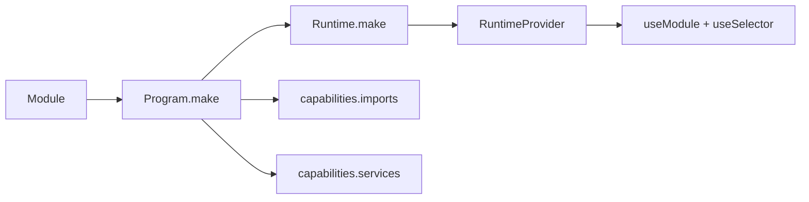

Logix composition 不是 helper hooks 的集合。先选择 owner。

## Composition routes

| 需求 | 路线 |
| --- | --- |
| parent scope 内的 child module | `Program.make(..., { capabilities: { imports: [ChildProgram] } })` |
| service dependency | `capabilities.services` 或 `Runtime.make(..., { layer })` |
| React local instance | `useModule(Program, { key? })` |
| domain package | 返回 Program，或降解到同一条主链 |
| Form field support facts | `field(...).source(...)` / `field(...).companion(...)` 加 `useSelector(...)` |

## 已删除路线

不要通过 `useLocalModule`、`useModuleList` 或 `ModuleScope` 等已移除 React surfaces 做组合。使用 Program ownership 与普通 React component composition。
