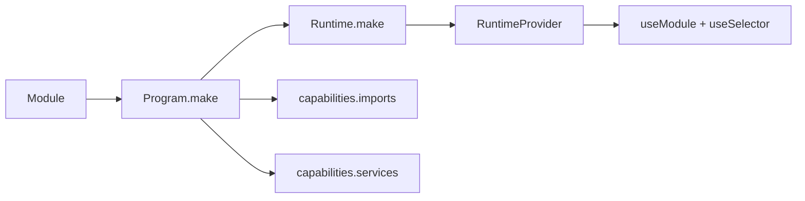

Logix composition is not a bag of helper hooks. Choose the owner first.

## Composition routes

| Need | Route |
| --- | --- |
| child module inside parent scope | `Program.make(..., { capabilities: { imports: [ChildProgram] } })` |
| service dependency | `capabilities.services` or `Runtime.make(..., { layer })` |
| local React instance | `useModule(Program, { key? })` |
| domain package | return a Program or reduce to the same spine |
| Form field support facts | `field(...).source(...)` / `field(...).companion(...)` plus `useSelector(...)` |

## Deleted routes

Do not compose through removed React surfaces such as `useLocalModule`, `useModuleList`, or `ModuleScope`. Use Program ownership and ordinary React component composition instead.
