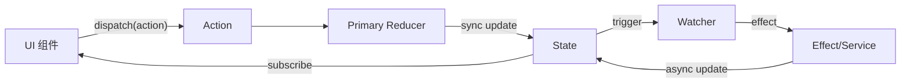

如果你熟悉 React，你可能听说过 "Thinking in React" —— **UI 是状态的函数**。

Logix 将这一思想延伸到业务逻辑领域：**业务逻辑是围绕状态变化的流（Flow）**。

### 适合谁

- 已经读过「快速开始」和 Essentials 基本章节，想整体理解 Logix 的设计取舍；
- 正在考虑在团队内推广 Logix，需要一份"可以拿去分享"的心智模型说明。

### 前置知识

- 了解什么是 Module / State / Action / Logic；
- 粗略知道 Bound API (`$`) 的用途。

### 读完你将获得

- 一套可以向别人解释 Logix 的"电梯介绍词"；
- 对 Intent / Flow / Runtime 三个层次的分工有清晰认识；
- 能在评审代码时判断"这段逻辑写在这里是否合适"。

---

## 核心概念一：Intent (What)

Intent 描述了"你想做什么"，而不是"怎么做"。在 Logix 中，Intent 主要体现为：

- **State Schema**: 数据长什么样。
- **Action Schema**: 可以对数据做什么操作。

```ts
const CounterModule = Logix.Module.make('Counter', {
  state: Schema.Struct({ count: Schema.Number }),
  actions: { increment: Schema.Void },
})
```

> **类比**：Intent 就像餐厅的菜单，它告诉你有什么菜（State）、可以点什么菜（Action），但不涉及厨房如何烹饪。

---

## 核心概念二：响应式流 (Flow)

业务逻辑往往不是线性的，而是充满异步、竞态和联动。Logix 使用 **Flow** 来声明这些关系。

想象你的业务逻辑是一组管道：

- **Input**: Action 流（点击、输入）或 State 流（数据变化）
- **Transform**: 过滤、防抖、映射
- **Effect**: 执行副作用（API 调用）并更新状态

```typescript
// "当用户名变化时，防抖 500ms，然后检查重名"
$.onState((s) => s.username)
  .debounce(500)
  .runLatest(checkUsername)
```

这种声明式的写法，比散落在 `useEffect` 或回调函数中的命令式代码更易读、更易维护。

---

## 核心概念三：Logic (How)

Logic 描述"如何响应 Intent"。它是纯粹的业务逻辑，不依赖具体的 UI 框架。

```ts
// 定义主 reducer（同步、纯函数）
const CounterModule = Logix.Module.make('Counter', {
  state: Schema.Struct({ count: Schema.Number }),
  actions: { increment: Schema.Void },
  reducers: {
    increment: (state) => ({ ...state, count: state.count + 1 }),
  },
})

// 在 Logic 中只放联动 / 副作用 watcher
const Logic = CounterModule.logic(($) =>
  Effect.gen(function* () {
    yield* $.onState((s) => s.count).runFork((count) => (count === 0 ? Effect.log('count is zero') : Effect.void))
  }),
)
```

这里有两个层次：

- **Primary Reducer（主 reducer）**：在 `Logix.Module` 的 `reducers` 中声明，由 Runtime 在 `dispatch` 时同步应用，负责核心的 State 变更；
- **Watcher（监听器）**：在 Logic 中通过 `$.onAction / $.onState` 声明，只处理联动和副作用。

---

## 核心概念四：Runtime (When & Where)

Runtime 负责将 Intent 和 Logic 结合起来，并在特定的环境中运行。

- **ModuleImpl**: 静态的装配蓝图（Module + 初始状态 + Logic）
- **ModuleRuntime**: 运行时的活动实例

---

## 数据流向



1. **UI 触发 Action**: 用户点击按钮，派发 `increment` Action。
2. **Primary Reducer 更新 State**: Runtime 根据 `_tag` 找到主 reducer，同步计算新状态。
3. **Watcher 响应变化**: 监听器捕获 Action 或 State 变化，执行联动或副作用。
4. **UI 重绘**: React 组件感知到状态变化，重新渲染。

---

## 总结

Thinking in Logix 意味着：

1. **定义意图 (Schema)**，而不是编写过程。
2. **描述流向 (Flow)**，而不是手动调度。
3. **隔离副作用 (Effect)**，让核心逻辑保持纯粹。

## 从 Redux/Zustand 迁移

- 推荐先读：[从 Zustand 迁移](../recipes/migration-from-zustand)

## 为什么选择 Logix？

- **类型安全**: 基于 Schema 的全链路类型推导。
- **副作用管理**: 基于 Effect 的强大副作用控制（异步、重试、并发）。
- **可测试性**: 逻辑与 UI 分离，易于单元测试。
- **模块化**: 模块自包含，易于组合和复用。
