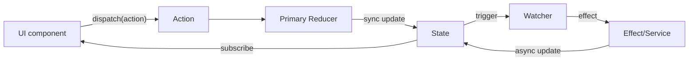

If you’re familiar with React, you’ve probably heard “Thinking in React” — **UI is a function of state**.

Logix extends that idea into the business-logic layer: **business logic is a set of flows around state changes**.

### Who is this for?

- You’ve read “Get Started” and the Essentials pages and want to understand Logix’s design trade-offs end-to-end.
- You want to adopt Logix across a team and need a mental model you can share.

### Prerequisites

- You know what Module / State / Action / Logic mean.
- You have a rough idea what the Bound API (`$`) is for.

### What you’ll get

- An “elevator pitch” you can use to explain Logix to others
- A clear separation of responsibilities across Intent / Flow / Runtime
- The ability to judge during code review whether a piece of logic belongs where it is

---

## Core idea 1: Intent (What)

Intent describes **what** you want to do, not **how** you do it. In Logix, Intent mainly shows up as:

- **State Schema**: what the data looks like
- **Action Schema**: what operations can happen to that data

```ts
const CounterModule = Logix.Module.make('Counter', {
  state: Schema.Struct({ count: Schema.Number }),
  actions: { increment: Schema.Void },
})
```

> Analogy: Intent is like a restaurant menu. It tells you what dishes exist (State) and what you can order (Action), but not how the kitchen cooks them.

---

## Core idea 2: Reactive flows (Flow)

Business logic is rarely linear. It’s full of async work, races, and linkages. Logix uses **Flow** to declare these relationships.

Think of your business logic as a set of pipelines:

- **Input**: an Action stream (clicks, typing) or a State stream (data changes)
- **Transform**: filter, debounce, map
- **Effect**: run side effects (API calls) and write back to state

```typescript
// "When username changes, debounce 500ms, then check availability"
$.onState((s) => s.username)
  .debounce(500)
  .runLatest(checkUsername)
```

This declarative style is usually easier to read and maintain than imperative code scattered across `useEffect` hooks and callbacks.

---

## Core idea 3: Logic (How)

Logic describes **how** to respond to Intent. It’s pure business logic and does not depend on a specific UI framework.

```ts
// Define a primary reducer (sync, pure function)
const CounterModule = Logix.Module.make('Counter', {
  state: Schema.Struct({ count: Schema.Number }),
  actions: { increment: Schema.Void },
  reducers: {
    increment: (state) => ({ ...state, count: state.count + 1 }),
  },
})

// Keep only linkage / side-effect watchers in Logic
const Logic = CounterModule.logic(($) =>
  Effect.gen(function* () {
    yield* $.onState((s) => s.count).runFork((count) => $.state.update((s) => ({ ...s, isZero: count === 0 })))
  }),
)
```

There are two layers here:

- **Primary Reducer**: declared in `reducers` on `Logix.Module`. The Runtime applies it synchronously during `dispatch`, and it is responsible for core State transitions.
- **Watcher**: declared in Logic via `$.onAction / $.onState`. It handles linkage and side effects only.

---

## Core idea 4: Runtime (When & Where)

The Runtime combines Intent and Logic and runs them in a specific environment.

- **ModuleImpl**: a static assembly blueprint (Module + initial state + Logic)
- **ModuleRuntime**: an active runtime instance

---

## Data flow



1. **UI triggers an Action**: the user clicks a button and dispatches the `increment` Action.
2. **Primary Reducer updates State**: the Runtime finds the reducer by `_tag` and synchronously computes the next state.
3. **Watchers react**: watchers observe Action or State changes and run linkage or side effects.
4. **UI re-renders**: React components observe state changes and render again.

---

## Summary

Thinking in Logix means:

1. **Define intent (Schema)**, rather than writing procedures.
2. **Describe flows (Flow)**, rather than manually orchestrating.
3. **Isolate side effects (Effect)** to keep core logic pure.

## If you’re migrating from Redux/Zustand

- Start with: [Migration from Zustand](../recipes/migration-from-zustand)

## Why Logix?

- **Type safety**: end-to-end type inference based on Schema.
- **Side-effect management**: powerful control via Effect (async, retries, concurrency).
- **Testability**: logic is separated from UI, enabling unit tests.
- **Modularity**: modules are self-contained and easy to compose and reuse.
