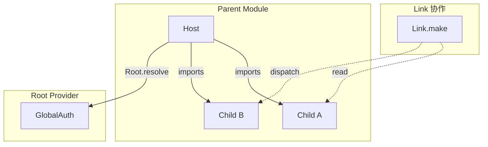

在真实业务里，模块很少是“单机作战”的：订单要读商品价格、用户要读认证状态、搜索要驱动详情刷新。

Logix 对跨模块协作的目标是同时满足：

- 写法清晰、类型安全；
- 作用域语义可预测（尤其是多实例场景）；
- 模块之间可以互相协作，但不会在 TypeScript/打包层面制造循环依赖。

> 下文示例都基于 Bound API（`$`），即在 `Module.logic(($) => ...)` 回调里编排逻辑。

## 1) 父子模块（imports）：在父实例 scope 下访问子模块（strict）

当一个模块通过 `imports` 组合了子模块时：

- **父模块实例就是子模块实例的作用域锚点**；
- 业务逻辑里用 `$.use(Child)` 获取子模块 `ModuleHandle`（strict：只能从当前父实例的 imports scope 解析）；
- React 组件里用 `host.imports.get(Child.tag)` / `useImportedModule(host, Child.tag)` 读取与派发子模块。

```ts
// host/logic.ts
import { Effect } from 'effect'

export const HostLogic = HostModule.logic(($) =>
  Effect.gen(function* () {
    const child = yield* $.use(ChildModule)
    const v = yield* child.read((s) => s.value)
    yield* $.dispatchers.hostSawChild(v)
  }),
)
```

前置条件：

- 你必须在装配时显式提供子模块实现：`HostDef.implement({ imports: [ChildImpl] })`（或先得到 `HostModule = HostDef.implement(...)` 再取 `HostModule.impl`）；
- 若缺失 imports，strict 语义必须失败（并提示“补 imports / 把模块提升为直接 imports / 透传实例句柄”等修复方式）。

> 经验法则：**UI 默认只依赖 Host**。只有当 UI 需要直接渲染子模块 state（或把子模块句柄传给子组件）时，才在组件侧 `useImportedModule/host.imports.get`。

## 2) 横向协作（Link.make）：把跨模块胶水逻辑挂到 Runtime processes

当你需要在“模块外部”定义一段长期运行的跨模块协作（例如：监听 A 的变化驱动 B），推荐用 `Link.make`：

- `Link` 逻辑运行在 Runtime 的 processes 中；
- 逻辑入参是 **只读句柄**（`read/changes/dispatch`），跨模块写入必须通过对方 actions；
- 适合“应用级/页面级单例模块”的编排（而不是“从多个实例里挑一个”）。

```ts
import * as Logix from '@logixjs/core'
import { Stream } from 'effect'

const SyncUserFromAuth = Logix.Link.make({ modules: [AuthDef, UserDef] as const }, ($) =>
  $.Auth.changes((s) => s.token).pipe(Stream.runForEach((token) => $.User.actions.syncFromToken(token))),
)

export const RootModule = RootDef.implement({
  initial: {
    /* ... */
  },
  imports: [AuthImpl, UserImpl],
  processes: [SyncUserFromAuth],
})

export const RootImpl = RootModule.impl
```

## 2.1 常见场景：状态联动触发“被 imports 的 Query 子模块”refetch

如果 `BModule` 通过 `imports` 引入了一个 `AQuery`（`@logixjs/query`），并且你希望“B 的某个状态变化”主动触发 `AQuery` 重新拉取：

- **最佳实践**：联动逻辑写在 `BModule` 自己的 Logic 内（B 作为 owner），在 **B 的实例 scope** 下解析到 `AQuery` 句柄，再显式触发 `setParams/refresh`。
- **不要**在 Link 里直接去“全局找一个 AQuery 实例然后 refresh”：多实例时会产生歧义，也更难调试。

可参考：[查询（Query）](./query) 的“由拥有者模块驱动 imports 子模块刷新”示例。

## 3) 全局单例（Root.resolve）：从 root provider 读取“固定 root”实例

当某个模块/服务被作为“全局单例”提供在 Runtime 的 root provider 中时：

- 在 Logic 内部可以用 `Logix.Root.resolve(Tag)` 显式从 root provider 读取它；
- 它不依赖 `imports`，也不会受到局部 override 的影响。

```ts
const Logic = SomeModule.logic(($) =>
  Effect.gen(function* () {
    const auth = yield* Logix.Root.resolve(GlobalAuth.tag)
    const userId = yield* auth.read((s) => s.userId)
    // ...
  }),
)
```

## 4) 文件结构：从设计上规避循环依赖

为了让导入关系始终干净、可控，推荐每个业务模块采用这样的文件布局：

- `features/foo/module.ts`：只定义 ModuleDef 的形状（state + actions）。
- `features/foo/logic.ts`：用 `FooDef.logic(($) => ...)` 写业务逻辑。
- （可选）`features/foo/live.ts`：放运行时接线、 Layer 组合等。

跨模块通信发生在 **各自的 `logic.ts` 文件里**，这些文件只导入其他模块的 `module.ts`：

```ts
// features/auth/module.ts
import { Schema } from 'effect'
import * as Logix from '@logixjs/core'

export const AuthDef = Logix.Module.make('Auth', {
  state: Schema.Struct({ token: Schema.String }),
  actions: {
    loginSuccess: Schema.String,
    logout: Schema.Void,
  },
})
```

```ts
// features/auth/logic.ts
import { Effect } from 'effect'
import { AuthDef } from './module'
import { UserDef } from '../user/module'

export const AuthLogic = AuthDef.logic(($) =>
  Effect.gen(function* () {
    const user = yield* $.use(UserDef)

    // 当用户登出时，顺带清理用户信息
    yield* $.onAction('logout').run(() => user.dispatch(UserDef.actions['user/clearProfile']()))
  }),
)
```

注意这里我们**刻意不做的事情**：

- `module.ts` 不导入任何其他模块；
- `module.ts` 也不反向导入自己的 `logic.ts`。

只要遵守这条简单规则：

- `user/logic.ts` 可以导入 `auth/module.ts`；
- `auth/logic.ts` 可以导入 `user/module.ts`；
- TypeScript/打包期看到的导入图始终是无环的，**即使运行时两边互相依赖**。

从打包器视角看，Logic 文件是一层“叶子”，它们只依赖各自的 `module.ts`，不会互相强依赖。

## 3. 互相依赖：两个模块互相使用对方

在上述结构下，让两个模块互相依赖是安全的：

- 在 `UserLogic` 里，用 `Link.make` / “拥有者模块”去编排 Auth 与 User 的协作；
- 在 `AuthLogic` 里，用 `$.use(UserModule)`（strict：要求被装配为 imports）或通过 actions 协作。

因为跨模块访问发生在 **运行时**（`imports` / `Link` / Runtime processes），导入层面始终是 `logic.ts` → 自己的 `module.ts` / 别人的 `module.ts`，不会出现经典的：

> store A 文件导入 store B，store B 又导入 store A，最终构成循环引用，实例不一致或初始化顺序混乱。

可以用一个心智模型来记：

- **编译期依赖图**：`logic.ts` → `module.ts`，无环；
- **运行时依赖图**：Module 之间可以是任意拓扑（A 依赖 B，B 依赖 A，都没问题），靠 App Runtime 的装配（imports/processes/Link）来解析。

## 4. 为什么在 zustand 里这件事很难，而在 Logix 里很自然

在大多数 zustand 的写法里：

- 每个 store 通常在一个文件里通过 `createStore(...)` 创建；
- 如果 `useAStore` 需要用 `useBStore` 的数据，就直接导入 `useBStore`；
- 若 `useBStore` 再需要依赖 `useAStore`，很快就踩到 **循环导入** 或各种“懒加载 hack”。

常见的缓解方式是：

- 干脆合成一个“大 store”，所有 state/action 混在一起；
- 或者人为拆成多 slice，再在某个入口文件里做汇总 wiring。

这样虽然可以跑，但：

- 模块边界被模糊掉了；
- 跨业务域的约束和协作难以单独讨论和演进。

Logix 的路径不一样：

- **Module 只定义一次**，是纯粹的描述（`Logix.Module`，在 `module.ts` 里写 state + actions）；
- Logic 后挂（`Module.logic(($) => ...)` 在 `logic.ts` 里实现行为）；
- 跨模块协作通过“imports / Link / processes”等运行时装配完成：业务代码拿到的是对方公开的句柄（`read/changes/actions`），而不是在导入层面直接拿某个 store 实例。

因此：

- 你可以保持 **细粒度、按功能划分的 Module**；
- 同时又可以在它们之间建立 **丰富的互相依赖关系**，不用为了避免循环导入而被迫合并 store 或硬拆 slices。

## 5) 语义对比表（你应该用哪一个？）



| 入口                                                                 | 场景                                 | 作用域语义                               | 返回值（直觉）                                |
| -------------------------------------------------------------------- | ------------------------------------ | ---------------------------------------- | --------------------------------------------- |
| `$.use(Child)`                                                       | Logic 内访问“当前实例的子模块”       | strict：只认当前模块实例的 imports scope | 子模块 `ModuleHandle`（read/changes/actions） |
| `host.imports.get(Child.tag)` / `useImportedModule(host, Child.tag)` | React 组件侧读取/派发子模块          | strict：只认 `host` 的 imports scope     | 子模块 `ModuleRef`（可交给 hooks）            |
| `Link.make({ modules })`                                             | Runtime processes 中的跨模块胶水逻辑 | 以 Runtime tree 为边界；不做多实例选择   | 多个模块的只读句柄集合                        |
| `Logix.Root.resolve(Tag)`                                            | 显式读取 root provider 的固定单例    | 固定 root；忽略局部 override             | Tag 对应的服务/模块运行时                     |

## 6) 使用建议（Best Practices）

1. 让 `module.ts` 保持“干净”
   只定义 state 和 actions；不要在这里导入其他模块或具体的 runtime/wiring 代码。

2. UI 默认只绑定 Host，一跳即可
   组件侧优先只拿 Host 的 state；只有 UI 真的需要渲染子模块状态时，才用 `host.imports.get/useImportedModule`。

3. 深层（3 层+）不要到处“爬树”
   优先把常用模块提升为 Host 的直接 imports（“二层化”），或在边界 resolve 一次，把 `ModuleRef` 往下传；必要时将子模块的 view 投影到父模块 state 再由 UI 消费。

4. 全局单例要显式
   需要固定 root provider 的单例语义时，用 `Logix.Root.resolve(Tag)`；不要指望深层组件的局部 override 能影响它。

## 下一步

- 回到总览：[可组合性地图](../advanced/composability)
- 深入了解运行时架构：[深度解析](./deep-dive)
- 进入高级主题：[Suspense & Async](../advanced/suspense-and-async)
- 学习错误处理策略：[错误处理](../advanced/error-handling)
