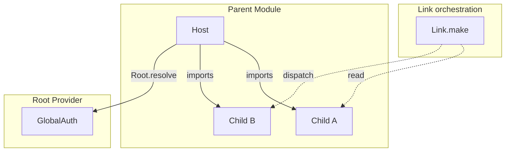

# Cross-module communication

In real products, modules rarely fight alone: orders need product prices, users need auth state, and search needs to trigger detail refresh.

Logix’s goals for cross-module collaboration are:

- Clear, type-safe code
- Predictable scope semantics (especially with multiple instances)
- Modules can collaborate without creating TypeScript/bundler-level circular dependencies

> All examples below are based on the Bound API (`$`), i.e. orchestration inside the `Module.logic(($) => ...)` callback.

## 1) Parent/child modules (imports): access child modules in the parent instance scope (strict)

When a module composes child modules via `imports`:

- **The parent module instance is the scope anchor for child instances**.
- In Logic, use `$.use(Child)` to get the child `ModuleHandle` (strict: resolves only from the current parent instance’s imports scope).
- In React, use `host.imports.get(Child.tag)` / `useImportedModule(host, Child.tag)` to read/dispatch the child module.

```ts
// host/logic.ts
import { Effect } from 'effect'

export const HostLogic = HostModule.logic(($) =>
  Effect.gen(function* () {
    const child = yield* $.use(ChildModule)
    const v = yield* child.read((s) => s.value)
    yield* $.actions.hostSawChild(v)
  }),
)
```

Prerequisites:

- You must provide the child implementation at assembly time: `HostDef.implement({ imports: [ChildImpl] })` (or first `HostModule = HostDef.implement(...)`, then use `HostModule.impl`).
- If imports are missing, strict resolution must fail (with actionable fixes like “add imports / promote to direct imports / pass through an instance handle”).

> Rule of thumb: **UI should depend on Host by default**. Only when UI needs to directly render child state (or pass a child handle to a subcomponent) should you use `useImportedModule/host.imports.get`.

## 2) Lateral collaboration (Link.make): attach cross-module glue logic to Runtime processes

When you need long-running cross-module collaboration “outside modules” (e.g. watch A and drive B), prefer `Link.make`:

- Link logic runs in the Runtime processes.
- Inputs are **read-only handles** (`read/changes/dispatch`); cross-module writes must go through the other module’s actions.
- Suitable for orchestration over app/page singleton modules (not “pick one instance out of many”).

```ts
import * as Logix from '@logixjs/core'
import { Stream } from 'effect'

const SyncUserFromAuth = Logix.Link.make({ modules: [AuthDef, UserDef] as const }, ($) =>
  $.Auth.changes((s) => s.token).pipe(Stream.runForEach((token) => $.User.actions.syncFromToken(token))),
)

export const RootModule = RootDef.implement({
  initial: {
    /* ... */
  },
  imports: [AuthImpl, UserImpl],
  processes: [SyncUserFromAuth],
})

export const RootImpl = RootModule.impl
```

## 2.1 Common case: linkage triggers refetch for an imported Query child module

If `BModule` imports an `AQuery` (`@logixjs/query`), and you want “some state change in B” to proactively refetch `AQuery`:

- **Best practice**: keep linkage logic inside `BModule`’s own Logic (B is the owner). Resolve the `AQuery` handle in **B’s instance scope**, then call `setParams/refresh` explicitly.
- **Don’t** “find a global AQuery instance and refresh it” inside Link: it becomes ambiguous with multiple instances and is harder to debug.

See also: [Query](./query) for an “owner module drives an imported Query child refresh” example.

## 3) Global singleton (Root.resolve): read a fixed-root instance from the root provider

When a module/service is provided as a “global singleton” in the Runtime root provider:

- In Logic, use `Logix.Root.resolve(Tag)` to explicitly read it from the root provider.
- It does not depend on `imports` and is not affected by local overrides.

```ts
const Logic = SomeModule.logic(($) =>
  Effect.gen(function* () {
    const auth = yield* Logix.Root.resolve(GlobalAuth.tag)
    const userId = yield* auth.read((s) => s.userId)
    // ...
  }),
)
```

## 4) File structure: avoid circular dependencies by design

To keep imports clean and controllable, structure each feature module like this:

- `features/foo/module.ts`: define only the ModuleDef shape (state + actions).
- `features/foo/logic.ts`: implement business logic with `FooDef.logic(($) => ...)`.
- (optional) `features/foo/live.ts`: runtime wiring, Layer composition, etc.

Cross-module communication should live in **each module’s `logic.ts`**, and those files should import only other modules’ `module.ts`:

```ts
// features/auth/module.ts
import { Schema } from 'effect'
import * as Logix from '@logixjs/core'

export const AuthDef = Logix.Module.make('Auth', {
  state: Schema.Struct({ token: Schema.String }),
  actions: {
    loginSuccess: Schema.String,
    logout: Schema.Void,
  },
})
```

```ts
// features/auth/logic.ts
import { Effect } from 'effect'
import { AuthDef } from './module'
import { UserDef } from '../user/module'

export const AuthLogic = AuthDef.logic(($) =>
  Effect.gen(function* () {
    const User = yield* $.use(UserModule)

    // When user logs out, clear user profile as well
    yield* $.onAction('logout').run(() => $.flow.run(User.actions['user/clearProfile'](undefined)))
  }),
)
```

Notice what we **deliberately do not do**:

- `module.ts` imports no other modules.
- `module.ts` does not import its own `logic.ts`.

If you follow this simple rule:

- `user/logic.ts` can import `auth/module.ts`.
- `auth/logic.ts` can import `user/module.ts`.
- The TypeScript/bundler import graph stays acyclic, **even if runtime dependencies are cyclic**.

From the bundler’s perspective, Logic files are “leaves”: they depend only on `module.ts` files and don’t strongly depend on each other.

## 3. Mutual dependency: two modules use each other

With the structure above, mutual dependency is safe:

- In `UserLogic`, orchestrate collaboration via `Link.make` or an “owner module”.
- In `AuthLogic`, use `$.use(UserModule)` (strict: requires it to be assembled as imports) or collaborate through actions.

Because cross-module access happens at **runtime** (`imports` / `Link` / Runtime processes), the import layer stays as `logic.ts` → `module.ts` (self/others), avoiding the classic problem:

> store A imports store B, store B imports store A, and you end up with circular imports, inconsistent instances, or initialization-order issues.

Use this mental model:

- **Compile-time dependency graph**: `logic.ts` → `module.ts`, acyclic.
- **Runtime dependency graph**: modules can be any topology (A depends on B, B depends on A is fine), resolved by App Runtime assembly (imports/processes/Link).

## 4. Why this is hard in zustand but natural in Logix

In many zustand codebases:

- Each store is created in a file via `createStore(...)`.
- If `useAStore` needs data from `useBStore`, it imports `useBStore`.
- If `useBStore` later needs `useAStore` too, you quickly hit **circular imports** or various “lazy-load hacks”.

Common mitigations:

- Merge into one “big store” where everything is mixed together.
- Or split into slices and do wiring in a central entry file.

It can work, but:

- module boundaries get blurred
- cross-domain constraints and collaboration become harder to evolve independently

Logix takes a different path:

- **Module is defined once** as pure description (`Logix.Module` in `module.ts`: state + actions).
- Logic is attached later (`Module.logic(($) => ...)` implemented in `logic.ts`).
- Cross-module collaboration is resolved at runtime via assembly (`imports / Link / processes`): your code interacts with the other module via public handles (`read/changes/actions`), not by importing a concrete store instance.

Therefore:

- You can keep **fine-grained Modules** by feature.
- You can still build **rich dependency topologies**, without being forced to merge stores or over-slice just to avoid circular imports.

## 5) Semantics comparison: which one should you use?



| Entry                                                                | Scenario                               | Scope semantics                                   | Return (intuition)                               |
| -------------------------------------------------------------------- | -------------------------------------- | ------------------------------------------------ | ------------------------------------------------ |
| `$.use(Child)`                                                       | Logic: “child of current instance”     | strict: current instance’s imports scope only    | child `ModuleHandle` (read/changes/actions)      |
| `host.imports.get(Child.tag)` / `useImportedModule(host, Child.tag)` | React: read/dispatch child module      | strict: `host`’s imports scope only              | child `ModuleRef` (usable by hooks)              |
| `Link.make({ modules })`                                             | Runtime processes cross-module glue    | bounded by runtime tree; no multi-instance pick  | read-only handle set over modules                |
| `Logix.Root.resolve(Tag)`                                            | Explicit fixed-root singleton access   | fixed root; ignores local overrides              | the Tag’s service/module runtime                 |

## 6) Best practices

1. Keep `module.ts` clean
   Only define state and actions. Do not import other modules or concrete runtime/wiring code here.

2. UI binds to Host by default (one hop)
   Prefer reading Host state in components. Only when UI truly needs child state, use `host.imports.get/useImportedModule`.

3. Don’t “climb the tree” everywhere for deep (3+ level) dependencies
   Prefer promoting common modules to direct imports of Host (“flatten one level”), or resolve once at a boundary and pass `ModuleRef` down; if needed, project child view state into parent state for UI consumption.

4. Make global singletons explicit
   If you need fixed-root singleton semantics, use `Logix.Root.resolve(Tag)`. Don’t assume deep local overrides in components can affect it.

## Next

- Back to the overview: [Composability map](../advanced/composability)
- Runtime architecture: [Deep dive](./deep-dive)
- Advanced topic: [Suspense & Async](../advanced/suspense-and-async)
- Error handling: [Error handling](../advanced/error-handling)
