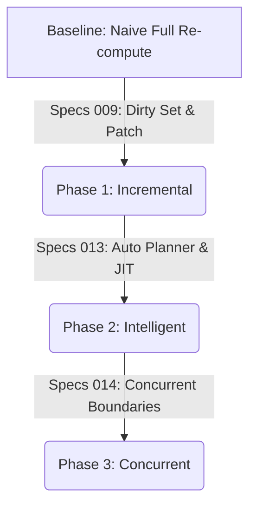

# Map of Content: Logix Runtime Performance & Optimization

> **定位**: 本文档（Performance MOC）旨在串联 Logix Runtime 演进过程中的核心优化思路与 Specs，形成一张“长链路组合型优化”的导航图。

## 1. 核心战役概览

我们将 Logix Runtime 的性能演进分为三个阶段（Tenets）：

1.  **增量化 (Incrementalism)**: 从全量计算转为按需计算 (009)。
2.  **智能化 (Intelligence)**: 引入 Planner 与 JIT 思想，消除增量计算本身的开销 (013)。
3.  **时间分片化 (Time Slicing)**: 借鉴并发模式，消除长任务对主线程的阻塞 (014)。

## 2. 关键抓手 (Optimization Levers)

为了达成上述目标，我们在不同维度实施了具体的优化手段：

| 维度                  | 关键手段                     | 对应 Spec / Doc                                                              | 收益点                        |
| :-------------------- | :--------------------------- | :--------------------------------------------------------------------------- | :---------------------------- |
| **Space vs Time**     | **Dirty Pattern Caching**    | [013-auto-converge-planner](specs/013-auto-converge-planner/spec.md) | 用内存换时间，热路径决策 O(1) |
| **Logic vs Data**     | **Static Structural ID**     | [Impl Notes 01](./01-micro-optimizations.md)                                 | 消除字符串比对与 GC 压力      |
| **Accuracy vs Speed** | **Speculative Budget**       | [013-auto-converge-planner](specs/013-auto-converge-planner/spec.md) | 保证决策成本有上界 (Cut-off)  |
| **Granularity**       | **Dirty Set Normalization**  | [009-txn-patch-dirtyset](specs/009-txn-patch-dirtyset/spec.md)       | 避免“假更新”触发重算          |
| **Safety**            | **Single Writer Constraint** | [009-txn-patch-dirtyset](specs/009-txn-patch-dirtyset/spec.md)       | 消除非确定性竞争              |

## 3. 长链路组合思路 (Emergent Patterns)

当上述 Specs 组合在一起时，会涌现出更高级的架构模式：

### 3.1 The "Zero-Overhead" Abstraction

- **组合**: `009 (off/light mode)` + `013 (Canonical Plan Cache)` + `SlimOp`
- **效果**: 在生产环境下，Runtime 的开销无限趋近于手写原生 JS 代码。
  - 不做多余的 Trace 记录。
  - 不做多余的图遍历。
  - 不做多余的对象分配。

### 3.2 The "Self-Correcting" Runtime

- **组合**: `013 (Auto Mode)` + `014 (Task Scheduling)`
- **效果**: 系统能感知当前的主线程压力与图复杂度。
  - 闲时：做 Deep Validation，预计算 Cache。
  - 忙时：即刻止损 (Budget Cut-off)，优先保证响应度，必要时降级为 Full 算完拉倒。

### 3.3 The "Deterministic" Time Machine

- **组合**: `009 (Identities)` + `012 (Program API)`
- **效果**:
  - 所有行为（Input + Output）都由稳定标识串联。
  - 这使得“性能回退”不再是偶发玄学，而是可以被精确捕捉（Bisect）的代码变更。

## 4. 后续演进 (Roadmap Expansion)

基于当前进度，建议重点关注以下未在主线 Spec 中充分展开的方向：

- **@[specs/014-browser-perf-boundaries]**: 探索浏览器主线程调度边界（`requestIdleCallback`, `scheduler.postTask`）与 Logix 事务的结合。
- **Structural Sharing (Map/Set)**: 在 state-trait 内部引入类似于 Hammer/Immutable.js 的结构共享机制，进一步降低 Snapshot 内存开销。
- **Wasm Planner**: 如果 JS 层的 Plan 计算即便是位运算也嫌慢，可以考虑将 Static IR 与 Planner 下沉到 Wasm (Rust)。
