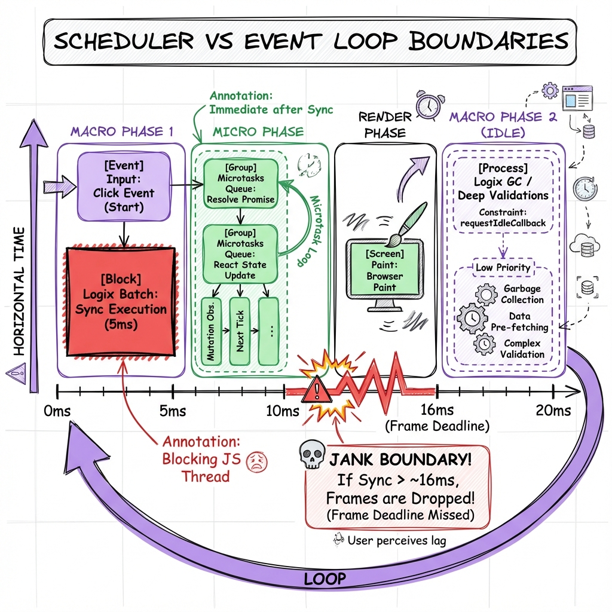
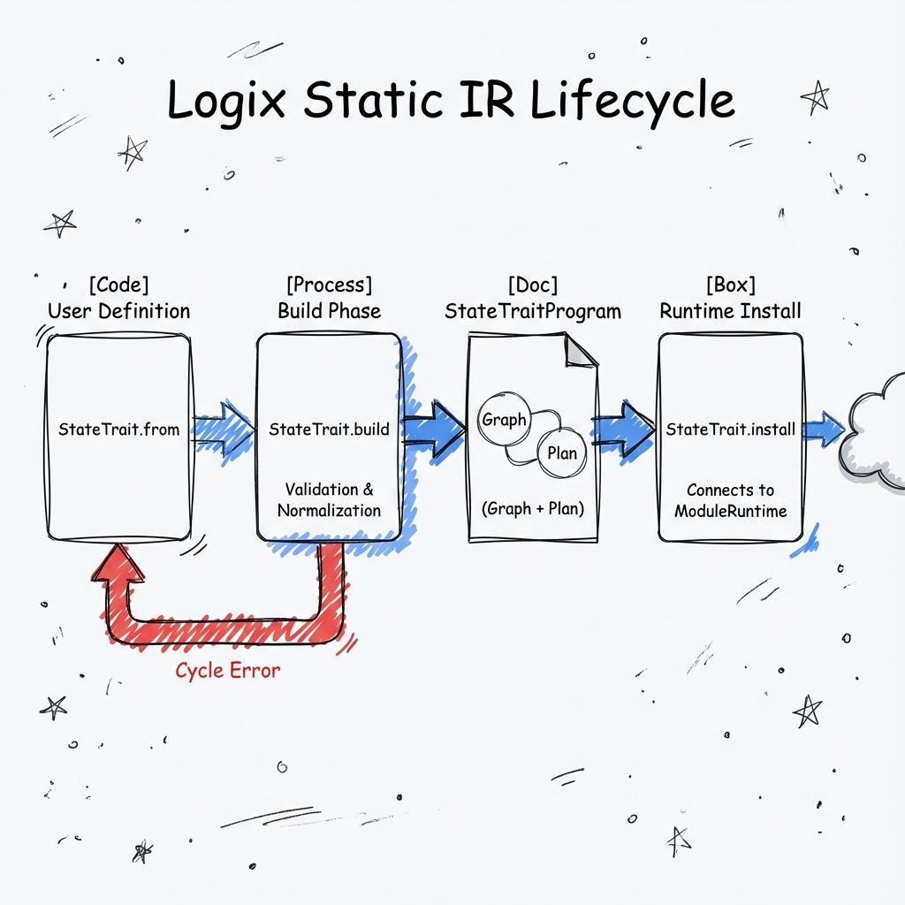
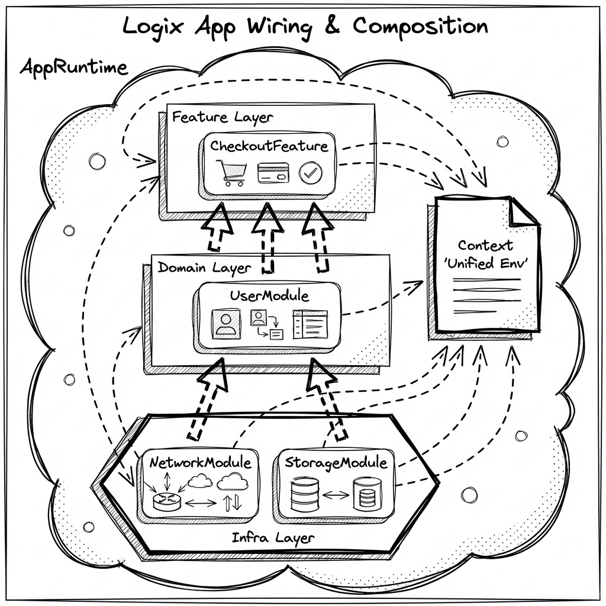
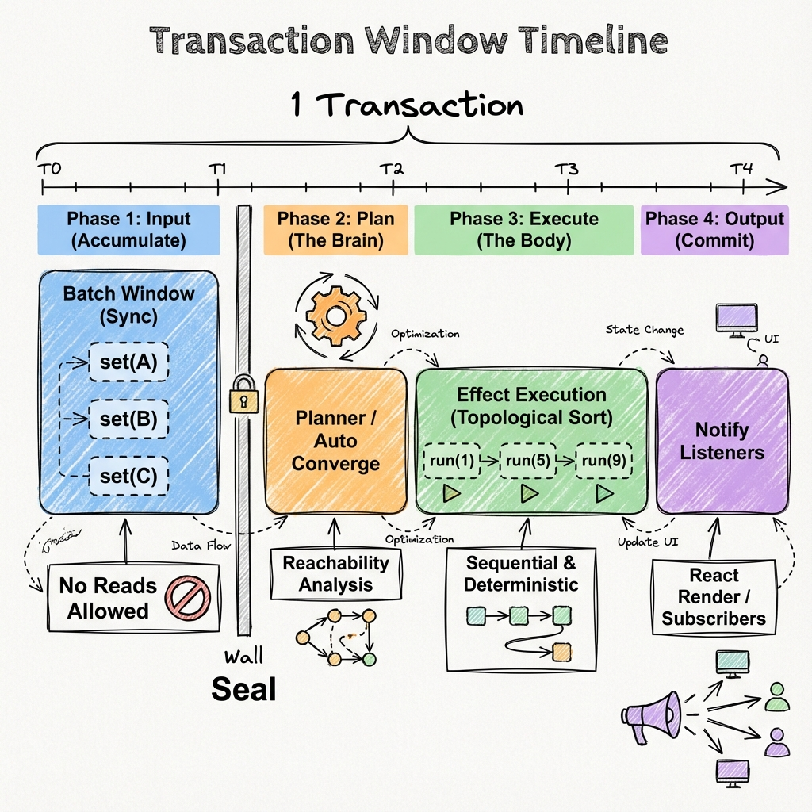
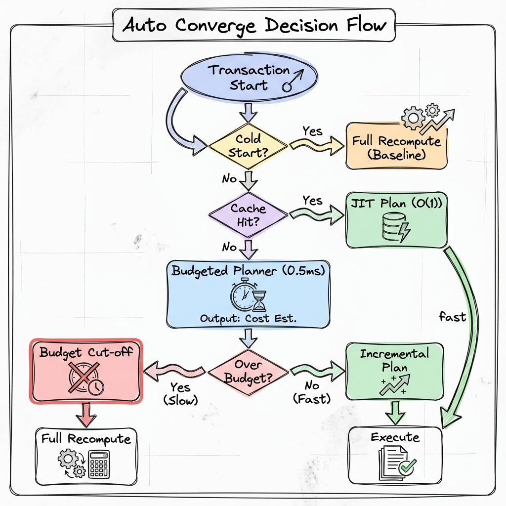
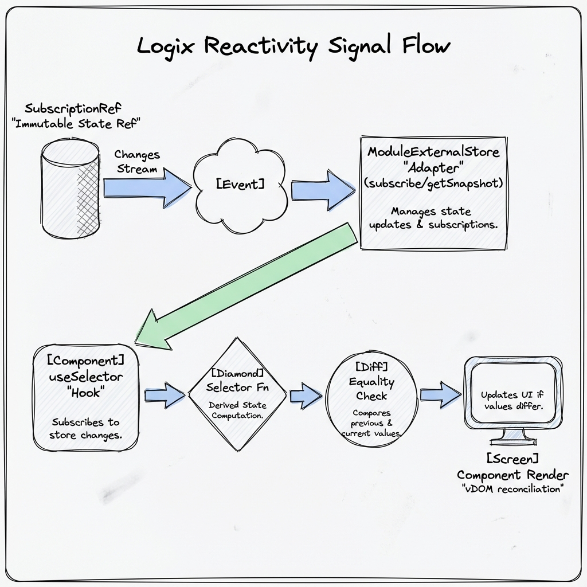
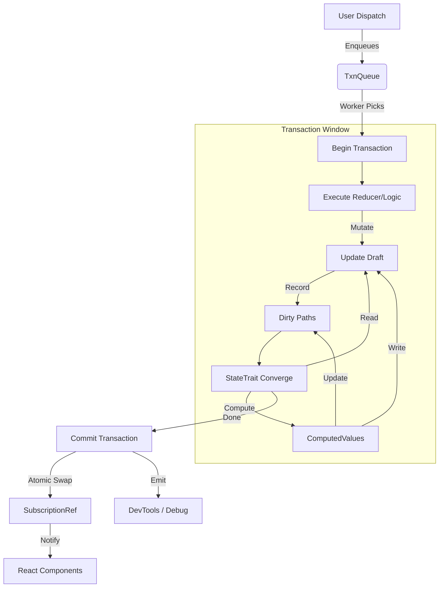

# Logix Runtime Architecture & Lifecycle（实现视角）

本文档基于 `packages/logix-core` 009 Implementation 现状，梳理 Logix 运行时从定义、构建、启动到事务执行的全链路机制，用于帮助维护者快速建立实现脉络（**不是 SSoT**）。

- 运行时 SSoT（契约/语义口径）：`.codex/skills/project-guide/references/runtime-logix`
- 长链路地图（从入口快速定位到源码）：`docs/impl-notes/05-runtime-long-chain-map.md`

如本文与 SSoT 或 TypeScript 类型提示不一致，以 SSoT + 代码类型为准。

**Scope**: Logix Runtime（Implementation Notes）
**Status**: Current Implementation (Feature 009+)

---

## 1. 核心概念与分层

Logix 运行时采用典型的分层架构，从上到下依次为：

1.  **Definitions (DSL)**: 用户定义的 Module、Schema、Traits。
2.  **App Runtime (Container)**: 全局容器，负责 Layer 组装、Env 注入与进程管理。
3.  **Module Runtime (Node)**: 单个逻辑模块的运行时实例，持有 State、Queue 与 Traits。
4.  **Transaction Engine (Kernel)**: 处理 `Start -> Patch -> Converge -> Commit` 的事务循环。
5.  **Effect Runtime (Substrate)**: 底层基于 `Effect-TS` 的并发原语与调度器。

---

## 2. Phase 1: 模块定义 (Definition Phase)

在代码静态阶段，用户通过 `Logix.Module` 和 `Logix.StateTrait` 定义逻辑蓝图。

### 2.1 Module Definition

- **Output**: `ModuleTag` (Tag + Factories)。
- **Artifact**: 纯数据对象，包含 `StateSchema`、`ActionSchema` 和 `id`。运行时作为 `Context.Tag` 使用。

### 2.2 Trait Definition

- **Input**: `StateSchema`。
- **API**:
  - `StateTrait.from(Schema).computed(...)`
  - `StateTrait.from(Schema).link(...)`
  - `StateTrait.from(Schema).source(...)`
- **Build Process** (`StateTrait.build`):
  - **Normalization**: 将链式调用转为 `StateTraitEntry` 列表。
  - **Validation**: 检查 Single Writer 约束 (同一路径只能有一个 Writer)。_目的：防止 multiple traits 争抢写入导致“Last Write Wins”的竞态不确定性。_
  - **Cycle Check**: 简单的 DFS 检查 Link 环（Computed 暂不查）。_目的：防止 Converge 阶段陷入无限循环。_
  - **Output**: `StateTraitProgram`，包含 `entries` (线性列表) 和 `graph` (仅用于调试的可视化结构)。此时**没有**生成优化的执行计划 (IR)。

### 2.3 Dependency Graph & Reverse Closure

这是 Logix 实现 **"精确范围控制 (Scoped Scope)"** 的核心算法引擎。

#### 1. 为什么需要它？(The Problem)

在校验（Validation）和诊断（Diagnostics）场景中，我们经常面临反向问题：

- **正向 (Forward)**: "A 变了，根据规则 B = f(A)，我需要重算 B。" (Computed 的逻辑)
- **反向 (Reverse)**: "我改了 A，**到底有哪些业务规则**（包括间接依赖的 C、D、E）受到了影响？"

如果只靠正向图，每次查询都得遍历全图，这在 1000+ 节点的复杂表单中是不可接受的。

#### 2. 构建过程 (Build Phase) (`graph.ts`)

在 `StateTrait.build` 阶段，Runtime 不仅构建了正向的 `entry.deps`，还同时构建了**反向邻接表**：

- **Input**: `A -> B` (B 依赖 A)
- **Transform**: `Edges.flip()`
- **Output (ReverseAdj)**: `Map<A, [B]>` (A 被 B 依赖)

这使得 "查找谁依赖我" 变成了 O(1) 的哈希表查找。

#### 3. 运行时查询 (Runtime Query) (`reverse-closure.ts`)

当调用 `validate(fields)` 或 `analyze(patch)` 时，特定算法 **Reverse Closure (反向闭包)** 介入：

1.  **Seed**: 从输入的 dirty fields (如 `user.name`) 开始入队。
2.  **BFS Traversal**:
    - 取出节点 N，查 `InverseAdj` 找到依赖它的所有节点 M。
    - 将 M 加入 `visited` 集合并入队。
    - 递归重复，直到队列为空。
3.  **Result**: 得到一个**闭包集合**，包含了所有受波及的节点。

**收益**:

- **Scoped Validation**: 只重跑受影响的 Check Rules，而不是整个表单。
- **Precise Diagnostics**: 开发者 Hover 一个字段，立即高亮所有下游影响链。
- **Complexity**: 复杂度即使在最坏情况下也是 O(Subgraph)，远小于 O(TotalGraph)。

---

## 3. Phase 2: 运行时初始化 (Runtime Initialization)

当应用启动 (`Runtime.make`) 或组件加载 (`$.use(Module)`) 时，进入初始化阶段。

### 3.1 App Wiring (`AppRuntime.makeApp`)

- **Input**: `ReadonlyArray<AppModuleEntry>` (Feature Modules).
- **Output**: `Effect<RuntimeContext>` (Ready-to-use DI Container).

1.  **Layer Merge**: 将所有模块的 `Layer` (通常由 `Module.implement` 产生) 合并为一个巨大的 Env Layer。_目的：构建统一的依赖注入 (DI) 容器，实现模块这一“乐高积木”的自动组装。_
2.  **Tag Validation**: 扫描所有模块提供的 Service Tag，检测 Key 冲突。
3.  **Scope Creation**: 创建全局 Scope，并在其中 build Layer，生成最终的 `Context`。_目的：确保 DB 连接、WebSocket 等资源的生命周期绑定到 App 实例，随 App 销毁而自动释放。_
4.  **Process Fork**: 启动长生命周期的后台 Effect (如 Link 进程、Global Watcher)。

### 3.2 Module Setup (`ModuleRuntime.make`)

- **Input**: `ModuleTag` + `RuntimeContext`.
- **Output**: `PublicModuleRuntime` (The Stateful Node).

当 `ModuleRuntime` 在 Env 中被解析时 (Lazily via Layer):

1.  **State Init**: 创建 `SubscriptionRef` 持有初始状态。
2.  **Queue Init**: 创建 `txnQueue` (Unbounded)，用于串行化该实例的所有写入操作。
    - _Constraint_: 单实例内的写入 (Dispatch/Refresh) 必须串行。_目的：实现无锁并发控制 (Lock-free Concurrency)，开发者在写 Flow 逻辑时不需要考虑“多线程竞争”。_
3.  **Txn Context**: 初始化 `StateTxnContext`，持有 `moduleId`, `instanceId` 和 `instrumentation` 配置。

4.  **Worker Fork**: 启动后台 Fiber 消费 `txnQueue`。

5.  **Trait Install** (`StateTrait.install`):
    - 将 `StateTraitProgram` 挂载到 Runtime 内部引用 (`registerStateTraitProgram`)。
    - 为 `source` 类型的 Trait 注册 `refresh` Handler 到 `sourceRefreshRegistry`。

### 3.3 User logic Setup (`BoundApi.make`)

- 执行 `logic` 块中的 `$.lifecycle.onInit` 等注册逻辑。
- 这些生命周期 Hook 会被收集到 `LifecycleManager`，等待 Runtime 统一触发。

---

## 4. Phase 3: 事务循环 (The Transaction Loop)

这是 Logix 的心脏。每一次状态变更 (`dispatch` 或 `source.refresh`) 都会触发一次完整的事务。

**Trigger**: 用户调用 `actions.dispatch(action)` 或 `$.mutate(draft => ...)`。

### Step 1: Enqueue & Serialize

- 调用 `enqueueTransaction(effect)`。
- **Anti-Deadlock**: 如果当前 Fiber 已经是 Queue Worker (重入情况)，直接执行，不入队。
  - _(注: Fiber 是 Effect Runtime 的轻量级虚拟线程。Logix 为每个 Module 分配独立的 Worker Fiber 来串行处理写入)_。
- 否则，封装为 Task 入队，并 `Deferred.await` 等待结果。

### Step 2: Begin Transaction (`runWithStateTransaction`)

1.  **Open**: `StateTransaction.beginTransaction(ctx)`.
    - 记录 `startedAt`。
    - 创建 **`draft` (临时草稿)**: _基于 Copy-on-Write 的可变状态副本。用户逻辑只修改这个副本，即使报错也不会污染真实状态。_
    - 初始化空的 `patches` 列表和 `dirtyRoots` 集合。
2.  **Execution Window**: 执行业务逻辑 (Reducer / Effect Logic)。
    - 用户对 `draft` 的所有修改会被拦截。
    - **Patch Recording**: 每次修改 (`updateDraft`) 都会计算 `normPath` 并记录到 `patches` 和 `dirtyRoots`。
      - **Patches (变更记录)**: _“谁”在“什么时候”把“哪个字段”从“什么值”改为了“什么值”_。这是实现时光旅行 (Time Travel) 的基础。
      - **Dirty Roots (受影响字段)**: _“本次事务中，哪些字段发生了变化”_。它是一个 **“去重、去索引、去冗余”** 后的精简集合，专门喂给 Auto Converge 算法做决策：
        - **结构化聚合 (Structural Aggregation)**: 自动忽略数组索引。例如修改 `users[0].name` 和 `users[1].name`，只会记录唯一的 `['users', 'name']`。_解决问题：关注“哪类字段变了”而非“哪行数据变了”，大幅减少依赖匹配的计算量。_
        - **前缀收敛 (Prefix Convergence)**: 如果修改了 `user` 对象（整体）和 `user.age`，只保留顶层 `['user']`。_解决问题：上游变了下游一定脏，消除冗余路径。_
        - **DirtyAll (全量兜底)**: 当无法追踪路径时置为 `true`，强制全量重算。_解决问题：保证在非结构化写入下的正确性。_

    -   **Conflict Check**: 检查同一 key 是否被不同 stepId 写入 (Single Writer check)。

### Step 3: Auto Converge (The "Magic")

在业务逻辑执行完，**提交之前**，Runtime 自动调用 `convergeInTransaction`。

**Location**: `state-trait/converge.ts`

- **Input**: `StateTraitProgram` + `DirtySet` (from Step 2).
- **Process (Current 009 Implementation)**:
  1.  **Filter**: 遍历所有 Computed/Link Entry。
  2.  **Dirty Check** (If mode=dirty): 检查 Entry 依赖是否与 `DirtySet` (String Paths) 重叠。
  3.  **Topology Sort**: 对筛选出的 Writers 进行全量拓扑排序 (O(V+E))。**（这是当前性能瓶颈，013 计划优化的点）**
  4.  **Execution**: 按拓扑序依次执行 Writer。
      - `computed`: 执行 `derive` 函数，对比 `equals`，若变化则更新 draft 并记录 patch。
      - `link`: 复制源字段值。
  5.  **Loop**: 如果 Converge 过程中产生了新的 dirty data，是否需要重跑？
      - 当前实现是**单次 Pass** (基于拓扑序)，因为 computed 依赖关系是静态 DAG，一次拓扑序执行即可收敛。

- **Planned Optimization (013 - 对应架构图中的优化路径)**:
  - **Cache Hit (缓存命中)**: _复用“路线图”_。
    - **原理**: `Plan = f(StaticGraph, DirtySet)`。因为 **State Trait 定义 (Static Graph)** 在运行时是**恒定不变**的，所以只要 **输入 (DirtySet)** 相同，计算出的 **执行路径 (Plan)** 必然相同。
    - **机制**: Runtime 发现这个 `DirtySet` 组合以前出现过，直接取出缓存的 **执行指令列表 (Execution Plan)** 照着跑。即：_“上次你改了 A 和 B，我知道按现在的规则这就意味着要依次更新 C、D、E。规则没变，所以这次还是照旧。”_
  - **JIT (Just-In-Time Planning)**: _现场“查地图”_。第一次遇到这种 DirtySet 组合，必须遍历依赖图算一次最优路径 (拓扑排序)，然后存入缓存。009 现状相当于每次都要重新查地图。

### Step 4: Commit (`StateTransaction.commit`)

1.  **No-op Check**: 如果最终 Draft 与 Base State 引用相同 (无变化)，直接返回。
2.  **Swap**: `SubscriptionRef.set(finalState)`。这是对外唯一可见的原子更新。
    - _目的：防止 **"UI Tearing" (撕裂)**。即防止 UI 在渲染过程中看到“改了一半”的数据（比如总价变了但单价没变）。通过原子替换，UI 要么看到旧状态，要么看到完全一致的新状态。_
    - **SubscriptionRef**: _类似于 "Observable Box"，它是 Logix 的单一事实源。React 组件只监听它的 `changes` 流。_
3.  **Event Emit**:
    - 生成 `StateTransaction` 对象 (包含 Duration, Patches, Origin)。
    - 发出 `state:update` Debug 事件 (供 DevTools 消费)。

---

## 5. Phase 4: 资源清理 (Teardown Phase)

当 App Scope 关闭或 Module Layer 被释放时，触发清理流程。

### 5.1 Lifecycle Destroy (`ModuleRuntime.runDestroyTasks`)

- **Trigger**: `Scope.close(appScope)`。
- **Actions**:
  1.  **Finalizers**: 执行所有通过 `Effect.addFinalizer` 注册的清理函数 (如关闭 `txnQueue`)。
  2.  **Hook Execution**: 逆序执行 `$.lifecycle.onDestroy` 注册的逻辑。
  3.  **Resource Release**: 释放 `SubscriptionRef` 与 `RuntimeRegistry` 引用，允许 GC 回收 State。

---

## 6. Phase 5: 副作用与外部交互 (Side Effects Integration)

### 5.1 Flow / Tasks

- **Logic DSL**: `$.onAction(...)` 创建的 Flow。
- **Execution**: 运行在 Runtime Scope 的独立 Fiber 中。
- **Write Back**: Flow 必须通过 `$.update` / `$.mutate` 回写状态，这些 API 内部会自动调用 `enqueueTransaction`，重新进入上述事务循环。

### 5.2 React Interop (External Viewer)

- **Package**: `@logix/react`
- **Mechanism**:
  - `useSelector(module, selector)` 订阅 `runtime.changes`。
  - 当 `SubscriptionRef` 更新时，React 组件收到通知并重绘。
  - **Concurrent Support**: 通过稳定 identity（moduleId/instanceId 等）确保服务端渲染/客户端回放时的 ID 一致性。

---

## 7. 关键数据流图 (Data Flow Diagram)

## 8. 深入话题 (Deep Dive)

### 7.1 Identity & Determinism

Logix 保证在分布式或重放场景下的 ID 确定性，通过 `ModuleId + InstanceId + OperationSequence` 唯一标识每一次变更。

### 7.2 Memory Layout

虽然 JS 运行时主要依赖对象引用，但设计上预留了对齐 Wasm 线性内存的结构（如 Static IR 的数组化）。

### 7.3 Deterministic Time (TestClock & Scheduler)

Logix 依赖 Effect Scheduler 提供的虚拟时间能力，配合 TestClock 可在测试中实现确定性的时间步进，精确控制宏任务与微任务的执行顺序。

## 9. 现状总结与限制 (Current Limitations)

1.  **Converge 性能**: 依赖运行时动态拓扑排序，且基于 String Path 比较，在大规模图下会有性能压力。(Spec 013 旨在解决此问题)
2.  **Identity**: 内部大量使用 `JSON.stringify(path)` 作为 Key，GC 压力较大。
3.  **Global Registry**: `runtimeRegistry` (WeakMap) 用于调试，但 Strictly Speaking 不应作为业务依赖路径 (Strict Mode 下已禁用)。
