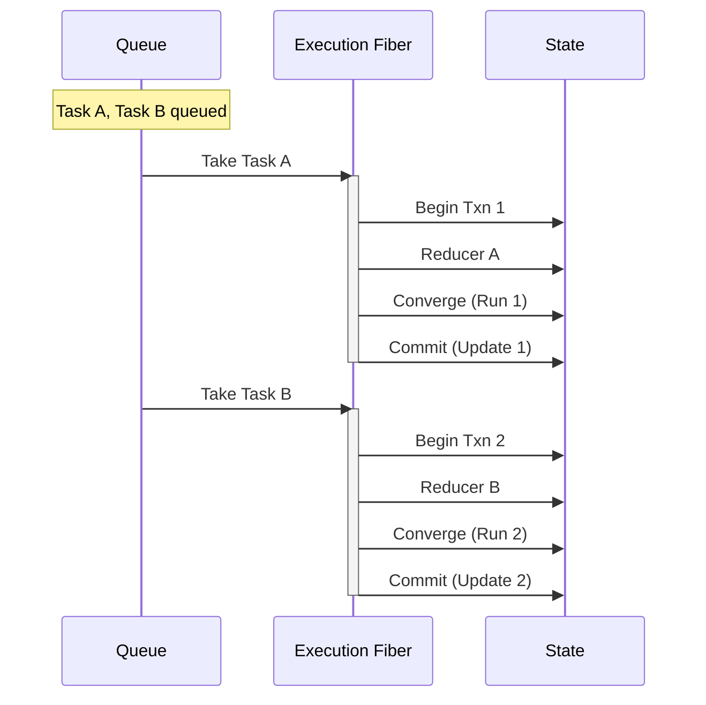
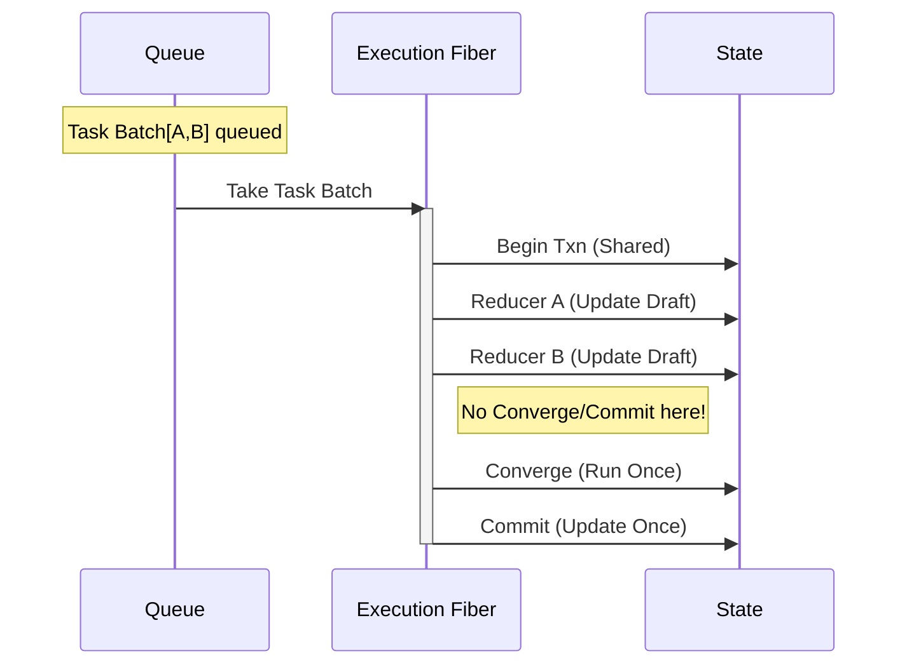

# Logix Runtime 并发模型与批处理机制 (Concurrency & Batching)

> **Status**: Living Document
> **Related**: `specs/019-txn-perf-controls`
> **Target**: Runtime Contributors & Advanced Users

本文档深入解析 Logix Runtime 核心的**串行并发模型**以及 **`dispatchBatch` / `dispatchLowPriority`** 的实现原理。理解这一模型对于掌握性能优化边界和避免竞态条件至关重要。

## 1. 核心铁律：实例级串行队列 (Per-Instance Serial Queue)

Logix Runtime 在并发安全上采用了一种极其简单但健壮的策略：**“单实例、单线程、串行执行”**。

- **隔离粒度**：每个 `ModuleRuntime` 实例拥有独立的执行上下文。不同实例（如 `FormA` 和 `FormB`）之间是完全并行、互不干扰的。
- **串行机制**：每个实例内部维护一个串行事务队列（默认 FIFO；启用 Txn Lanes 时为 urgent/nonUrgent 双车道 urgent-first）和一个后台消费 Fiber。
- **行为承诺**：无论来自 React 组件、外部 WebSocket 事件还是内部 Effect 程序的 `dispatch` 调用，都不会立即修改状态，而是被封装为 Task 入队，等待后台 Fiber 依次取出排队执行。

### 形象比喻：银行柜台模型

- **ModuleRuntime** = 只有一个柜员的银行网点。
- **txnQueue** = 取号机的等待队列。
- **dispatch** = 客户取号排队。

这种设计彻底消除了单实例内的**写竞态 (Write Race Conditions)**。开发者永远不需要担心“两个 dispatch 同时修改同一个 state 导致数据覆盖”。在微观时间轴上，所有修改绝对有序。

### 1.1 Txn Lanes：关键交互优先 + 非紧急 backlog 追平

在保持“单实例串行”不变的前提下，Runtime 支持一个可选的扩展：**Txn Lanes**（`urgent` / `nonUrgent`）。

- **Lane-aware queue（车道队列）**：当队列里已经有 `nonUrgent` backlog 时，新的 `urgent` 事务仍可优先执行（urgent-first），避免低优先级工作“堵塞关键交互”的长尾。
- **Work loop（分片工作循环）**：`nonUrgent` backlog 不要求立刻清零，而是按预算分片执行；片与片之间显式让路给 `urgent`，输入停止后再追平。

当前首个落地的 `nonUrgent` follow-up work 是 043 的 **deferred converge flush**（`TxnWorkKind = "trait:deferred_flush"`）：

- 触发点：在一次正常事务窗口内，若存在 deferred traits 且开启 time-slicing，则本次事务只跑 immediate scope，deferred scope 被延后。
- 执行点：延后工作被入队为 `nonUrgent`，并可能被拆成多个切片事务执行；切片间 `yieldNow()` 给 `urgent` 让路。
- 合并/取消：输入持续到来时允许 coalesce/cancel 中间态（跳过被新输入覆盖的切片），但必须保证最终一致性。
- 饥饿保护：backlog 滞后超过 `maxLagMs` 时触发可解释的升档/强制追平策略，避免永远追不上。

## 2. 事务窗口与原子性 (Transaction Window)

每一个从队列中取出的 Task，都会在一个独立的 **StateTransaction (事务窗口)** 中执行。

- **开启 (Begin)**：创建一份当前 State 的浅拷贝（Draft）。
- **执行 (Execute)**：Reducer 和副作用逻辑在 Draft 上进行修改。此时外部读取到的仍是旧 State。
- **收敛 (Converge)**：执行 StateTrait 的增量派生（Computed/Link）和校验（Validate）。
- **提交 (Commit)**：原子替换 State，发出 **0/1 次** `state:update` 事件通知订阅者。

## 3. dispatchBatch 原理

`dispatchBatch` 在这个串行模型中，扮演了**“批量业务办理”**的角色。

当调用 `runtime.dispatchBatch([A, B, C])` 时，并不是把 A、B、C 分别入队，而是**把“执行 [A, B, C]”这一整个过程作为一个原子 Task 入队**。

### 3.1 核心机制

1.  **物理层：原子入队**
    整个 Batch 操作被视为一个不可分割的单元放入 `txnQueue`。这意味着一旦 Batch 开始执行，它就“霸占”了当前实例的执行权，直到整个 Batch 结束（Commit）前，队列中后续的任何 `dispatch` 都必须等待。

2.  **事务层：单窗口循环**
    Runtime 开启**一个** `StateTransaction`，然后在窗口内循环执行所有 Action。

    **关键点**：在循环结束前，**不发生 Commit，不触发 Converge**。

3.  **数据层：Draft 累积**
    - Action A 修改 Draft -> 产生 Patch A
    - Action B 修改 Draft -> 产生 Patch B
    - Action C 修改 Draft -> 产生 Patch C
    - **结果**：Draft 累积了所有变更，dirty-set 包含了 A+B+C 的所有影响域。

4.  **性能层：延迟收敛 (Deferred Convergence)**
    这是性能优化的核心。Runtime 等到所有 Action 的 Reducer 都跑完后，基于最终的 Draft 和聚合的 dirty-set，**只执行一次** `convergeInTransaction`。
    - **收益**：如果 A 和 B 都修改了字段 `count`，依赖 `count` 的 `computed` 以前会算两次，现在只会算一次。

5.  **通知层：0/1 Commit**
    最终只产生**一条** `state:update` 事件（标记 `commitMode: "batch"`），React 只会收到一次通知，Render 一次。

### 3.2 流程对比

假设我们需要连续执行 Action A 和 Action B。

#### 标准 Dispatch (两次调用)



#### Batch Dispatch (一次调用)



## 4. 最佳实践与约束

1.  **何时使用 Batch？**
    - **初始化/重置**：如“重置表单”+“回填默认值”。
    - **联动回填**：如“选择联系人”后，同时自动填写“电话”、“地址”、“邮箱”三个字段。
    - **性能热点**：任何导致 UI 闪烁或计算卡顿的连续同步操作。

2.  **什么不能放进 Batch？**
    - **IO 操作**：`dispatchBatch` 的回调必须是同步的（虽然 Runtime 内部是 Effect/Promise，但业务逻辑层面不能在 batch 只有等待 IO）。在 Batch 窗口内 `await` 会导致整个 Runtime 实例卡死（Head-of-Line Blocking）。
    - **依赖中间状态的逻辑**：虽然在 Reducer 内部能读到 Draft 的最新值，但在 Action A 和 Action B 之间，**Trait 的 Computed 值尚未更新**（因为 Converge 被推迟到了最后）。
      - _警示_：如果你指望 Action A 触发 Computed 更新，然后 Action B 读取这个 Computed 新值，那么在 `dispatchBatch` 中**读到的将是旧值**。在这种强依赖派生顺序的场景下，应拆分为两个独立 `dispatch` 或手动计算。

## 5. 代码映射 (Implementation Map)

| 概念         | 对应源码文件/位置                              | 说明                                     |
| :----------- | :--------------------------------------------- | :--------------------------------------- |
| **串行队列** | `ModuleRuntime.ts` / `txnQueue`                | `Queue.unbounded` + `enqueueTransaction` |
| **Txn Lanes** | `ModuleRuntime.txnQueue.ts`                    | urgent/nonUrgent 双队列（urgent-first）  |
| **Work loop** | `ModuleRuntime.ts` / deferred converge scheduler | `nonUrgent` 分片执行 + 片间让路 + coalesce |
| **批量入口** | `ModuleRuntime.ts` / `runDispatchBatch`        | 循环调用 `dispatchInTransaction`         |
| **事务循环** | `ModuleRuntime.ts` / `runWithStateTransaction` | 只有 body() 执行完才走后续 commit 流程   |
| **延迟收敛** | `ModuleRuntime.ts` / 1200行附近                | `convergeInTransaction` 位于 body() 之后 |

## 6. dispatchLowPriority：低优先级通知（不改变事务语义）

> TL;DR：`dispatchLowPriority` **不会改变 reducer / converge / commit 的正确性与顺序**，只会把本次提交的 `priority` 标记为 `low`，交由订阅侧（尤其是 React ExternalStore）用更温和的调度策略合并通知，从而降低高频渲染压力。

### 6.1 Core：在事务上下文写入 commit meta

入口：`ModuleRuntime.dispatchLowPriority(action)`

- 实现：`packages/logix-core/src/internal/runtime/ModuleRuntime.dispatch.ts`
  - `runDispatchLowPriority` 在 `runWithStateTransaction(...)` 的事务窗口内写入：
    - `commitMode = "lowPriority"`
    - `priority = "low"`
  - 然后复用同一套 `dispatchInTransaction(action)` 逻辑执行 reducer + 诊断事件记录。
- 事务提交：`packages/logix-core/src/internal/runtime/ModuleRuntime.transaction.ts`
  - 提交时从 `txnContext.current` 读取 `commitMode/priority`，写入 `state:update` 的 `meta`，并通过 `changesWithMeta(...)` 对外暴露。

**重要含义**

- `lowPriority` 影响的是 **commit meta**，而不是 “Action 入队优先级 / 事务执行优先级”。
- `dispatchLowPriority` 仍然通过实例级 `txnQueue` 串行化（同样入队、同样一次事务窗口）。

### 6.2 React：ExternalStore 根据 meta.priority 调度通知

React 订阅侧：`@logix/react` 的 ExternalStore

- 实现：`packages/logix-react/src/internal/ModuleRuntimeExternalStore.ts`
  - 订阅 `moduleRuntime.changesWithMeta(...)`，每次拿到 `{ value: nextState, meta }`。
  - `meta.priority === "normal"`：用 `queueMicrotask` 尽快 flush（并取消任何待执行的 lowPriority 通知）。
  - `meta.priority === "low"`：优先使用 `requestAnimationFrame`（无则 `setTimeout`）延后 flush，并额外用 `setTimeout(maxDelay)` 做“最终必达”兜底（默认约 16ms / 50ms）。

配置键落点：

- `logix.react.low_priority_delay_ms` / `logix.react.low_priority_max_delay_ms`（读取实现：`packages/logix-react/src/internal/config.ts`）

### 6.3 何时用 lowPriority（实现视角的经验法则）

- 适合：统计/摘要/非关键提示/后台刷新这类“可以晚一点更新，但必须最终更新”的 UI。
- 不适合：输入框 value / 光标位置 / hover 高亮 / 拖拽反馈 等“必须立即反馈”的交互关键路径。

## 7. Architecture Diagrams (Excalidraw Prompts)

由于当前无法自动生成图片，以下是架构图的 Excalidraw 提示词，可用于辅助构图：

### Diagram 1: Logix Runtime Serial Concurrency Flow

```text
High-density **Excalidraw-style** architecture diagram: "Logix Runtime Serial Concurrency Flow".

**Style Requirements:**
- **Hand-drawn look**: Rough lines, sketchy borders, handwritten-style font (Virgil or similar).
- **Whiteboard aesthetic**: White or light gray background, black ink for main structures.
- **High Density**: Packed with details but organized. Use distinct "hand-drawn" containers/boxes.
- **Color**: Use limited accent colors (pastel blue, soft red, highlighter yellow).

**Content Layout (Left to Right):**

1.  **Event Sources (Left)**
    - [Group] **Inputs**:
      - User Interaction (Mouse Click icon)
      - WebSocket Event (Lightning icon)
      - Effect Program (Code block icon)
    - **Actions**: Represented as small envelopes/cards labeled "A1", "A2", "Batch[B1,B2]".

2.  **Runtime Barrier (Center-Left)**
    - [Process] **ModuleRuntime Instance**: Large container.
    - [Cylinder] **txnQueue**: Vertical queue structure.
      - Contains: "Task 1", "Task 2 (Batch)", "Task 3".
      - Label: "Serial Force (FIFO)".
    - Annotation: "Race Condition Killer!".

3.  **Execution Core (Center)**
    - [Process] **Worker Fiber**: Running figure icon.
    - [Box] **StateTransaction**: The active window.
      - Inside:
        - **Draft State**: "S'" (mutable).
        - **Reducer**: Gears grinding "A1" into "S'".
        - **DirtySet**: "path: a.b".
    - Arrow "Loop": For batch, arrow loops back to Reducer before exiting.

4.  **Convergence & Output (Right)**
    - [Diamond] **Converge**: "Computed/Validate".
      - Input: "Draft + DirtySet".
      - Output: "Final patches".
    - [Database] **Commit**: "StateRef (Atomic Swap)".
    - [Cloud] **React/Devtools**: "Notify (once)".

**Composition details:**
- **Arrows**: "Dispatch" flows into Queue. "Task" flows into Worker.
- **Contrast**: Queue is "Blue" (Safe). Worker is "Yellow" (Busy).
- **Icons**: Lock icon on Queue (Thread Safe).
```

### Diagram 2: Logix Batch vs Serial Comparison

```text
High-density **Excalidraw-style** architecture diagram: "Logix Batch vs Serial Comparison".

**Style Requirements:**
- **Hand-drawn look**: Rough lines, sketchy borders, handwritten-style font (Virgil or similar).
- **Whiteboard aesthetic**: White or light gray background, black ink for main structures.
- **High Density**: Packed with details but organized. Use distinct "hand-drawn" containers/boxes.
- **Color**: Use limited accent colors (pastel blue, soft red, highlighter yellow).

**Content Layout (Top vs Bottom):**

1.  **Scenario A: Standard Serial Dispatch (Top)**
    - **Flow**: Dispatch(A) -> Dispatch(B).
    - **Timeline**:
      - [Box] **Txn 1**: Reducer A -> Converge -> Commit (Update #1).
      - [Gap] Small delay.
      - [Box] **Txn 2**: Reducer B -> Converge -> Commit (Update #2).
    - **Result**: [Eye Icon] **2 Renders** (Flicker).
    - **Color**: Txn boxes are "Blue".

2.  **Scenario B: Batch Dispatch (Bottom)**
    - **Flow**: DispatchBatch([A, B]).
    - **Timeline**:
      - [Long Box] **Txn Batch**:
        - Reducer A -> (Draft S')
        - Reducer B -> (Draft S'')
        - [Diamond] **Converge** (Once!)
        - [Star] **Commit** (Update #3).
    - **Result**: [Eye Icon] **1 Render** (Smooth).
    - **Color**: Txn box is "Green" (Optimized).

**Composition details:**
- **Annotation**: "Draft Accumulation" inside the Batch box.
- **Icons**: Red "X" near Top (Bad). Green Checkmark near Bottom (Good).
- **Arrows**: Show flow of time from Left to Right.
```
