# Logix 平台视觉资产索引 (Visual Assets Index)

本文档是 Logix 平台高保真 UI 概念和 UX 规格的视觉指南。为了更好地理解设计意图，下列图片均配有背景说明。

---

## 1. 核心平台与运行时 (Core Platform & Runtime)

展示平台的基础编排能力、Trait 系统以及运行时观测能力。

### L2 Galaxy 编排视图

> **背景说明**：Logix 的核心编排界面，采用了 "Architecture as View" 的设计理念。它不再是低效的连线图，而是高维度的意图拓扑，让架构师和开发者能一眼看清模块间的依赖关系和数据流向。

### 统一 Trait 构建器

> **背景说明**：针对复杂业务逻辑（Trait）的可视化配置器。它解决了传统 Excel 无法定义复杂联动逻辑的痛点，通过结构化的 UI 让开发者直观地配置字段间的依赖、校验和副作用。

### 通用运行时 Spy (Universal Spy)

> **背景说明**：Logix 运行时的上帝视角。它能实时展示当前系统的所有状态、信号流转和副作用执行情况，是调试复杂交互逻辑的终极武器。

### 时光机与 Diff 分析

> **背景说明**：基于确定性回放（Deterministic Replay）的调试工具。开发者可以像看视频一样回放之前的用户操作，并对比不同时刻的状态差异（State Diff），快速定位 Bug。

### 能力市场 (Pattern Marketplace)

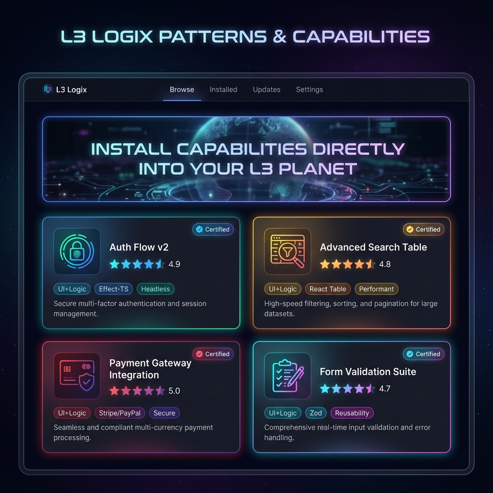

> **背景说明**：复用已有的业务模式（Pattern）和资产。旨在通过标准化的物料降低重复造轮子的成本，促进企业级资产的沉淀与流通。

### 意图到代码实时转换

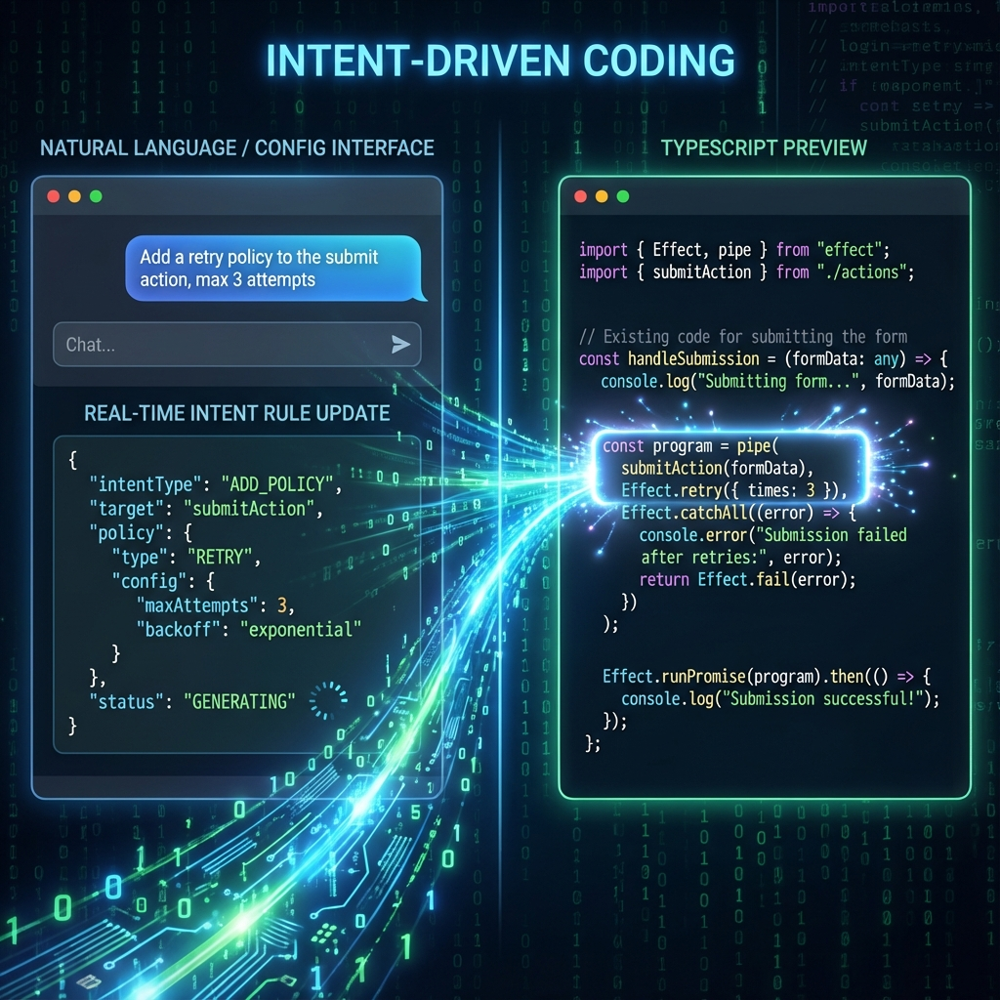

> **背景说明**：展示了 Intent DSL 如何实时映射为高质量的 TypeScript 代码。体现了 Logix "Code as Truth" 的核心原则，生成的代码既可读又可维护。

---

## 2. 规格驱动开发 (SDD Lifecycle)

可视化 "Living Spec" 从头脑风暴到落地执行的全生命周期。

### 规格编辑器 (Spec Editor)

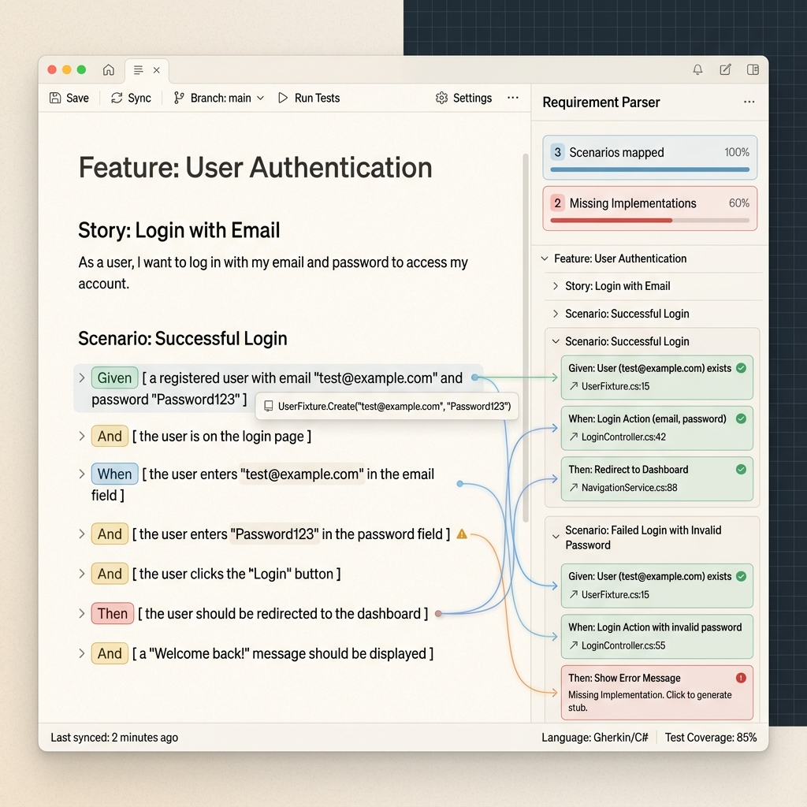

> **背景说明**：SDD 的核心界面。文档不再也是死文本，而是包含可执行逻辑的 "Living Document"。用户可以直接在文档中插入逻辑块，实现文档与代码的同构。

### 模块脚手架

> **背景说明**：基于规格自动生成代码结构的工具。它确保了项目结构的一致性，让开发者从繁琐的配置工作中解放出来，专注于业务逻辑的实现。

### 需求追溯矩阵

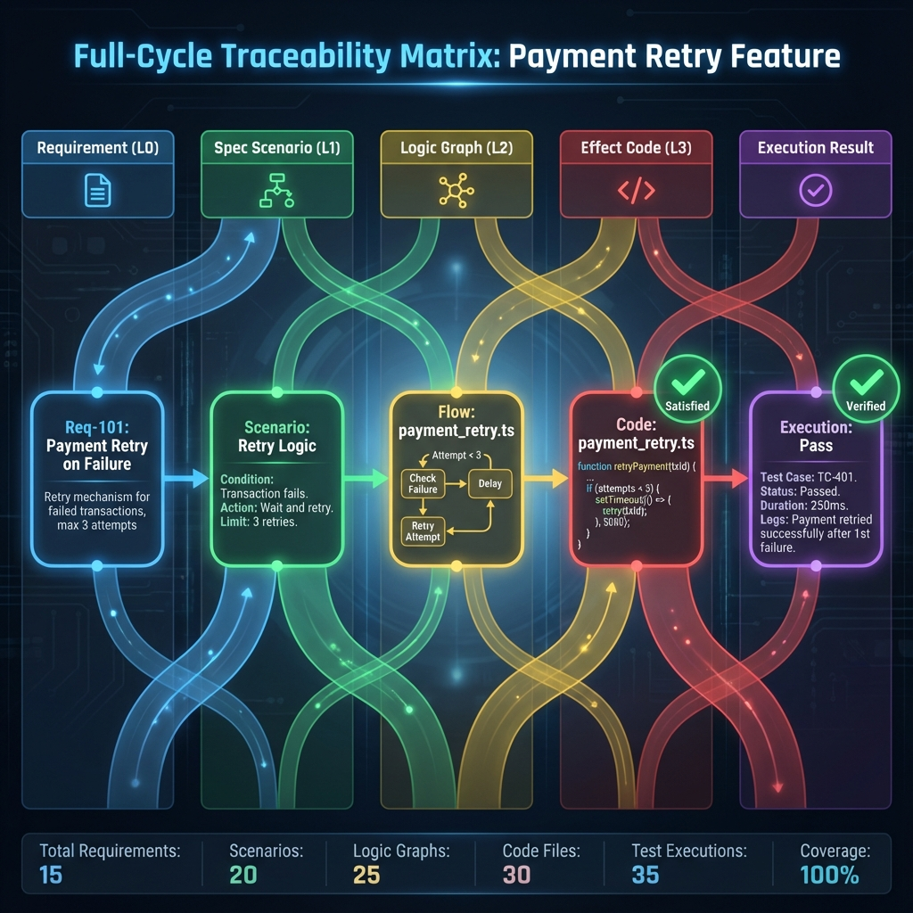

> **背景说明**：连接需求、代码和测试用例的纽带。通过可视化的矩阵，PM 和 QA 可以清晰地看到每一个需求是否都有对应的代码实现和测试覆盖，杜绝需求遗漏。

### AI 规格头脑风暴

> **背景说明**：利用 AI 辅助将自然语言需求转化为结构化的 Spec Block。极大地降低了编写形式化规格的门槛，让非技术人员也能参与到规格定义中。

### 嵌入式逻辑流

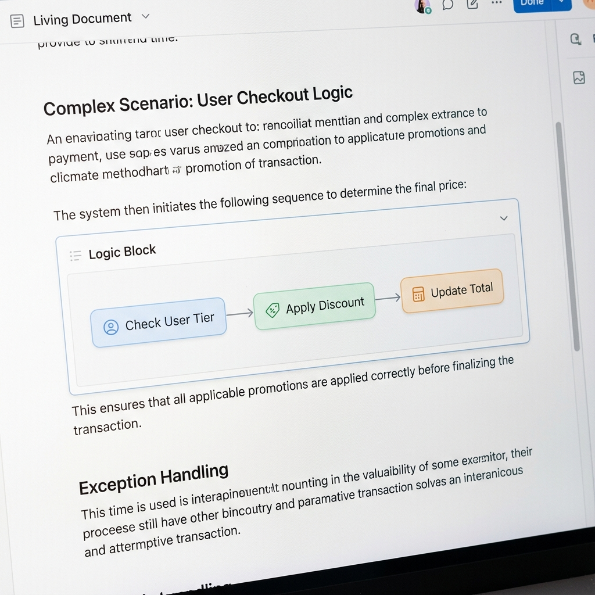

> **背景说明**：在规格文档流中直接嵌入的逻辑视图。保证了阅读文档时上下文的连贯性，不需要在文档和代码编辑器之间反复跳转。

### 实时验收 (Live Acceptance)

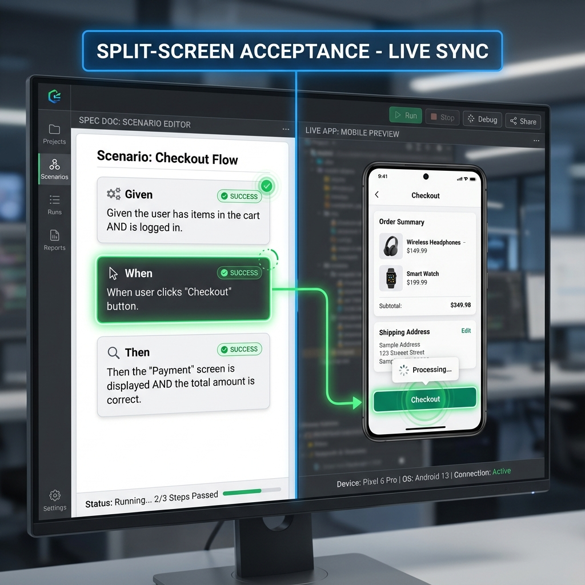

> **背景说明**：在开发过程中实时验证代码是否满足规格要求。通过红绿灯式的反馈，让开发者对交付质量充满信心。

### 块级评审 (Block Review)

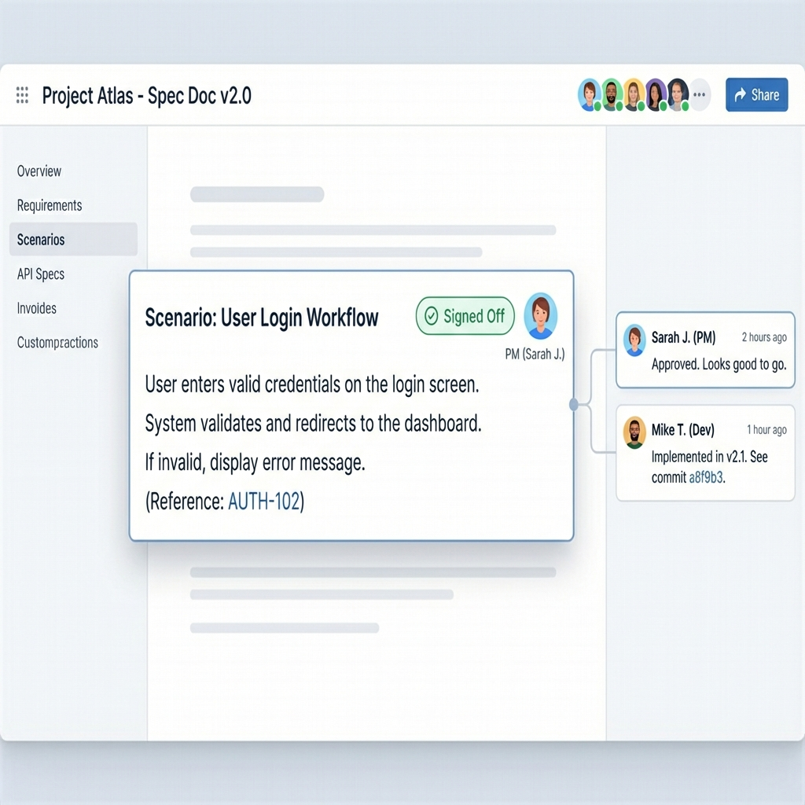

> **背景说明**：精细化的变更签发流程。相比于粗粒度的文件级评审，Logix 支持针对单个逻辑块的 Review，让协作更加精准高效。

---

## 3. 产品经理意图编排 (PM Intent Orchestration)

面向非技术用户的 Grounded UX，用于定义约束和解决冲突。

### 需求收集工作台

> **背景说明**：处理非结构化需求的入口。PM 可以将散落在聊天记录、邮件里的需求汇聚于此，逐步清洗为结构化的意图。

### 配置实时校验

> **背景说明**：配置即校验。当 PM 修改业务规则时，系统实时分析其影响范围和潜在错误，将问题拦截在定义阶段，而不是留给开发去发现。

### 冲突决议 UI

> **背景说明**：当不同的业务规则（如不同地区、不同角色的策略）发生冲突时，提供可视化的界面帮助 PM 设定优先级，裁决冲突。

### 规格历史与问责

> **背景说明**：Git 风格的业务逻辑版本控制。每一次规则的变更都有迹可循，清楚地记录了是谁、在什么时候、因为什么原因修改了逻辑。

---

## 4. Logix 意图工坊 (Logix Intent Studio)

这是 "Excel Killer" 的终极形态，展示了从概念验证到生产级系统的演进。

### Phase 1: 概念验证 (Conceptual Playground)

#### 智能 Schema 网格

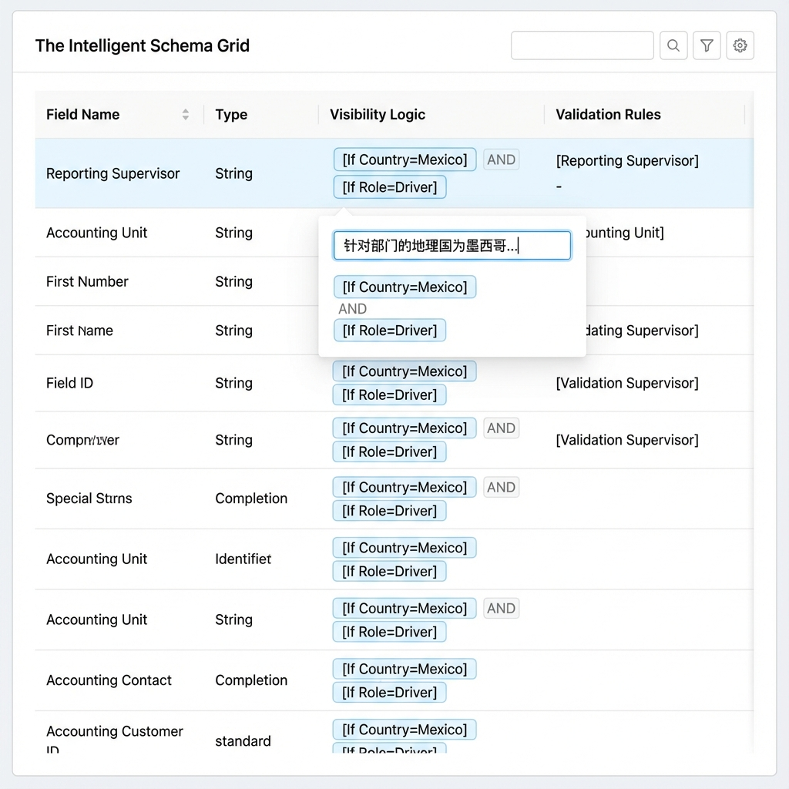

> **背景说明**：早期的逻辑感知表格概念。尝试打破 Excel 的二维限制，引入类型感知和逻辑联动。

#### 冲突熔断 (Conflict Breaker)

> **背景说明**：可视化的逻辑重叠分析。使用 Venn 图的形式直观地展示规则冲突的区域（例如："既必填又隐藏"），这是 Excel 永远无法做到的。

#### 遗漏卫士 (Omission Guard)

> **背景说明**：基于最佳实践的 AI 建议。当用户配置了 "隐藏" 却忘了 "重置值" 时，系统会像贴心的助手一样给出提示，防止脏数据产生。

#### 智能摄入 (Smart Ingestion)

> **背景说明**：从文本到逻辑芯片的魔法转换。PM 只需要框选自然语言文本，AI 就能自动生成对应的结构化逻辑 Chips。

#### 工坊布局 (Studio Layout)

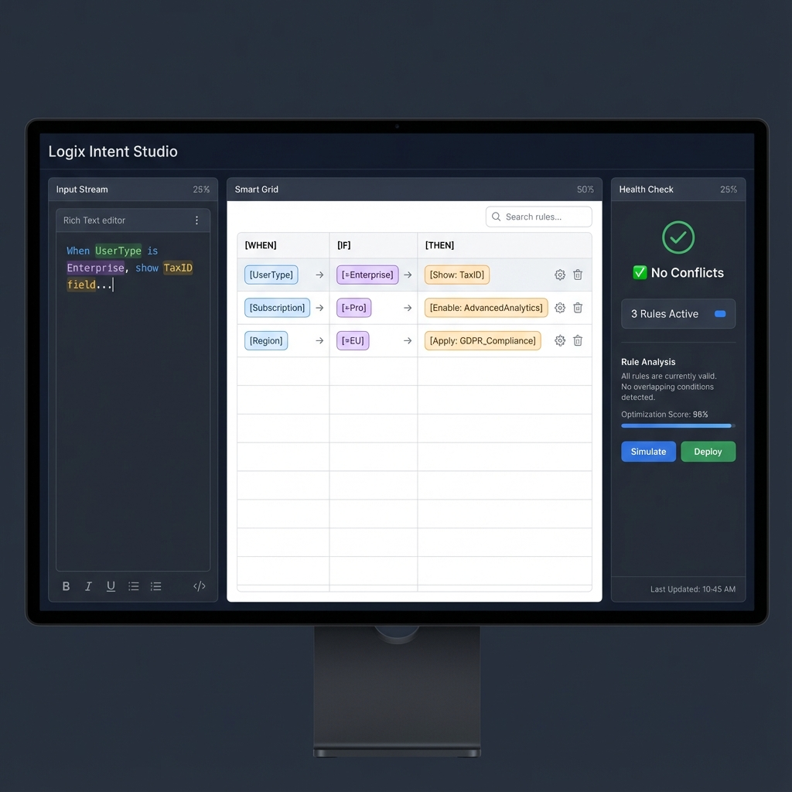

> **背景说明**：确立了 "左文、中表、右健康" 的三栏式经典架构。左侧是输入流，中间是决策网格，右侧是系统健康度，层次分明。

### Phase 2: 生产级 UI (Production-Grade SaaS)

完全对标 Linear/Vercel 等顶级 SaaS 产品的最终交付视觉。

#### 生产环境工作区

> **背景说明**：Logix Studio v1.0 的全貌。深色侧边栏搭配清爽的内容区，体现了专业工具的冷静与高效。

#### 网格微交互详情

> **背景说明**：像素级的细节展示。Logic Chips 不仅仅是色块，而是具备实体感的可交互组件；操作菜单精准、清晰，提供了极致的录入体验。

#### AI 逻辑评审 (Diff Review)

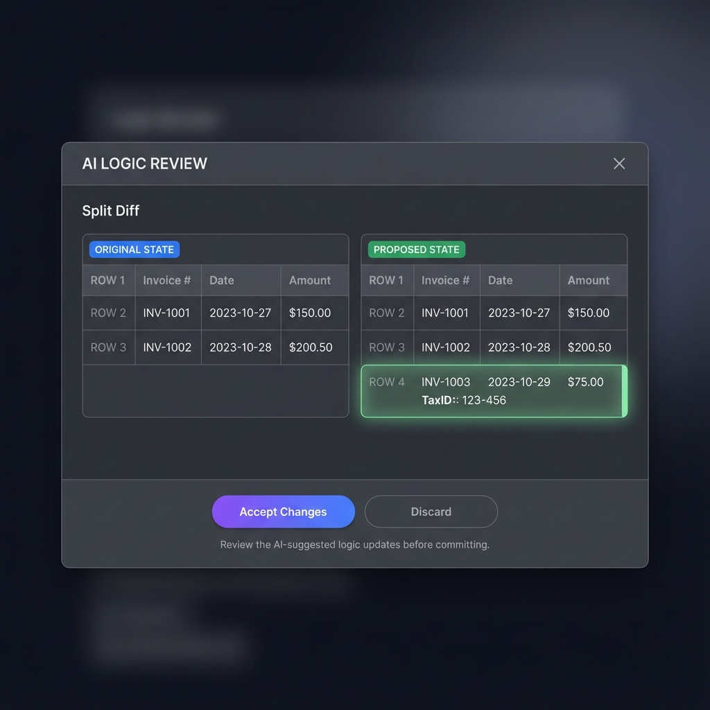

> **背景说明**：类 GitHub 的逻辑变更 Diff 视图。当 AI 提议修改逻辑时，通过左右分栏的对比，让变更一目了然，确保每一次 Merge 都心中有数。

#### 移动端审批

> **背景说明**：响应式设计的体现。即使在 iPad 上，也能保持与 PC 端一致的逻辑编排体验，满足管理者随时随地审批的需求。

### Phase 3: 纯系统 UI (Pure System UI)

剥离设备边框，聚焦于 "文档与逻辑一体化" 的深度集成展示。

#### 统一工作台 (Unified Workbench)

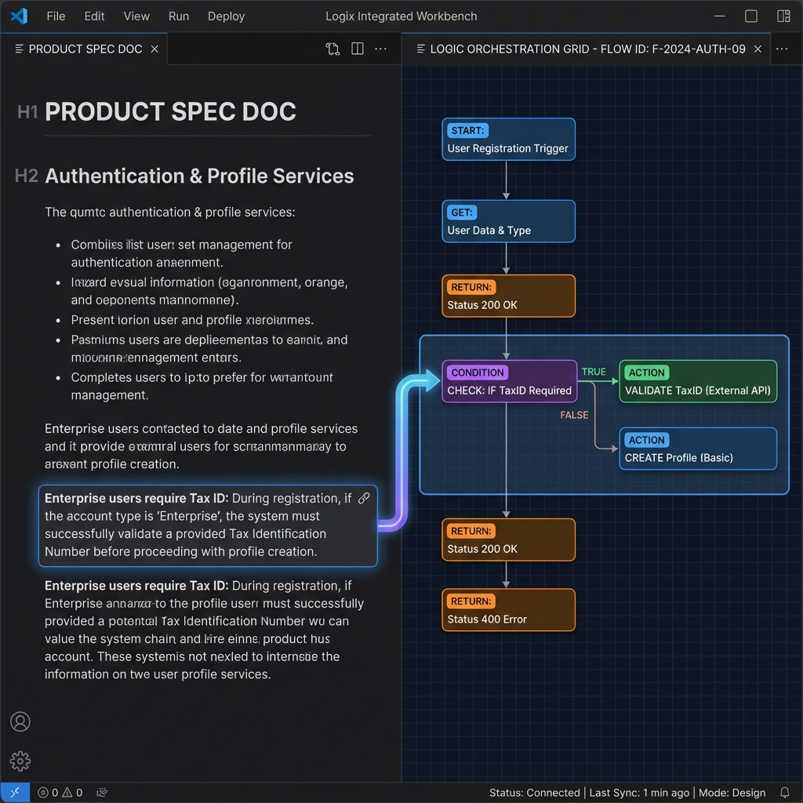

> **背景说明**：完美展示了 "Doc IS Code" 的理念。文档段落与逻辑块之间通过可视化的连线紧密结合，证明了二者在系统底层是互通的。

#### 上下文逻辑气泡 (In-Context Popover)

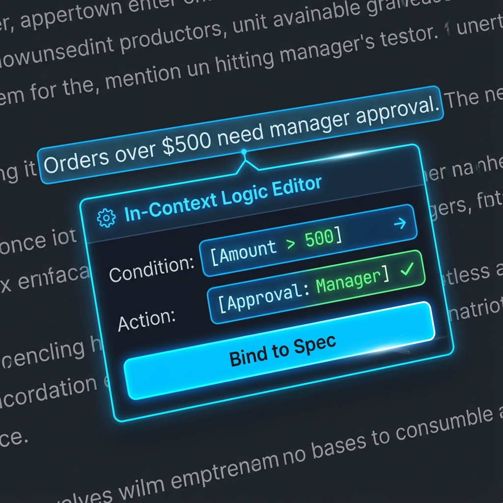

> **背景说明**：原地编排能力的极致体现。用户无需离开当前阅读的文档上下文，就能直接唤起浮层进行逻辑编辑，打断感降至最低。

#### 追溯图层 (Traceability Overlay)

> **背景说明**：叠加在文档之上的数据可视化层。清晰地呈现了 "需求 -> 规则 -> 代码" 的血缘关系，让系统的透明度达到前所未有的高度。

#### 系统状态栏 (Status Footer)

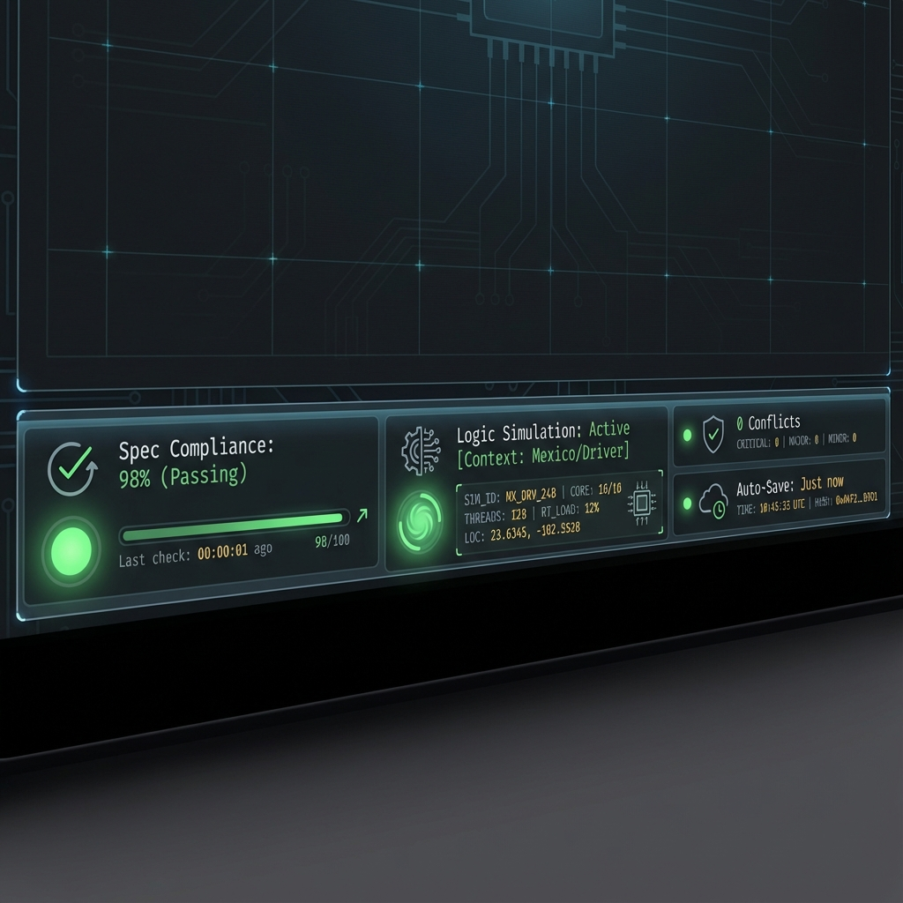

> **背景说明**：系统的 "心跳"。实时展示编译状态、模拟器上下文和冲突检测结果，给予用户 "系统正在活着且健康" 的安全感。
