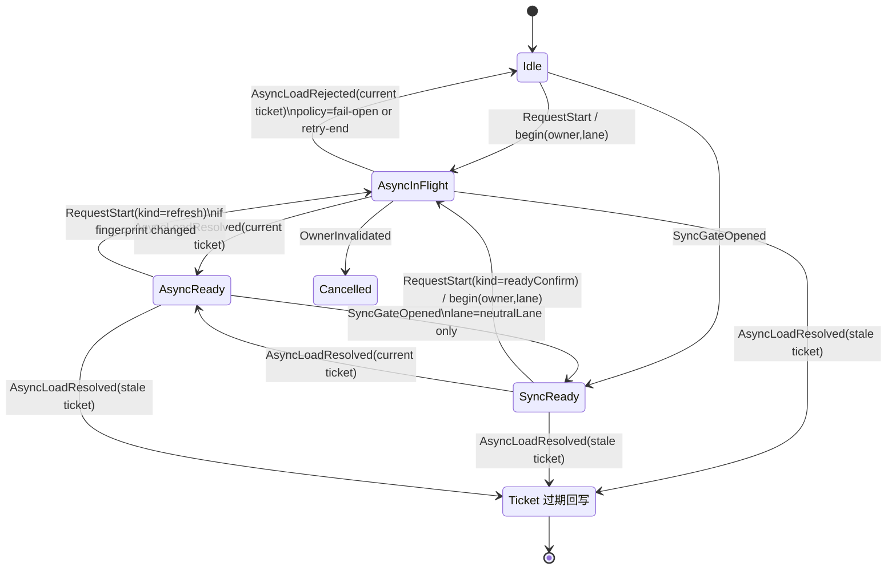

# 2026-03-20 · React controlplane owner/phase phase-machine（implementation-ready 设计包）

> 后续状态更新（2026-03-22）：在该设计包后续路线中，`Stage G6 ControlplaneKernel v1` 已实施并 `accepted_with_evidence`，见 `docs/perf/2026-03-22-react-controlplane-stage-g6-kernel-v1.md`。

## 结论类型

- `docs/spec`
- `implementation-ready design package`

## 范围与约束

本文目标是把更大的 `owner/phase` 状态机重建整理成可开实施线的设计包，用于裁决何时值得从 `P1-6'` 的最小 sync-ready gate 升级到完整 controlplane 重建。

边界：

- 本文不引入新的 public API 约定，也不改动现有 public API 的实现路径。
- 本文不复刻 `boot-epoch config singleflight` 旧题，不把已失败的切法换皮重做。
- 本文把 `P1-6'` 已吸收的最小 gate 视为当前基线，设计聚焦于后续是否要做结构性重建。

输入来源：

- `docs/perf/2026-03-19-identify-react-controlplane.md`
- `docs/perf/archive/2026-03/2026-03-19-p1-6-owner-phase-rebuild.md`
- `docs/perf/archive/2026-03/2026-03-15-r3-react-controlplane-neutral-config-singleflight-failed.md`

## 背景基线（当前已成立的最小正确性）

`P1-6'` 已证明一条最小切口可同时满足：

- config-bearing provider layer 的首个 ready render 正确性
- 同一 owner/phase 的 async config load 去重

该切口落在 `RuntimeProvider` 的最小 gate，处理了：

- config-bearing 路径：`runtime.layer-bound@boot`
- env-only 路径：`runtime.base@ready` 的 async confirm 固定为 1 次，并由 token 去重

剩余问题已更像“是否要升级到更大 owner/phase 状态机”，典型代表是 R3 记录的现象：

- `neutral binding settle` 触发第二轮 async config snapshot load
- 在保持现有语义的前提下，最小修复难以收口，继续叠分支会把 controlplane 变脏

## 术语与对象模型

### 关键目标

把 React controlplane 的“谁在驱动一次 resolve”与“当前处于哪个阶段”显式化，并把它做成可测试、可诊断、可渐进迁移的状态机内核。

### OwnerKey（谁在驱动）

`OwnerKey` 表示一次可去重的控制面所有者。它的唯一职责是单飞维度与取消边界，避免把去重逻辑散落在 `RuntimeProvider` 的条件分支里。

建议 `OwnerKey` 由以下信息拼装成稳定结构（实现时可逐步演进，只要求稳定可比较）：

- `providerId`：provider 实例维度的稳定标识
- `runtimeId`：目标 runtime 维度标识，确保跨 runtime 不共享单飞
- `lane`：控制面通道，至少包含 `configLane` 与 `neutralLane`

注意：

- `OwnerKey` 不能直接绑定到“当次渲染”这种瞬态对象上，否则会把 dedupe 变成随机。
- `OwnerKey` 不能细到每个 config 字段，否则会把单飞维度碎片化，失去去重意义。

### Phase（处于哪个阶段）

`Phase` 表示某个 owner 在某个 lane 上的生命周期阶段。Phase 需要满足：

- 可穷举，状态集合固定
- 转移规则固定，输入事件固定
- 可输出 Slim 的诊断事件，支持定位抖动与重复 load 的原因

### Epoch 与 Ticket（单飞与取消）

每个 `(OwnerKey, lane)` 对应一个 `epoch` 单调递增序列。

- 发起一次异步 load 时，分配一个 `ticket = { ownerKey, lane, epoch }`
- 任意结果回写与 readiness 变更必须携带 ticket
- 若回写时 epoch 已过期，结果直接丢弃

这套规则目标是把“旧请求回写覆盖新请求”转成可证明不可能的结构性约束。

## 设计总览：模块边界

本节给出“实现时可独立落地并写测试”的模块边界。命名为建议名，真实落点以实现时的目录结构为准。

### 1) ControlplaneKernel（纯内核）

职责：

- 接收事件，驱动 `PhaseMachine` 计算下一状态
- 维护 `OwnerRegistry`，分配 epoch，提供 ticket 校验
- 输出诊断事件与最小可观测指标

约束：

- 内核不直接依赖 React，不直接执行异步 IO
- 内核 API 面向“事件输入与状态输出”，可用纯测试覆盖

### 2) OwnerRegistry（owner 生命周期与 epoch）

职责：

- `begin(ownerKey, lane) -> ticket`：分配新 epoch
- `isCurrent(ticket) -> boolean`：判定是否可回写
- `cancel(ownerKey, lane, reason)`：触发状态机进入 `Cancelled` 或 `Stale` 分支

可观测输出：

- 记录 per-owner inFlight 数量
- 记录 epoch bump 频率，作为 boot churn 的结构性信号

### 3) PhaseMachine（纯状态机）

职责：

- 定义状态集合、事件集合、转移函数 `reduce(state, event) -> state`
- 定义每个状态允许触发的副作用意图（由外层执行器执行）

输出方式：

- `nextState`
- `effects[]`：例如 `StartAsyncLoad(ticket, kind)`、`PublishReadySync(...)`、`EmitTrace(...)`

### 4) SnapshotExecutor（副作用执行器）

职责：

- 执行 `effects[]`，真正触发 async snapshot load 或同步 gate 放行
- 将执行结果回传为事件，重新喂给 `ControlplaneKernel`

约束：

- 任何结果回传必须携带 ticket
- executor 层不得做额外隐式去重，去重只由 owner/phase 规则表达

### 5) ReactAdapter（与 React 的最薄粘合层）

职责：

- 把 React 世界的信号翻译成状态机事件
- 把状态机输出的 readiness 信号映射到 provider 的实际行为

约束：

- adapter 不持有复杂状态，不做“多处 if 分支裁决”
- adapter 的复杂度上限由“状态机可测试性”反向约束

### 6) DiagnosticsEmitter（Slim 诊断与采样）

职责：

- 把 phase 变化、epoch bump、load start/end 输出为 Slim 可序列化事件
- 支持 probe/trace 抽样，服务于 perf 证据闭环

约束：

- 默认成本接近零，只有在启用 diagnostics 或采样时产生开销

## 状态机：状态集合与事件集合

本状态机按 lane 拆分。每个 lane 都以 `(OwnerKey, lane)` 为唯一实体。

### Lane 划分（当前版本）

- `configLane`：与 config snapshot load、config-bearing readiness 相关
- `neutralLane`：与 neutral binding settle、env-only readiness 相关

补充说明：

- preload/suspend 等能力若进入“完整重建线”，建议作为第三条 lane 合并到同一 PhaseMachine 内核，避免再出现跨模块隐式耦合。本文先把它当作扩展点，不在最小状态集合里预先塞入全部分支。

### 状态集合（建议）

以每条 lane 的状态为单位，定义一组可复用的基础状态：

- `Idle`：无 inFlight，请求可发起
- `SyncReady`：sync gate 已放行，仍可能需要 async confirm
- `AsyncInFlight`：异步 load 进行中，持有 `ticket`
- `AsyncReady`：异步 confirm 已完成，ready 已可稳定复用
- `Stale`：收到过期 ticket 回写，状态保持不变但输出诊断
- `Cancelled`：owner 被取消，本 lane 不再接收旧结果

### 事件集合（建议）

- `RequestStart({ ownerKey, lane, kind, reason })`
- `SyncGateOpened({ ownerKey, lane })`
- `AsyncLoadStarted({ ticket, kind })`
- `AsyncLoadResolved({ ticket, resultSummary })`
- `AsyncLoadRejected({ ticket, errorTag })`
- `OwnerInvalidated({ ownerKey, lane, reason })`
- `NeutralSettled({ ownerKey, detail })`
- `ConfigFingerprintChanged({ ownerKey, newFingerprint })`

其中 `kind` 用于区分不同触发源，例如 `bootResolve`、`readyConfirm`、`preload`。

## 状态图（高层）

下面给出一个“单 lane 的通用骨架”，实现时对 configLane 与 neutralLane 做实例化，并在转移规则里加入 lane 特有约束。

注：

- `Stale` 在实现里可做成“不会改变状态，只 emit diagnostics”的分支，不必真的落成持久状态。

## 关键规则（把历史失败形态转成硬约束）

### 规则 1：去重维度统一到 OwnerKey 与 lane

任何 async snapshot load 的去重都必须能归到某个 `(OwnerKey, lane)` 的 epoch 单飞上。

这条规则直接针对 R3 的失败形态：`neutral settle` 在 effect 期触发第二轮 async config load。若第二轮 load 不能归入同一 owner/phase 维度，就只能靠条件分支硬挡，最终会失控。

### 规则 2：sync 放行与 async confirm 的关系由 phase 表达

sync gate 放行后是否需要 async confirm，以及 confirm 触发的时机，必须由 phase-machine 明确表达。

当前 `P1-6'` 基线里已存在 “env-only layer 的 async confirm 固定 1 次” 的语义。完整重建时应把这条语义从组件分支提升为状态机规则，做到可测试、可诊断。

### 规则 3：所有异步回写都必须 ticket 校验

任何异步结果回写若 ticket 过期，必须丢弃，并输出 Slim 诊断事件。

这条规则保证 forward-only 演进下可以大胆重排内部结构，同时把回归定位成本压到可控。

### 规则 4：config-bearing 与 env-only 的 lane 分离

config-bearing 的行为与 env-only 的行为可以共享内核，但必须分 lane 表达。

原因：

- config-bearing 关心 “ready 的语义” 与 “config snapshot 正确性”
- neutralLane 关心 “binding settle 的抖动” 与 “是否触发额外确认”

把它们揉在一套隐式 if 里，会重演 “局部指标改善，整体 boot phase 抖动不降” 的局面。

## 迁移策略（从最小 gate 到完整重建）

迁移策略目标是把行为差异控制在可验证范围内，并确保任何一步都能给出清晰的 perf 证据与回归定位锚点。

### Stage A：只加诊断与影子状态机（无行为切换）

产物：

- 定义 `OwnerKey`、`lane`、`phase` 的最小类型与序列化形态
- 在现有路径旁路计算影子 phase，并输出诊断事件
- 在现有集成测试里断言关键 invariant（例如 async confirm 次数、owner 标签序列）

成功门：

- 影子 phase 输出与现有 trace 语义一致
- 新增诊断不引入明显性能开销

### Stage A 实施落地（2026-03-20）

本轮已按 Stage A 完成最小 skeleton，且保持 zero-behavior-change。

已落地：

- 在 `RuntimeProvider` 旁路维护 `(ownerKey, lane)` 的 `epoch + shadow status`（`Idle/AsyncInFlight/AsyncReady`），只做诊断，不改原有 resolve 判定。
- 在现有 async resolve 路径追加影子事件：
  - `trace:react.runtime.controlplane.shadow`：`request-start/request-reused/resolve-commit/resolve-stale-drop/resolve-reject`
  - `trace:react.runtime.controlplane.shadow.invariant`：影子状态不一致时输出告警事件
- 保持原 `trace:react.runtime.config.snapshot` 字段语义，未替换、未删减。
- 集成测试新增 Stage A 断言：`runtime.base + neutral + ready` 的 shadow `epoch` 在 `request-start -> resolve-commit` 闭环内保持一致，且无 invariant 事件。

本轮修改文件：

- `packages/logix-react/src/internal/provider/RuntimeProvider.tsx`
- `packages/logix-react/test/RuntimeProvider/runtime-bootresolve-phase-trace.test.tsx`
- `specs/103-effect-v4-forward-cutover/perf/2026-03-20-react-controlplane-phase-machine-stage-a.react-controlplane-validation.json`
- `specs/103-effect-v4-forward-cutover/perf/2026-03-20-react-controlplane-phase-machine-stage-a.probe-next-blocker.json`

最小验证结果：

1. `pnpm --filter @logixjs/react typecheck:test`：通过
2. `pnpm --filter @logixjs/react exec vitest run test/RuntimeProvider/runtime-bootresolve-phase-trace.test.tsx --pool forks`：`2 passed, 0 failed`
3. `python3 fabfile.py probe_next_blocker --json`：`status=clear`，`blocker=null`

### Stage B：把 async confirm 触发逻辑迁到 executor（行为局部替换）

产物：

- 把 “何时触发 async confirm” 的裁决集中到 `PhaseMachine`
- adapter 变薄，只负责发事件与消费 readiness

成功门：

- 维持 `P1-6'` 已验证的两条硬约束
- R3 记录的重复 async load 能在 phase 规则下被解释，且存在清晰的抑制路径

### Stage C：把 neutral settle 显式化，并建立 lane 间协作协议

产物：

- neutral settle 变成标准事件 `NeutralSettled`
- 明确 “neutral settle 是否允许触发 configLane refresh” 的规则，落在 PhaseMachine

成功门：

- “neutral settle 触发第二轮 async config load” 的现象被消除或被严格界定为可接受的少数情形，并给出可诊断原因码

### Stage D：扩展到 preload/suspend（若裁决进入完整重建线）

产物：

- 把 preload/suspend 的调度也归入同一 kernel，消除跨模块隐式耦合

成功门：

- preload 行为与 ready 语义在同一状态机视角下可解释
- probe 指标无显著退化

### Stage E：owner/phase × preload in-flight 协同（稳定收口）

产物：

- preload lane 从“最小接线”推进到 token 级 in-flight 协同，控制同一 owner/phase token 在 rerender 期间不重复 dispatch。
- 新增 preload lane 的协同原因码：
  - `defer-preload-reuse-inflight`
  - `defer-preload-token-completed`
- preload `warmSync` 与 `preload` 执行路径统一携带当前 preload lane phase，补齐 owner/phase 语义链路。

成功门：

- in-flight rerender 场景下，`defer-preload-dispatch` 只出现一次，后续只允许 `reuse/complete` 跳过原因码。
- 最小验证命令全绿，`probe_next_blocker` 为 `clear`。

### Stage E 实施落地（2026-03-20）

已落地：

- `RuntimeProvider` 新增 preload token 级 in-flight 注册表，避免同 token 被 effect cleanup 中断后重启。
- `trace:react.runtime.controlplane.phase-machine` 在 preload lane 输出复用/完成原因码，收敛 “run/skip” 口径。
- 新增 phase-trace 用例覆盖 “preload in-flight + rerender” 协同路径，约束单次 dispatch 行为。

工件：

- `docs/perf/archive/2026-03/2026-03-20-react-controlplane-phase-machine-stage-e.md`
- `specs/103-effect-v4-forward-cutover/perf/2026-03-20-react-controlplane-phase-machine-stage-e.react-controlplane-validation.json`
- `specs/103-effect-v4-forward-cutover/perf/2026-03-20-react-controlplane-phase-machine-stage-e.probe-next-blocker.json`

### Stage F：preload lane 并入共享 owner registry / cancel boundary

产物：

- 把 preload lane 的 `latestToken/completed/inFlight/retainedCancels` 聚合到按 `ownerKey` 索引的 registry，减少 lane-specific ref 分叉。
- 把 preload lane 的三类取消动作统一到共享 cancel boundary：
  - unmount cleanup
  - token mismatch cleanup
  - defer ready 后的 holder release
- `trace:react.runtime.controlplane.phase-machine` 的 preload 事件补齐 `ownerKey`，便于跨 lane 对齐 owner 语义。

成功门：

- Stage E 的 `single-dispatch + reuse-inflight` 行为持续成立，且不引入新的边界回归。
- preload lane 的状态与取消路径可在同一 owner registry 口径下解释。
- 最小验证命令全绿，`probe_next_blocker` 为 `clear`。

### Stage F 实施落地（2026-03-20）

已落地：

- `RuntimeProvider` 新增 preload lane owner registry entry，统一维护 `latest/completed/inFlight/retainedCancels`。
- preload lane 的 mismatch/unmount/release 全部改走共享 cancel helper，移除独立 ref 分支。
- phase-trace 用例新增 preload `ownerKey` 断言，锁定 registry 口径。

工件：

- `docs/perf/archive/2026-03/2026-03-20-react-controlplane-phase-machine-stage-f.md`
- `specs/103-effect-v4-forward-cutover/perf/2026-03-20-react-controlplane-phase-machine-stage-f.react-controlplane-validation.json`
- `specs/103-effect-v4-forward-cutover/perf/2026-03-20-react-controlplane-phase-machine-stage-f.probe-next-blocker.json`

### Stage G：config/neutral/preload 三 lane owner registry + cancel/readiness 统一桥接（implementation-ready）

目标：

- 在不改 public API、不触 `packages/logix-core/**` 的前提下，把 `configLane / neutralLane / preloadLane` 的 owner registry 口径统一到同一套桥接层。
- 优先统一三类动作的语义：
  - `begin/complete`（token 生命周期）
  - `cancel`（mismatch、unmount、release 的边界）
  - `readiness`（config-ready / defer-ready 的发布口径）

当前裁决：

- Stage G design-only 路由已完成，作为实施前约束基线。
- `G1 owner-lane registry adapter` 已完成实现并通过最小验证，结论为 `accepted_with_evidence`。
- `G2 cancel boundary isomorphic merge` 已完成实现并通过最小验证，结论为 `accepted_with_evidence`。
- `G3 owner-lane phase contract normalization` 已完成实施并通过最小验证，结论为 `accepted_with_evidence`。
- `G5 controlplane kernel v0 (neutral-settle no-refresh)` 已完成独立 worktree 复验并升级为 `accepted_with_evidence`。

`G1/G2` 已吸收约束：

- `G1`：引入 `owner-lane registry adapter`，先覆盖 `configLane/neutralLane` 的 token + cancel + readiness 发布，`preloadLane` 只接 bridge，不改 preload executor。
- `G2`：preload `retainedCancels` 与 config/neutral cancel boundary 做同构合并，统一 owner-lane cancel boundary 生命周期。

`G3` 最小可实施切口（下一实施线唯一建议）：

- 目标：把 `config/neutral/preload` 三 lane 的 phase-machine 决策语义统一到同一 owner-lane contract 层，统一 `action/reason/executor/cancelBoundary/readiness` 的诊断与断言口径。
- 仅改内部实现：
  - `packages/logix-react/src/internal/provider/RuntimeProvider.tsx`
  - `packages/logix-react/test/RuntimeProvider/runtime-bootresolve-phase-trace.test.tsx`
- 保持外部行为：
  - 不改 public API。
  - 不触 `packages/logix-core/**`。
  - `configLane ready` 继续保留 `legacy-control` 执行边界。

`G3` 触发器：

1. `probe_next_blocker` 至少一次可运行，结果为 `clear` 或 `blocked` 但 `failure_kind` 非 `environment`。
2. 出现任一跨 lane 语义漂移信号：
   - `trace:react.runtime.controlplane.phase-machine` 的 `reason/executor/cancelBoundary` 无法在同一 owner-lane 上稳定解释。
   - `runtime-bootresolve-phase-trace` 新增场景需要同时改三处 lane 逻辑才能通过。
3. 仍处于“无 public API 改动”窗口。

`G3` 成功门（实施线）：

1. `runtime-bootresolve-phase-trace` 新增“同 owner-lane contract 一致性”断言通过，至少覆盖 `config ready + neutral ready + preload reuse` 三类场景。
2. `pnpm --filter @logixjs/react typecheck:test` 通过。
3. `pnpm --filter @logixjs/react exec vitest run test/RuntimeProvider/runtime-bootresolve-phase-trace.test.tsx --pool forks` 通过。
4. `python3 fabfile.py probe_next_blocker --json` 为 `clear`。

`G3` 失败门（实施线回退条件）：

- `configLane ready` 出现 executor 漂移，或 `neutral-settled-refresh-allowed` 语义变更。
- `preload` 的 `single-dispatch + reuse-inflight` 断言失效。
- `probe_next_blocker` 仅因 `failure_kind=environment` 无法得出可比结论。

`G4` 边界（不在 G3 内实施）：

- `G4` 才允许讨论把 `configLane ready` 从 `legacy-control` 收敛到 phase-machine executor。
- `G4` 入场前提：`G3` 已 `accepted_with_evidence`，且存在明确收益证据显示 executor 双轨导致维护或性能税。
- 若 `G4` 需要 public API 变更，单独走 proposal 线，不与 `G3` 混线。

`G1` 历史约束：

- 不重做以下失败切口：
  - `boot-epoch config singleflight`
  - `owner-conflict` 小修补
  - Stage A-F 已收口的小切口回滚
- `configLane ready` 在 `G1` 期间保留 `legacy-control` 执行边界，只统一 registry/cancel/readiness 载体。
- 所有新增诊断事件保持 Slim 且可序列化。

### Stage G1 实施落地（2026-03-20）

已落地：

- `RuntimeProvider` 引入共享 owner-lane registry adapter，`configLane/neutralLane` 的 `latest/completed/inFlight` 迁入同一 ownerKey 载体。
- `preloadLane` 接入同一 registry map，保留既有 preload executor 与并发逻辑，仅桥接 readiness 发布。
- `trace:react.runtime.controlplane.phase-machine` 与 `trace:react.runtime.config.snapshot` 在 `config/neutral` 补齐 `ownerKey`，统一跨 lane owner 诊断口径。
- phase-trace 用例补齐三 lane owner registry 一致性断言，覆盖 `neutral/config/preload` 的 ownerKey 与 ownerId 对齐。

工件：

- `docs/perf/archive/2026-03/2026-03-20-react-controlplane-phase-machine-stage-g1-owner-lane-registry-adapter.md`
- `specs/103-effect-v4-forward-cutover/perf/2026-03-20-react-controlplane-phase-machine-stage-g1-owner-lane-registry-adapter.react-controlplane-validation.json`
- `specs/103-effect-v4-forward-cutover/perf/2026-03-20-react-controlplane-phase-machine-stage-g1-owner-lane-registry-adapter.probe-next-blocker.json`

### Stage G2 实施落地（2026-03-20）

已落地：

- `RuntimeProvider` 新增 `OwnerLaneCancelBoundary`，统一承载 cancel 回调与取消状态。
- `config/neutral` 从局部 `cancelled` 标记升级为 owner-lane boundary 生命周期，token mismatch 前置 cancel，并追加 `owner-lane-cancelled` stale 原因码。
- preload holder release 改为复用同一 boundary helper，保留现有 preload executor 与并发逻辑。
- `trace:react.runtime.controlplane.phase-machine` 为三 lane 统一补齐 `cancelBoundary: "owner-lane"` 字段。
- `runtime-bootresolve-phase-trace` 新增 cancel boundary 断言，覆盖 neutral/config/preload 与 preload reuse-inflight。

工件：

- `docs/perf/archive/2026-03/2026-03-20-react-controlplane-phase-machine-stage-g2-cancel-boundary-isomorphic.md`
- `specs/103-effect-v4-forward-cutover/perf/2026-03-20-react-controlplane-phase-machine-stage-g2-cancel-boundary-isomorphic.react-controlplane-validation.json`
- `specs/103-effect-v4-forward-cutover/perf/2026-03-20-react-controlplane-phase-machine-stage-g2-cancel-boundary-isomorphic.probe-next-blocker.json`

### Stage G3 设计收口（2026-03-20）

已落地：

- `G3` 的 implementation-ready 最小切口已固化为 owner-lane phase contract 归约层。
- `G3 trigger` 与 `G4 boundary` 已明确，保持不触 public API。
- 该次 worktree 验证受环境阻塞，按 docs/evidence-only 收口，等待触发器满足后再进实施线。

工件：

- `docs/perf/archive/2026-03/2026-03-20-react-controlplane-phase-machine-stage-g3-owner-lane-phase-contract.md`
- `specs/103-effect-v4-forward-cutover/perf/2026-03-20-react-controlplane-phase-machine-stage-g3-owner-lane-phase-contract.summary.md`
- `specs/103-effect-v4-forward-cutover/perf/2026-03-20-react-controlplane-phase-machine-stage-g3-owner-lane-phase-contract.probe-next-blocker.json`

### Stage G3 实施复核（2026-03-21）

复核结论：

- 本轮按最小实现线尝试进入 `owner-lane phase contract` 代码切口。
- 由于 `node_modules` 缺失，`tsc/vitest` 不可执行，`probe_next_blocker` 仍为 `failure_kind=environment`。
- 为满足“若保留代码必须 accepted_with_evidence”，本轮不保留代码改动，继续按 `docs/evidence-only` 收口。

`G3 trigger / G4 boundary` 口径保持不变：

- `G3` trigger 仍要求 `probe_next_blocker` 给出可比结论，且出现跨 lane contract 漂移信号。
- `G4` 仍要求 `G3 accepted_with_evidence` 后再讨论 executor 收敛；public API 变更继续独立 proposal 分线。

工件：

- `docs/perf/archive/2026-03/2026-03-21-react-controlplane-phase-machine-stage-g3-impl-recheck.md`
- `specs/103-effect-v4-forward-cutover/perf/2026-03-21-react-controlplane-phase-machine-stage-g3-impl-recheck.summary.md`
- `specs/103-effect-v4-forward-cutover/perf/2026-03-21-react-controlplane-phase-machine-stage-g3-impl-recheck.react-controlplane-validation.json`
- `specs/103-effect-v4-forward-cutover/perf/2026-03-21-react-controlplane-phase-machine-stage-g3-impl-recheck.probe-next-blocker.json`

### Stage G3 实施落地（2026-03-21）

落地结论：

- 在不改 public API、不触 `packages/logix-core/**` 的约束下，完成 `owner-lane phase contract` 最小切口。
- `runtime-bootresolve-phase-trace` 补齐 owner-lane phase contract 一致性断言组，覆盖 `config ready + neutral ready + preload reuse-inflight`。
- 最小验证闭环全绿，`probe_next_blocker` 为 `clear`，满足 `accepted_with_evidence` 成功门。

工件：

- `docs/perf/archive/2026-03/2026-03-21-react-controlplane-phase-machine-stage-g3-owner-lane-phase-contract.md`
- `specs/103-effect-v4-forward-cutover/perf/2026-03-21-react-controlplane-phase-machine-stage-g3-owner-lane-phase-contract.summary.md`
- `specs/103-effect-v4-forward-cutover/perf/2026-03-21-react-controlplane-phase-machine-stage-g3-owner-lane-phase-contract.react-controlplane-validation.json`
- `specs/103-effect-v4-forward-cutover/perf/2026-03-21-react-controlplane-phase-machine-stage-g3-owner-lane-phase-contract.probe-next-blocker.json`

### Stage G5 kernel v0 证据升级（2026-03-21）

升级结论：

- `G5 controlplane kernel v0 (neutral-settle no-refresh)` 已在独立 worktree 完成同口径复验。
- 最小验证链路全绿：
  - `pnpm --filter @logixjs/react typecheck:test`
  - `pnpm --filter @logixjs/react exec vitest run test/RuntimeProvider/runtime-bootresolve-phase-trace.test.tsx --pool forks`
  - `python3 fabfile.py probe_next_blocker --json`
- `probe_next_blocker` 为 `status=clear`，默认 3 gate 均 `passed`，`threshold_anomalies=[]`。
- 本轮不需要新增代码修补，沿用当前母线实现，把分类从 `merged_but_provisional` 升级为 `accepted_with_evidence`。

工件：

- `docs/perf/2026-03-21-react-controlplane-phase-machine-stage-g5-kernel-v0-evidence.md`
- `specs/103-effect-v4-forward-cutover/perf/2026-03-21-react-controlplane-stage-g5-kernel-v0-evidence.summary.md`
- `specs/103-effect-v4-forward-cutover/perf/2026-03-21-react-controlplane-stage-g5-kernel-v0-evidence.evidence.json`
- `specs/103-effect-v4-forward-cutover/perf/2026-03-21-react-controlplane-stage-g5-kernel-v0-evidence.validation.typecheck.txt`
- `specs/103-effect-v4-forward-cutover/perf/2026-03-21-react-controlplane-stage-g5-kernel-v0-evidence.validation.vitest.txt`
- `specs/103-effect-v4-forward-cutover/perf/2026-03-21-react-controlplane-stage-g5-kernel-v0-evidence.probe-next-blocker.json`

## 验证策略（正确性与性能）

### 正确性矩阵（最小集合）

1. config-bearing layer：首个 ready render 读取正确 config，且 async snapshot 数量固定为 1
2. env-only layer：sync 放行成立，同时存在固定 1 次 async confirm，且 owner 标签序列稳定
3. neutral settle：不触发额外的 async config load，或触发必须带可解释的原因码与 ticket
4. owner invalidation：切换 owner 或关键 fingerprint 后，旧结果不会覆盖新状态

### 性能证据（最小集合）

面向 `probe_next_blocker` 与已有 trace 体系，建议固化以下指标：

- `boot wall-clock`：首屏 ready 的总时长
- `trace count`：关键 trace 的计数，包含 config snapshot load 与 confirm
- `epoch bump`：per-owner epoch 增量频率，用于定位 churn 来源
- `inFlight`：并发中的 async load 数量峰值

任何进入完整重建线的实施，都应在同一环境、同一采样参数下给出对比证据。

## 何时停在最小 sync-ready gate，何时升级到完整重建

把裁决做成显式门槛，避免靠感觉开线。

### 继续停在最小 gate 的条件

满足全部条件时，默认不启动完整重建：

- `P1-6'` 的两条硬约束在回归测试与 probe 上持续成立
- 当前 boot churn 的主要问题可以由其他 lane 的独立实验解决，且不要求改动 controlplane 内核
- `RuntimeProvider` 的新增逻辑仍能保持局部、可读、可测试，没有出现明显的规则爆炸

### 启动完整 controlplane 重建的触发条件

满足任一条件时，启动完整重建更划算：

1. R3 类问题持续存在，并且已出现第二个独立症状指向“neutral 与 config 的隐式耦合”，继续打补丁会扩大回归面。
2. 后续关键 cut（例如 Provider 单飞控制面显式化、preload 与 ready 的共享调度）被当前 controlplane 的隐式规则阻塞，无法在一个可证伪的小切口内推进。
3. `RuntimeProvider` 内部出现多处互相牵制的分支裁决，新增用例需要同时改动多个位置才可通过，维护成本进入持续上升区间。

### 启动实施线的入场清单（implementation-ready）

只有在以下工件齐全时才开线，避免“边写边想”导致的发散：

- 有一份最小状态机定义与状态图，包含 lane、OwnerKey、epoch、ticket 的序列化形态
- 有一组针对上文“正确性矩阵”的集成测试或等价回归锚点
- 有一条 perf 证据闭环脚本与基线结果，能稳定复现当前指标
- 明确迁移阶段与回滚策略：至少 Stage A 与 Stage B 的门槛可验收

## 与既有文档的关系

- 本文是“更大 owner/phase 状态机重建”的设计包，用于判断何时值得启动实施线。
- `docs/perf/archive/2026-03/2026-03-19-p1-6-owner-phase-rebuild.md` 记录了最小 gate 的成功证据，作为当前基线与回归锚点。
- `docs/perf/archive/2026-03/2026-03-15-r3-react-controlplane-neutral-config-singleflight-failed.md` 记录了最小修补路径的失败证据，用于反向约束本设计的硬规则。
- `docs/perf/archive/2026-03/2026-03-20-react-controlplane-phase-machine-stage-e.md` 记录 Stage E 的 owner/phase × preload in-flight 协同证据。
- `docs/perf/archive/2026-03/2026-03-20-react-controlplane-phase-machine-stage-f.md` 记录 Stage F 的 preload owner registry / cancel boundary 收口证据。
- `docs/perf/archive/2026-03/2026-03-20-react-controlplane-phase-machine-stage-g-design.md` 记录 Stage G 的 implementation-ready 最小切口与路由决策。
- `docs/perf/archive/2026-03/2026-03-20-react-controlplane-phase-machine-stage-g1-owner-lane-registry-adapter.md` 记录 Stage G1 的最小实施证据与验证结果。
- `docs/perf/archive/2026-03/2026-03-20-react-controlplane-phase-machine-stage-g2-cancel-boundary-isomorphic.md` 记录 Stage G2 的同构合并证据与验证结果。
- `docs/perf/archive/2026-03/2026-03-20-react-controlplane-phase-machine-stage-g3-owner-lane-phase-contract.md` 记录 Stage G3 的 implementation-ready 触发器、成功门与 G4 边界。
