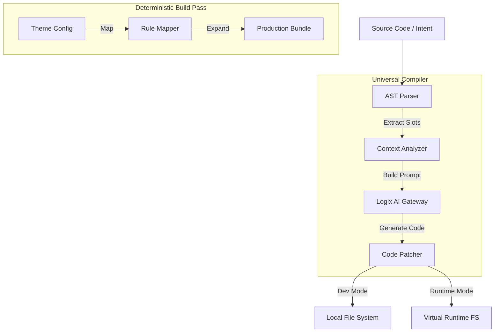

# Universal AI Compilation Toolchain: The "Fleshing" Engine

> **Status**: Consolidated (Toolchain Architecture)
> **Context**: `v3/ai-native`
> **Previous**: `L6/ai-compilation-toolchain.md`

本文档定义 **Logix AI Toolchain**。这是一个环境无关的（Universal）编译器架构，负责解析代码中的 `S.AISlot` 并将其“血肉化” (Fleshing)。

## 1. The Core Philosophy: "Deconstruct, Reconstruct, Combine"

我们的核心流程不是简单的“生成代码”，而是：
1.  **Deconstruct (解构)**: 解析源码，提取 `S.AISlot` 及其上下文 (Context)。
2.  **Reconstruct (重构)**: 将 Slot 转换为 LLM Prompt，调用 AI 生成实现。
3.  **Combine (组合)**: 将生成的代码 (Flesh/Soul) 回填到源码或运行时中。

## 2. Architecture: The "Two-Pass" Compiler

这个 Compiler 包含两个独立的 Pass，分别对应开发期和构建期：



### 2.1 The Modules

1.  **Parser (AST-based)**:
    *   基于 `ts-morph` 或 `babel`。
    *   任务：识别 `<S.AISlot>` 节点，提取 `intent`, `context`, `constraints` 属性值。

2.  **Analyzer (Context Awareness)**:
    *   任务：收集 Slot 周围的上下文。
    *   *Scope*: 当前文件 Imports、定义的变量、Logix Store 定义。
    *   *RAG*: 检索项目中的 Design System 文档、类似组件。

3.  **Patcher (The "Combiner")**:
    *   **Static Mode (CLI/IDE)**: 使用 AST 变换，将 `<S.AISlot>` 替换为生成的 JSX 代码。
    *   **Runtime Mode (Browser/Server)**: 返回一个 `React.lazy` 或 `DynamicComponent` 定义。

## 3. Consumption Scenarios

### 3.1 Scenario A: Local CLI / IDE (Build-Time Fleshing)
*   **User**: 开发者在 VSCode 中写了 Slot。
*   **Tool**: `logix flesh src/components/UserCard.tsx`
*   **Result**: 源码被永久更新。

### 3.2 Scenario B: Platform Backend (Server-Side Fleshing)
*   **User**: 业务人员在低代码平台拖拽了一个 "AI Slot"。
*   **Tool**: Logix Server (Node.js Environment).
*   **Result**: 生成临时的、可执行的页面代码。

### 3.3 Scenario C: Browser Runtime (Just-in-Time Fleshing)
*   **User**: 最终用户在 App 中点击“生成报表”。
*   **Tool**: Logix Runtime (Browser Environment).
*   **Result**: 临时的、内存中的组件实例。

## 4. The "LLM Tool" Integration

为了支持高级 Agent 能力，我们将 Compiler 封装为一个 **Standard Tool**：

```typescript
interface FleshToolInput {
  intent: string;
  context: Record<string, any>;
  outputType: 'ui' | 'live-component';
}

// Agent 调用示例
await tools.logix.flesh({
  intent: "一个带搜索功能的表格",
  context: { columns: ["id", "name"] },
  outputType: "live-component"
});
```

**结论**:
Logix AI Toolchain 是一个**连接器**。它让 "AI 生成" 不再是一个黑盒魔法，而是一个**可控的、标准化的编译过程**。
