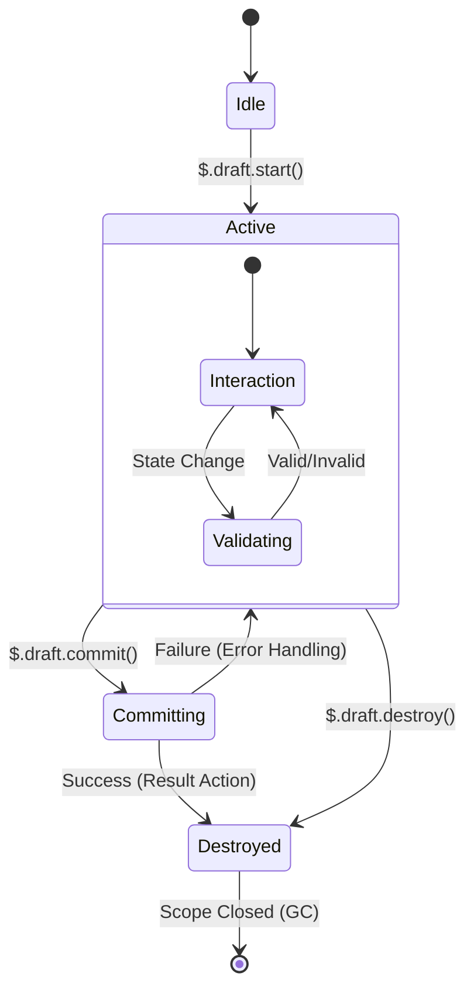

# Draft Pattern: Ephemeral Interaction & Transaction

> **Status**: RFC (Request for Comments)
> **Version**: 2.0 (Deep Dive)
> **Author**: Logix Architecture Team
> **Context**: `v3/effect-runtime`

## 1. Executive Summary

**Draft (草稿)** 是 Logix v3 架构中用于处理 **Ephemeral Interaction (瞬时交互)** 的核心原语。它旨在解决复杂前端应用中“交互状态”与“业务状态”混杂导致的熵增问题。

从计算机科学视角，Draft 是 **Software Transactional Memory (STM)** 思想在 UI 交互领域的工程化投影。它提供了一个 **Long-Lived Interactive Transaction (长活交互式事务)** 环境，具备以下 ACID 特性：

*   **Atomicity (原子性)**: 交互过程中的所有变更要么全部提交 (Commit)，要么全部销毁 (Rollback)。
*   **Consistency (一致性)**: Draft 内部通过 Schema 保证数据的结构完整性，Commit 时进行最终一致性校验。
*   **Isolation (隔离性)**: Draft 运行在独立的 `Effect.Scope` 中，其内部状态对外部 Module 不可见，杜绝“脏读”。
*   **Durability (持久性)**: *注：UI 事务通常不追求持久性，但 Draft 支持序列化 (Serialization) 以实现“中断恢复”。*

> **Scope Clarification (责任边界)**:
> Draft 专注于 **UI/Interaction Transaction (交互层事务)**，即“用户在屏幕前的临时操作序列”。
> 它不应被误解为跨微服务的分布式业务事务 (Saga/TCC)。Draft 的产物通常是一个 Atomic Command，最终由 Domain/Flow 层负责持久化。

## 2. Problem Space & Motivation

在构建复杂 ToB 应用（如 IDE、低代码平台、数据分析工具）时，我们面临三大挑战：

### 2.1 The "State Pollution" Problem (状态污染)
*   **现象**: 为了实现“拖拽排序”，我们在 Domain Store 中引入了 `draggingId`, `currentX`, `currentY`。
*   **后果**:
    *   **性能恶化**: 60fps 的坐标更新导致订阅了 Domain Store 的无关组件（如侧边栏、Header）频繁 Re-render。
    *   **逻辑耦合**: 业务逻辑（如“保存数据”）被迫处理这些临时字段（需手动剔除）。

### 2.2 The "Lifecycle Mismatch" Problem (生命周期错位)
*   **现象**: 一个“三步向导”的 `currentStep` 状态被保存在随页面生命周期的 Store 中。
*   **后果**: 用户关闭向导后，开发者忘记手动 `resetState`。用户下次打开，看到的依然是“第 3 步”的残影。
*   **本质**: 交互的生命周期 < 页面的生命周期。

### 2.3 The "Transaction" Problem (事务语义缺失)
*   **现象**: 用户在“批量编辑”模式下修改了 10 条数据，然后点击“取消”。
*   **后果**: 开发者需要编写复杂的 `undo` 逻辑来回滚这 10 条数据的变更。
*   **本质**: 缺乏一种机制来“原子性地丢弃”一组变更。

## 3. Conceptual Model: The Draft Lifecycle

Draft 是一个有限状态机 (FSM)，其生命周期严格受控于 `Effect.Scope`。



1.  **Idle**: 定义阶段，仅存在 Schema 和 Logic 描述，不占用内存。
2.  **Active**: 实例化阶段。`Scope` 创建，`Ref` 初始化。此时 Draft 接管交互。
3.  **Committing**: 事务提交阶段。执行最终校验，产出 Result。
4.  **Destroyed**: 终态。`Scope` 关闭，所有 Fiber 停止，内存释放。

## 4. Detailed API Specification

### 4.1 Type Definition (`Draft.make`)

我们采用 **Schema-First** 的定义方式，利用 TypeScript 的推导能力实现极致的类型安全。

```typescript
import { Draft, Schema, Effect } from "@logixjs/core";

// 1. Define Schema
const WizardState = Schema.Struct({
  step: Schema.Number,
  formData: Schema.Record(Schema.String, Schema.Unknown)
});

const WizardContext = Schema.Struct({
  mode: Schema.Literal("create", "edit"),
  targetId: Schema.optional(Schema.String)
});

export interface DraftDefinition<S, C, Comp, E, A = {}> {
  readonly id: string;
  readonly schema: {
    readonly state: Schema.Schema<S>;
    readonly context: Schema.Schema<C>;
  };
  readonly initial: (context: C) => S | Effect.Effect<S, E>;

  // Logic: 定义状态流转规则
  readonly logic: (
    $: DraftRuntime<S, C, Comp, E>
  ) => Effect.Effect<void, E, Scope | DraftEnv>; // 允许扩展环境

  // Actions: 定义对外暴露的操作
  readonly actions?: (
    $: DraftRuntime<S, C, Comp, E>
  ) => A;

  // Optional
  readonly computed?: (state: S) => Comp;
  readonly invariants?: ReadonlyArray<(state: S) => boolean | Effect.Effect<void, InvariantError>>; // 支持异步校验
}

export declare const make: <S, C, Comp, E, A>(
  def: DraftDefinition<S, C, Comp, E, A>
) => Draft<S, C, Comp, E, A>;

// 2. Define Draft
export const WizardDraft = Draft.make({
  id: "wizard-interaction",

  schema: {
    state: WizardState,   // Mutable Ref<State>
    context: WizardContext // Readonly Context
  },

  // 3. Define Logic (Effect-Native)
  // $ 类型被自动推导为: DraftRuntime<WizardState, WizardContext>
  logic: ($) => Effect.gen(function* () {

    // Lifecycle Hook: onStart
    yield* $.lifecycle.onStart(
      Effect.log("Wizard Started", $.context)
    );

    // Reactive Logic: 当 step 变化时自动校验
    yield* $.onState(s => s.step).run((step) =>
      step > 1
        ? Effect.gen(function* () {
            const state = yield* $.state.read
            return yield* validateForm(state.formData)
          })
        : Effect.void
    )

    // Internal Action: 处理内部交互
    yield* $.onAction('nextStep').mutate((draft) => {
      draft.step += 1
    })
  })
});
```

### 4.2 Runtime Consumption (`$.draft`)

在主 Module 中，Draft 被视为一个可组合的 Effect 单元。

```typescript
// MainModule.ts
Module.logic(($) => Effect.gen(function* () {

  // Start: 启动 Draft，返回 Handle
  // Handle 包含: { id, state$, actions, commit, destroy }
  const draftHandle = yield* $.onAction('openWizard').run(({ payload }) =>
    $.draft.start(WizardDraft, {
      mode: 'edit',
      targetId: payload.id,
    }),
  )

  // Interaction: 外部也可以通过 Handle 驱动 Draft (可选)
  // 通常 Draft 内部逻辑自洽，外部只需关注 Start/Commit

  // Commit: 提交事务
  yield* $.onAction('submitWizard').run(() =>
    $.draft.commit(WizardDraft).pipe(
      // 错误处理 (Error Boundary)
      Effect.catchTag("ValidationError", (err) =>
        $.actions.toast("表单校验失败: " + err.message)
      ),
      // 成功处理 (Result Handling)
      Effect.andThen((result) =>
        $.actions.updateRecord(result)
      )
    )
  )
}));
```

## 5. Advanced Capabilities

### 5.1 Validation & Invariants (校验与不变量)
Draft 支持定义 **Invariants (不变量)**。在 `commit` 阶段，Runtime 会自动执行所有 Invariants 检查。

```typescript
Draft.make({
  // ...
  invariants: [
    (state) => state.step < 3 || state.hasAgreedToTerms, // 必须同意条款才能过第3步
    (state) => state.items.length > 0 // 列表不能为空
  ]
});
```

### 5.2 Computed State (计算状态)
Draft 内部支持派生状态，这些状态是只读的，且随 State 变化自动更新（Lazy Evaluation）。

```typescript
Draft.make({
  // ...
  computed: {
    canSubmit: (state) => state.isValid && !state.isSubmitting,
    progress: (state) => (state.step / state.totalSteps) * 100
  }
});
```

### 5.3 Serialization & Hydration (序列化与恢复)
为了支持“保存草稿”功能，Draft Runtime 提供了序列化接口。

```typescript
// Save
const snapshot = yield* $.draft.snapshot(WizardDraft);
localStorage.setItem('draft_backup', JSON.stringify(snapshot));

// Restore
yield* $.draft.start(WizardDraft, {
  initialState: JSON.parse(localStorage.getItem('draft_backup'))
});
```

## 6. Integration Strategy (React)

为了让 React 组件能便捷地消费 Draft，我们提供 `useDraft` Hook。

```tsx
// WizardComponent.tsx
import { useDraft } from "@logixjs/react";
import { WizardDraft } from "./logic";

export const WizardComponent = () => {
  // 自动订阅 Draft 状态
  // 如果 Draft 未启动，返回 null 或 fallback
  const { state, actions, commit } = useDraft(WizardDraft);

  if (!state) return null;

  return (
    <Modal>
      <StepIndicator step={state.step} />
      <Button onClick={() => actions.nextStep()}>Next</Button>
      <Button onClick={() => commit()}>Submit</Button>
    </Modal>
  );
};
```

## 7. Performance & Engineering

### 7.1 Memory Management
*   **Scope-based GC**: Draft 的所有资源（State Ref, Subscriptions, Forked Fibers）都绑定在一个 `Scope` 上。
*   **Automatic Cleanup**: 当 `$.draft.destroy()` 被调用（或主 Module 卸载），Scope 关闭，Effect Runtime 保证所有资源被释放，无内存泄漏风险。

### 7.2 Concurrency Control
*   **Singleton by ID**: 默认情况下，同一个 Draft ID 在同一时间只能有一个实例。重复 `start` 会自动销毁前一个实例（或抛错，可配置）。
*   **Locking**: `commit` 过程会自动加锁，防止在提交过程中状态被修改。

## 8. Conclusion

Draft Pattern 不仅仅是一个状态管理工具，它是一种 **架构范式**。它强迫开发者显式地思考交互的边界、生命周期和事务性。

在 Logix v3 中，Draft 将成为构建 **High-Fidelity Interaction (高保真交互)** 的基石，让前端代码在复杂度爆炸的边缘依然保持优雅与可控。

## 9. Industry Landscape & Decision Matrix (竞品分析与决策)

为了验证 Draft 模式的架构优越性，我们对业界主流的状态管理方案进行了深度调研。以下是详细的对比分析与最终决策依据。

### 9.1 XState (Actor Model)

*   **核心理念**: "Everything is an Actor". 通过 `spawn` 创建子状态机，通过 `send` 进行消息传递。
*   **Logix 借鉴点**:
    *   **隔离性**: Actor 拥有私有状态，外部无法直接修改，只能通过消息交互。
    *   **生命周期**: Actor 可以被动态创建和停止。
*   **Gap Analysis (不足)**:
    *   **手动管理成本高**: 开发者必须手动管理 `spawn` 和 `stop`。如果忘记 `stop`，Actor 会一直占用内存（虽然 XState v5 有所改进，但仍需显式管理）。
    *   **定义繁琐**: 定义一个简单的“计数器 Actor”需要大量的样板代码（Machine Definition, Events, Context）。
    *   **非事务性**: Actor 模型本质上是事件驱动的，缺乏“事务提交/回滚”的内建语义。
*   **Logix Draft 优势**: 利用 `Effect.Scope` 实现了 **全自动的 Actor 生命周期管理**。开发者只需 `start`，无需关心 `stop`（Scope 自动处理）。同时提供了 `commit` 语义，补全了事务能力。

### 9.2 Redux Toolkit (Undo/Redo)

*   **核心理念**: "Global Store + History Stack". 通过记录 State 的快照（或 Patch）来实现时间旅行。
*   **Logix 借鉴点**:
    *   **不可变性**: 基于 Immer 的 Patch 机制是实现 Undo 的基础。
*   **Gap Analysis (不足)**:
    *   **全局 vs 局部**: Redux 的 Undo 通常是全局的（或 Slice 级别的）。很难实现“只撤销这个弹窗里的操作，而不影响页面其他部分”。
    *   **状态污染**: 所有的临时状态（Draft）都必须挂载到 Global Store 树上，导致 Store 结构臃肿。
*   **Logix Draft 优势**: Draft 是 **Micro Store**，天然支持 **局部事务 (Local Transaction)**。Draft 的 Undo 只回滚 Draft 内部的状态，绝不影响全局。

### 9.3 React Hook Form (Form State)

*   **核心理念**: "Uncontrolled Inputs + Subscription". 专注于表单状态的性能优化，区分 `defaultValues` (Committed) 和 `currentValues` (Draft)。
*   **Logix 借鉴点**:
    *   **脏检查 (Dirty Check)**: `isDirty` 是判断是否需要提交的关键信号。
    *   **提交生命周期**: `isSubmitting` -> `isSubmitted` 的状态流转非常经典。
*   **Gap Analysis (不足)**:
    *   **场景受限**: RHF 深度绑定 DOM 表单元素，难以用于非表单场景（如：画布拖拽、复杂的步骤条控制器、纯逻辑的倒计时任务）。
*   **Logix Draft 优势**: Draft 可以被视为 **"General Purpose React Hook Form"**。它提取了 RHF 的状态模型（Draft vs Committed），但解耦了 DOM，使其适用于任何 UI 交互场景。

### 9.4 MobX (Volatile State)

*   **核心理念**: "Observable Graph". 允许在 Model 上定义 `volatile` 属性，这些属性不参与序列化。
*   **Logix 借鉴点**:
    *   **瞬时性**: 明确区分了“持久化状态”和“瞬时状态”。
*   **Gap Analysis (不足)**:
    *   **生命周期绑定对象**: MobX 的 Volatile State 通常绑定在 Model 实例上。只要 Model 还在，Volatile State 就还在。这导致了“上次的交互状态残留”问题（Lifecycle Mismatch）。
*   **Logix Draft 优势**: Draft 将状态绑定在 **“交互 (Interaction)”** 上，而不是“对象”上。交互结束，Scope 关闭，状态即焚。

### 9.5 Final Verdict (最终决策)

基于以上分析，我们确认 **Draft Pattern** 是 Logix v3 的最佳选择。它不是对现有库的简单模仿，而是 **Effect-Native 架构下的最优解**：

1.  **架构定位**: 它是 **STM (软件事务内存)** 在前端交互领域的工程化投影。
2.  **核心创新**:
    *   用 **Scope** 解决生命周期问题 (vs MobX/XState)。
    *   用 **Ref** 解决隔离性问题 (vs Redux)。
    *   用 **Transaction** 解决原子性问题 (vs React State)。
3.  **DX 承诺**: 保持 API 的声明式与简洁性，让开发者用写普通 Logic 的方式写事务。

**结论**: Draft Pattern 将作为 Logix v3 处理 Ephemeral Interaction 的标准原语，不再引入第三方状态库。

## 10. Open Questions & Future Work (待定事项)

以下问题尚未在本规范中“钉死”，留待后续 L3/L2 草稿进一步探讨：

1.  **Commit Return Type**: `commit()` 成功后应该返回什么？是 `void`，还是 `Result`，还是 `Effect<Result>`？错误通道如何定义？
2.  **Concurrency**: 重复调用 `start()` 时的行为是“自动销毁前一个”还是“抛错”？多组件共享同一 Draft 时的并发约束如何设计？
3.  **Invariants**: `invariants` 校验是否支持异步 Effect（例如服务端唯一性校验）？
4.  **Composition**: Draft 是否允许嵌套（Draft in Draft）？是否允许组合（Draft A + Draft B）？
5.  **Snapshot Compatibility**: 序列化后的 Snapshot 如果遇到代码版本升级（Schema 变更），如何做兼容或迁移？
