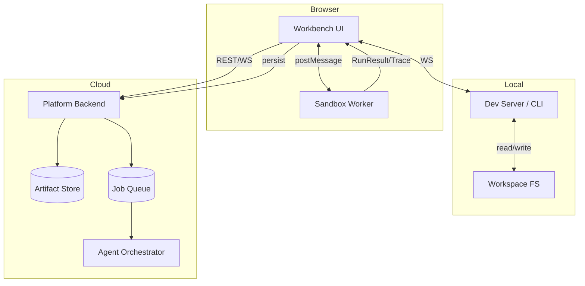
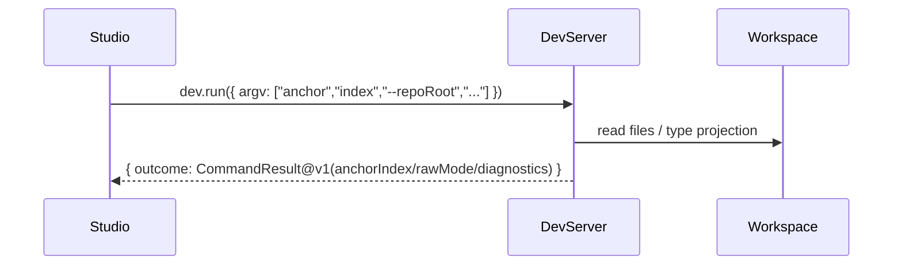
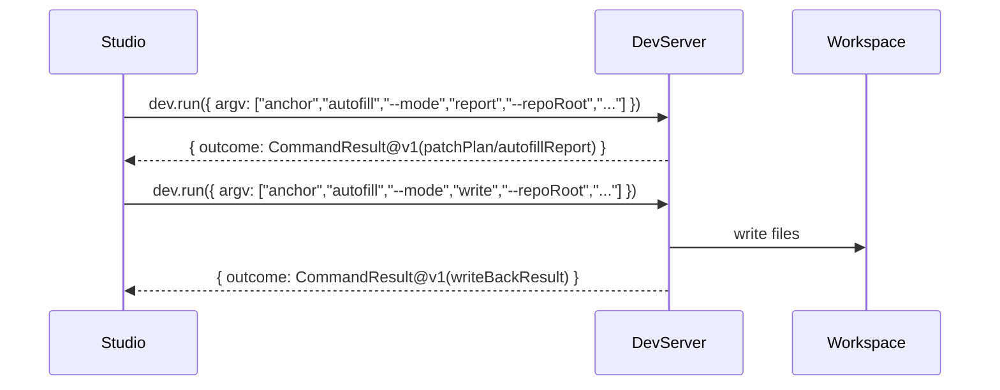
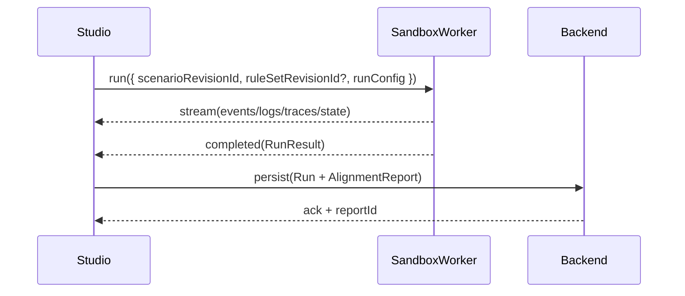

# 30 · 系统设计（总体架构）（Platform Workbench PRD）

## 1. 设计原则（平台侧）

1. **IR‑First**：平台一切可视化/治理/协作都以 IR（IntentRule、Blueprint、Scenario Steps）为中心。
2. **Code‑as‑Truth（带锚点）**：涉及实现语义的最终真理仍在 TS 代码，但平台要能投影/回写（Full‑Duplex）。
3. **显式降级**：可解析子集（白盒）之外一律 Gray/Raw，并在 UI 中显式提示，不做半懂半不懂。
4. **可诊断优先**：任何自动化（Agent/Codegen）都必须产出可解释链路（ruleId/intentId/runId/spanId）。
5. **稳定标识**：平台生成与运行事件中避免随机化漂移（见 `31-data-model-and-contracts.md`）。

## 1.1 平台 IR 分层（Static IR + Dynamic Trace）

平台不应该把“图/表/代码/运行”视作四套真相源；它们必须在统一最小 IR 上收敛，并严格区分静态与动态：

### Static IR（静态意图投影）

- **Spec/Scenario/Steps**：Stage 0（可执行规范的结构化表达）
- **Blueprint**：Stage 1–2（Domain→Schema 的粗粒度骨架）
- **IntentRuleSet**：Stage 3（规则层的统一 IR，R‑S‑T）
- **StateTraitGraph**（如适用）：字段能力/依赖图（模块内部静态依赖）
- **Anchors**：Spec↔Rule↔Code 的稳定引用（blockId/stepId/ruleId + file/span/hash）

### Dynamic Trace（动态执行证据）

- **RunResult**：日志/Trace/StateSnapshot（或 stateDiff）
- **Timeline / EffectOp**：运行时事件流（可被聚合为“规则触发证据”）
- **AlignmentReport**：Spec/Rule 与动态证据的对比结果（通过/失败 + 可行动诊断）

> 上游参考：`../../../sdd-platform/workbench/02-full-duplex-architecture.md`（Code↔Studio↔Runtime）与 `../sandbox-runtime/65-playground-as-executable-spec.md`（Executable Spec Lab）。

## 2. 组件与边界

### 2.1 Browser / Studio（Workbench UI）

- 负责：编辑 Spec/Scenario/Rules、触发 Run、渲染 Trace/对齐报告、发起 Agent 任务
- 不负责：直接读写本地文件系统（必须经 Dev Server/CLI）

### 2.2 Local / Dev Server（Digital Twin）

- 负责：解析 TS（Parser）、生成 AST Patch（Codegen）、运行本地检查（typecheck/lint/test 的 orchestration）
- 负责：向平台提供“可解析投影”（IntentRule/Module graph）与“差分补丁”
- 约束：平台不自动执行破坏性 git 操作；Dev Server 仅在工作区写入文件与产出诊断

### 2.3 Browser / Sandbox Worker（Executable Spec Lab 的运行容器）

- 参考：`../../../sdd-platform/impl/code-runner-and-sandbox.md` 与 `../sandbox-runtime/*`
- 负责：编译（esbuild‑wasm）、运行（Effect/Logix）、输出 RunResult（logs/traces/stateSnapshot）
- 必须：具备硬重置能力（terminate & restart worker），避免死循环卡死

### 2.4 Cloud / Platform Backend

- 负责：用户/权限/审计、资产存储（Feature/Scenario/RuleSet/Run/Report 的版本化）、协作与 Sign‑off
- 可选：运行 Agent Orchestrator（也可本地化，但先按云端占位）

### 2.5 校验引擎（Validation Engine）

平台至少需要两类校验能力，且输出统一的 `diagnostics[]`（结构化、可序列化）：

1. **IR 校验（确定性）**：对 Spec/Steps/Rules/Graph 做静态分析（冲突/循环/非法写入/缺失字段等）
2. **建议引擎（非确定性）**：AI Advisor 生成软建议（遗漏补全/治理建议/重构建议），不得替代硬校验

IR 校验可在 Studio 本地运行（即时反馈），也可在 Backend 运行（协作一致性）；但裁决逻辑必须保持同口径，避免双端分叉。

## 3. 三条关键数据流（必须有清晰契约）

### 3.1 Authoring Flow（Spec/Rule 的版本化编辑）

1. Studio 编辑 Feature/Scenario/RuleSet
2. Backend 生成新 Revision（append‑only）并记录审计信息
3. Studio 以 `artifactId + revisionId` 为单位引用后续产物（runs/reports）

### 3.2 Plan/Code Flow（IR ↔ Code 的双向通道）

1. Studio 请求 Dev Server：通过 `dev.run` 调用 `logix`（085）导出/索引/试跑 → 返回版本化工件（含锚点/诊断）
2. Studio 在 UI 中基于 `CommandResult@v1` 的工件做可解释展示/编辑（不引入第二事实源）
3. Dev Server 通过 `dev.run` 调用写回类命令（079/082/Transform，默认 report-only）→ 返回 `PatchPlan/WriteBackResult`
4. Studio 可再次 `dev.run` 做 Gate（validate/diff）或重导出，校验“结构不漂移”

### 3.3 Run/Align Flow（Scenario → RunResult → Alignment）

1. Studio 选择 `scenarioRevisionId`，下发 RunConfig 到 Worker
2. Worker 编译/运行，返回 RunResult（含 stable runId、traces、stateSnapshot）
3. Studio/Backend 计算 AlignmentReport（可先在前端算，再落库）
4. Report 反向关联到 Scenario/Rule/Code 锚点，用于下一轮迭代

## 3.4 关键时序（建议用序列图把契约钉死）

### 3.4.1 Code → IR（解析投影）

### 3.4.2 IR → Code（生成并写回）

### 3.4.3 Scenario → RunResult → Report（执行与回流）

## 4. 失败恢复与一致性（MVP 也要定）

- **Worker 失控**：必须支持 terminate/restart，并能把本次 run 标记为 failed（带原因与 partial logs）
- **Dev Server 不可用**：平台 UI 仍可读写 Spec/Scenario，并能运行纯前端 Playground（不做 code sync）
- **Revision 冲突**：以 append‑only + 乐观并发（baseRevisionId）处理，冲突显式展示 diff，不做自动合并
