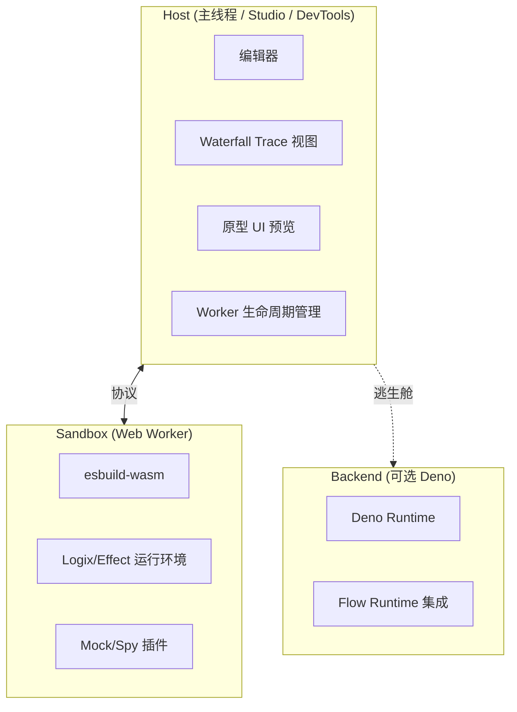

# Sandbox Architecture & Boundary

> 本文档从 `L4/logix-sandbox-verifiable-intent-architecture.md` 下沉整理，作为 Sandbox 主题的架构基础。

## 1. 核心定位：Verifiable Intent Engine

平台的目标不是提供通用的「在线代码编辑器」，而是提供一个面向 Intent/Logix 的 **Verifiable Intent Engine**：

- **输入**：用户或 AI 生成的 Logix/Effect 逻辑、Mock 环境与少量运行配置
- **输出**：执行 Trace、日志与状态演化信息，可用于验证行为意图是否被正确落实

核心闭环是「Generate → Run → Verify」：

```
Generate ──→ Run ──→ Verify
    ↑                    │
    └────── Feedback ────┘
```

1. **Generate**：基于 Intent/Pattern 生成 Logix/Effect 代码
2. **Run**：在沙箱运行时中以最小代价执行该段逻辑
3. **Verify**：通过 Trace/State Diff/Mock 交互等观察面验证行为是否符合 Intent

---

## 2. 三层架构：Host / Sandbox / Backend



### 2.1 Host（主线程）

- 承载编辑器、Waterfall Trace 视图、原型 UI 预览等
- 管理 Web Worker 生命周期（创建、终止、超时熔断）
- 通过协议向 Worker 发送「代码 + Mock 配置 + 环境变量」
- 消费来自 Worker 的日志、Trace、UI 意图信号

在本仓当前 PoC 中，Host 侧还有两个重要落点：

- `@logixjs/sandbox` 提供的 `SandboxClient` / `SandboxClientLayer`：以 Effect-Native 的 Service Tag 形式封装 Worker 生命周期与协议交互；  
- `@logixjs/sandbox/vite` 提供的 `logixSandboxKernelPlugin`：在 dev/build 阶段将 Kernel/wasm 静态资源挂载到约定的 HTTP 路径上，为 `kernelUrl` / `wasmUrl` 提供一条开箱即用的默认实现。

### 2.2 Sandbox（Web Worker）

- 通过 `esbuild-wasm` 在浏览器内完成打包与执行
- 提供「Headless 的 Logix/Effect 运行环境」，不直接触达真实 DOM 或外部 IO
- 通过预置 Kernel 与 Mock 插件，将复杂依赖统一折叠为可观测的逻辑行为与 Trace

### 2.4 Mock 层：Universal Spy 与 Semantic UI Mock

> 详细落地见 `20-dependency-and-mock-strategy.md`，这里只给架构层的定位。

- Universal Spy（IO/SDK Mock）：  
  - 负责接管非核心 IO/SDK 依赖（如第三方 SDK、后端客户端）；  
  - 在 Worker 内通过递归 Proxy 记录调用路径与参数，并按 MockManifest 返回模拟结果；  
  - 目标是让「外部依赖」在 Sandbox 中变成可观测、可配置的逻辑节点，而不是黑盒。
- Semantic UI Mock（UI 语义 Mock）：  
  - 负责接管 UI 库（如 antd/mui 等）的组件实现；  
  - 在 Worker 内不渲染真实 DOM，而是以「语义组件 + UI_INTENT 信号」的形式输出组件状态与交互意图；  
  - Host / Playground 在主线程根据 UI_INTENT 渲染线框视图，并将交互回传给 Worker；  
  - 在 Runtime Sandbox 主题下，Semantic UI Mock 被视为 UI 层的 **Executable Spec**：它描述的是「应该有哪些交互、这些交互如何影响状态」，而不是像素级 UI。

### 2.3 Backend（可选 Deno 逃生舱）

- 当需要访问内网、执行长时间任务或使用特定系统资源时，提供等价运行环境
- 倾向于使用 URL Imports 与前端保持模块解析同构
- 与「Effect Flow Runtime」在职责上区分：前者偏运行沙箱与调试，后者偏流程编排与生产级执行

---

## 3. 风险评估与边界约束

### 3.1 平台边界声明

> **沙箱承诺**：在受控的 Logix/Effect 运行时中，运行所有被 Intent/Pattern 映射的业务逻辑，并对外部交互提供可观测的 Mock。
>
> **沙箱不承诺**：在前端沙箱中运行所有 npm 包。

### 3.2 关键风险与缓解

| 风险类型       | 问题描述                      | 缓解策略                                     |
| -------------- | ----------------------------- | -------------------------------------------- |
| **依赖复杂度** | CommonJS/ESM 兼容性、循环依赖 | Kernel Lock + Allowlist + Universal Spy      |
| **浏览器限制** | CORS、类型文件获取缓慢        | Mock First + Proxy + IndexedDB 缓存          |
| **运行稳定性** | 死循环阻塞 Worker             | Watchdog + Hard Reset (`worker.terminate()`) |
| **安全边界**   | API Key 泄露                  | Playground 一律使用 Mock，不发真实请求       |

---

## 4. 与现有规范的关系

| 规范                                                                                                                                                                   | 关系                                                          |
| ---------------------------------------------------------------------------------------------------------------------------------------------------------------------- | ------------------------------------------------------------- |
| `docs/specs/sdd-platform/impl/code-runner-and-sandbox.md` | 本文档是其「细化与补充」，对齐 Frontend First 决策            |
| `docs/ssot/runtime/logix-core`               | Sandbox 复用 `Platform.Service` / Tracer / Observability 插件 |
| runtime-observability                                                                                                                                                  | DebugSink/TraceBus 事件源                                     |
| devtools-and-studio                                                                                                                                                    | Waterfall 视图、UI 意图信号展示                               |

---

## 5. 参见

- [15-protocol-and-schema.md](./15-protocol-and-schema.md) — 完整协议定义
- [25-sandbox-package-api.md](./25-sandbox-package-api.md) — `@logixjs/sandbox` API 设计
- [10-runtime-baseline.md](./10-runtime-baseline.md) — Worker 运行时基线
- [20-dependency-and-mock-strategy.md](./20-dependency-and-mock-strategy.md) — 依赖治理策略

特别是：  

- 运行时代码的 Effect-Native 封装建议与优先顺序，以 `25-sandbox-package-api.md` 4.3 节为准；  
- 依赖治理（Allowlist / Universal Spy / Semantic UI Mock）落地顺序与范围，以 `20-dependency-and-mock-strategy.md` 为准。
