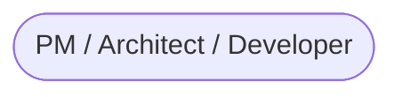

# SDD Platform Vision: Intent Flow as an Executable Spec Engine

> 本文确立了 Intent Flow 平台的终极形态：**一个原生支持 Spec-Driven Development (SDD) 的意图驱动研发平台**。
>
> 我们采纳业界关于 SDD (Specification-Driven Development) 的核心论断，并将其与 Intent Flow 的 v3 架构（UI/Logic/Module 三位一体 + Runtime Logix）深度融合，构建一套从 "Specificity" 到 "Implementation" 的全链路闭环系统。

## 1. 核心理念：AI-Native SDD Lifecycle

> **"Future-Proof Principle"**: 我们预设研发全链路的每一步——尤其是**从上一阶段产物到下一阶段产物**的转化过程——都由 **AI Agent** 主导完成，人类主要负责 Review 与 "Sign-off"。

参考 `github/spec-kit` 与 SDD 方法论，我们将研发全生命周期划分为四个阶段，并明确每个阶段的 **AI Agent 角色** 与 **Artifact 转化关系**。

### Phase 1: SPECIFY (定义)

> **Agent**: `Spec Agent` (Requirement Analyst)
> **Input**: User Intent (Raw Text / Voice / Meeting Notes)
> **Output**: `FeatureSpec` & `ScenarioSpec` (The Executable Truth)

用户仅需模糊描述 "我想要一个省市区选择器"，`Spec Agent` 将：

1.  **Interrogate**: 反问用户边界情况（"需要支持海外吗？"）。
2.  **Structure**: 将对话转化为结构化的 `FeatureSpec`。
3.  **Example**: 自动补全 `ScenarioSpec` 中的 Happy Path 与 Corner Cases。
4.  **Artifact**: 生成 `Feature` -> `Scenario` -> `Step` 的三层标准文档。

**平台能力**：

- **Spec Studio**: 类似 CMS 的 Spec 管理界面，支持 Versioning、Review。
- **Agent Chat**: 右侧对话框，随时呼叫 Spec Agent 修改文档。

### Phase 2: PLAN (规划)

> **Agent**: `Architect Agent` (Planner)
> **Input**: `FeatureSpec` + `ScenarioSpec` + Existing Codebase Context
> **Output**: `ImplementationPlan` & `IntentRule` (The Blueprint)

`Architect Agent` 消费 Spec，生成技术方案：

1.  **Module Design**: 决定复用现有 Module 或新建 Schema。
2.  **Logic Topology**: 规划 `IntentRule` (R-S-T 链路)，例如 "Region Change -> Trigger API -> Update City List"。
3.  **Constraint Check**: 确保设计符合全局架构约束（通过 `Logic.limit` / `Policy`）。

**平台能力**：

- **Architecture Canvas**: 可视化编排 Module 依赖关系与 Logic 拓扑。
- **Plan Review**: 对生成的 Plan 与 Rule 进行人工审核（Sign-off 后进入下一阶段）。

### Phase 3: TASKS (任务拆解)

> **Agent**: `Task Agent` (Project Manager)
> **Input**: `ImplementationPlan`
> **Output**: `Task` / `Logic Unit` (Atomic Work Items)

`Task Agent` 将宏大的 Plan 拆解为原子化的、可并行执行的任务单元：

1.  **Decompose**: 将一个 Feature 拆解为 "Impl State", "Impl Action", "Impl UI", "Write Integration Test" 等具体条目。
2.  **Context Prep**: 为每个 Task 准备好所需的上下文（Context Pack），确保后续 Coder Agent 能独立工作。

**平台能力**：

- **Task Board**: 自动生成的任务清单（与代码文件/PR 一一对应）。

### Phase 4: IMPLEMENT (执行与验证)

> **Agent**: `Coder Agent` (Developer)
> **Input**: `Task` + `Logic Unit` + `Context Pack`
> **Output**: `Code` (`.ts/tsx`) & `RunResult` (Verified Outcome)

`Coder Agent` 领取任务，填充具体代码，并通过 Runtime 验证：

1.  **Coding**: 根据 IntentRule 生成符合 `@logix/core` 规范的 TypeScript 代码。
2.  **Self-Correction**: 在 Playground 中运行 `ScenarioSpec`，如果红灯（Log/State 不匹配），自动读取 Trace 并修复代码，直到绿灯。

**平台能力**：

- **Studio Editor**: 也就是当前的 coding workspace。
- **Playground (Executable Spec Lab)**: 加载 Spec，并在 Sandbox 中运行代码，生成红绿报告。

## 2. 核心命题：Context Supply Chain

> **"Context is the new Code"**: 我们的核心竞争力不在于 LLM 本身（大家用的模型都一样），而在于**如何为 LLM 构建极其精准、高信噪比的上下文（Context Pack）**，使其产出能直接通过验证的代码。

为了达到 `speckit` 般的丝滑体验，Intent Flow 必须建立一条严密的 **Context Supply Chain**：

### 2.1 The "Context is World" Standard

> **"Context is World"**: 在 Agent 的世界里，Context 就是它的整个物理世界。
> 我们的目标是建设一个 **"Context Refining Engine"**，确保 LLM 看见的“世界”是 **"Just Right" (不多不少刚刚好)** 的。

每个阶段流转时，平台都会封装一个标准化的 **Context Pack (JSON)**，而非扔给 Agent 整个仓库。

- **Spec Context** (The "Why"):
  - `Strict Scope`: 只包含当前 `FeatureSpec` 及其直接依赖的 `DomainTerms`。
  - _Anti-Hallucination_: 严禁包含无关业务逻辑，防止 Agent "联想过度"。
- **Architecture Context** (The "Constraint"):
  - `Schemas`: 相关 Module 的状态定义。
    - `Bound API`: `$` 的 **Type Signatures (d.ts Subset)**.
      - _No AST JSON_: 直接提供 TypeScript 接口定义。LLM 对代码的理解力远强于对 AST JSON 的理解力，且 Token 更节省。
      - **Type Projection (Concrete > Generic)**:
        - _VS Raw Source_: 源码定义通常充满泛型 (`Logic<S, A>`) 和复杂的继承链。直接给源码，LLM 需要自己充当编译器去推导 `S` 是什么。
        - _Winner_: 投影后的接口是 **Flattened & Concrete** 的（如 `state: { count: number }`），LLM 看到即所得，无需消耗推理算力去"解方程"。
      - **Type Projection**: 这些接口并非简单的静态文件，而是平台利用 TS Compiler API 针对当前 Module **动态投影 (Project)** 出的 Concrete Types（例如将 `Logic<S, A>` 展开为具体的 `{ state: { count: number }, ... }`）。
    - `Patterns`: 针对当前任务的 Few-shot examples（如 "如何写一个 Debounce 搜索"）。
- **Runtime Context** (The "Grounding"):
  - `Services`: 可调用的 Service 接口定义。
  - `Global Types`: 核心类型定义 (`Effect`, `Schema`)。
- **Feedback Context** (The "Correction"):
  - `Trace`: 失败时的完整执行链路。
  - `Diff`: 期望状态 vs 实际状态的差异。

### 2.2 Context-Driven Generation

- **Generate with Precision**: 因为 Context 足够干净且包含约束，Coder Agent 不需要"猜" API 怎么用，也不需要"搜" 全局变量。它只需在 `Bound API` 的约束下填空。
- **Verify with Context**: 验证失败时，平台提供的不仅仅是 "Error Message"，而是 "Trace Context"，让 Agent 能像人类调试一样以“上帝视角”看到问题所在。

### 2.3 Architecture Strategy: Server-Side First, Local Next

针对 "Type Projection 在哪跑" 的问题，我们采取分阶段策略：

1.  **Phase 1: Platform-Native (Headless LSP)**
    - **Where**: 平台后端 (Serverless Worker / Container).
    - **How**: 平台维护一个虚拟的 TS Compiler Environment。当用户在 Studio 中定义 Schema 时，后端实时计算 `d.ts` 投影并注入给 Agent。这完全不需要用户本地环境支持，是纯 Web 体验。
2.  **Phase 2: Hybrid (CLI Agent)**
    - **When**: 当项目变大，依赖复杂的本地库时。
    - **How**: 推出 `intent-cli`，用户本地启动后建立 WS 隧道。平台将 "计算任务" 下发给 CLI，CLI 利用本地 TS Server 计算完将干净的 `d.ts` 回传给平台。

## 3. 概念收敛：Tri-Layer Spec Structure

为了适配 AI 生成与 BDD 最佳实践，我们在 Spec 层面严格遵循 **三层架构**，废弃四层冗余结构：

1. **Feature (功能/特性)**
   - 对应：`FeatureSpec` / Epics
   - 内容：Meta Info, User Story, Constraints, Module Scope
   - _Example: "Region Selector"_

2. **Scenario (场景)**
   - 对应：`ScenarioSpec` / Examples
   - 内容：Given (Mock Data), When (Intent Script), Then (Expectations)
   - _Example: "Happy Path: Select Province -> City"_

3. **Step (步骤)**
   - 对应：`SpecStep` / `IntentScript`
   - 内容：Atomic Interaction (UI Intent) or Assertion
   - _Example: "/select province 'Guangdong'"`_

## 3. 平台架构概览 (The "Big Picture")



## 4. 与子主题的关系（Spec Studio / Module Traits）

为了避免平台形态在多个草案中发散，本主题作为 **SDD 平台的总入口**，其他草案只覆盖各自子视角，并引用本文件作为上游：

- `topics/spec-studio`：聚焦 **L0/Specify 阶段的产品形态**（Spec Studio 画布与交互），不再重新定义 SDD 生命周期，而是把本文件中的四阶段视为上游约束，仅讨论“在 Phase 1 里，Studio 提供哪些 UI Widget 与 Agent 入口”。  
- `topics/module-traits-sdd-roadmap`：在 001-module-traits-runtime spec 已定的前提下，专门讨论 **Module 图纸（state/actions/traits）在 SDD 平台中的上下游位置**，即：如何从 Scenario/Domain Intent 推导 traits，如何用 StateTraitProgram + Alignment Lab 校验实现。  
- 其他 Runtime/Devtools 相关主题（如 `devtools-and-studio`、`runtime-middleware-and-effectop`）只讨论各自技术实现细节，遇到平台级流程或 Agent 分工时，应回指本主题。

后续在整理/前移草案时，所有关于：

- “四阶段（Specify/Plan/Tasks/Implement）如何映射到 Agent 与 Artifact”；  
- “Context Supply Chain / Context Pack 模板”；  
- “Spec → IntentRule → Code → Runtime → Alignment Lab 的链路设计”

都应优先收敛到本主题，再从这里分发到各子主题，避免出现第二套平台定义。

    subgraph "Spec Studio (The Brain)"
        Feature[Feature Spec]
        Scenario[Scenario Spec]
        Rules[Intent Rules]
    end

    subgraph "Intent Engine (The Transformer)"
        Planner[AI Planner]
        Coder[AI Coder]
        Parser[Code Parser]
    end

    subgraph "Runtime & Playground (The Lab)"
        Sandbox[Logix Sandbox]
        Runner[Scenario Runner]
        Reporter[Alignment Reporter]
    end

    subgraph "Codebase (The Artifact)"
        Modules[Module Assets]
        Logics[Logic Flows]
        UI[UI Components]
    end

    User -->|Define| Feature
    Feature -->|Drive| Planner
    Planner -->|Generate| Rules
    Rules -->|Guide| Coder
    Coder -->|Write| Modules & Logics
    Modules & Logics -->|Sync| Parser
    Parser -->|Verify| Feature

    Runner -->|Load| Scenario
    Runner -->|Execute| Sandbox
    Sandbox -->|Load| Modules & Logics
    Sandbox -->|Emit| RunResult
    RunResult -->|Compare| Reporter
    Reporter -->|Feedback| User
```

## 4. 下一步演进

1. **Schema Standardization**: 在 `packages/logix-spec` (拟新增) 中定义标准的 `FeatureSchema`, `ScenarioSchema`。
2. **Platform UI**: 将 `examples/logix-sandbox-mvp` 升级为 **Intent Flow Workbench**，集成 Spec 管理与 Playground。
3. **CI/CD Integration**: 为 `openskills` 增加 `validate-spec` 与 `verify-scenario` 能力。

## 5. 执行与闭环：The Execution Loop

> 用户可能会问："执行是在哪里呢？平台集成 LLM 做出码+验证？"
> 答案是：**平台 orchestrates（编排）了两个层面的执行。**

### 5.1 Layer 1: Code Generation Execution (AI Coder)

- **What**: LLM 根据 `IntentRule` (R-S-T) 生成具体的 TypeScript 代码 (`effect-ts`).
- **Where**: **Server-side / Local Process**.
- **Input**: `FeatureSpec` + `IntentRule` + `Module Schema`.
- **Output**: 源代码文件 (`.ts`) 写入文件系统.
- **Verification**: 静态类型检查 (`tsc`) + 规则一致性检查 (`Parser`).

### 5.2 Layer 2: Runtime Execution (Scenario Runner)

- **What**: 在真实/沙箱环境中运行生成的代码，验证其行为是否符合 Spec.
- **Where**: **Client-side Sandbox (Browser/Worker)** 或 **Headless CI (Node/Deno)**.
- **Input**: `ScenarioSpec` (Mock Data + Steps) + `Compiled Code`.
- **Output**: `RunResult` (Logs, Traces, State Snapshots).
- **Verification**: **Alignment Engine** 对比 `RunResult` 与 `ScenarioSpec` 的 `Expectations`.

### 5.3 The Feedback Loop (Self-Healing)

平台将两者串联成闭环：

1. **Gen**: AI 生成代码 (Layer 1).
2. **Run**: 平台自动将代码推送到 Sandbox 运行 Scenario (Layer 2).
3. **Check**: 对比 RunResult，发现 "Step 3: City list did not update".
4. **Fix**: 平台将 "Mismatch Error" + "Relevant Trace" 回传给 AI (Layer 1).
5. **Iterate**: AI 修正代码，从头再来。
