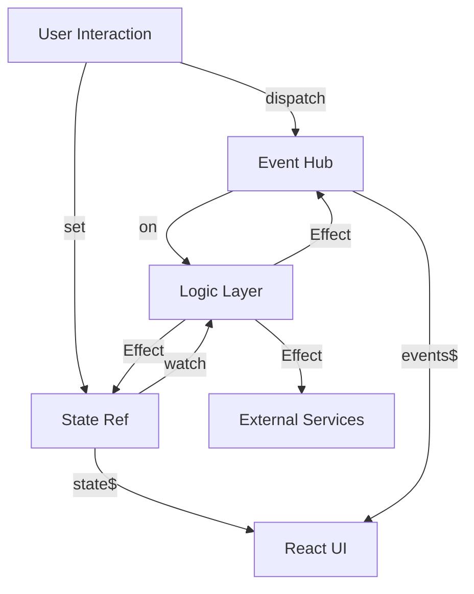

# 引擎实现架构思路 (Logix Implementation Architecture)

> **Status**: Draft
> **Date**: 2025-11-21
> **Layer**: Core Implementation

本文档详细阐述 Logix v1 的内部实现架构，特别是如何融合 **State-Driven** (FRP) 与 **Event-Driven** (Command) 两种范式，以及如何利用 Effect-TS 的能力构建高性能、类型安全的运行时。

## 1. 核心架构图景 (The Big Picture)

Logix 不仅仅是一个状态容器，它是一个 **"Reactive State Machine" (响应式状态机)**。它由三个核心支柱构成：

1.  **Memory (State)**: 系统的“记忆”，基于 `SubscriptionRef`，存储持久化的业务数据。
2.  **Senses (Events)**: 系统的“感官”，基于 `Hub`，处理瞬时的动作与意图。
3.  **Brain (Logic)**: 系统的“大脑”，基于 `Stream` 和 `Effect`，编排业务规则。

## 2. 混合架构设计 (Hybrid Architecture)

为了解决纯 FRP 无法优雅表达“瞬时动作”（如刷新、提交、通知）的痛点，我们采用了 **State + Event** 的混合架构。

### 2.1 State Channel (The "Is" Semantics)
*   **定义**: 描述系统**当前是什么状态**。
*   **实现**: `SubscriptionRef<S>`。
*   **特征**: 总是有一个当前值 (Current Value)，支持重放 (Replay 1)。
*   **用途**: 数据存储、UI 渲染、持久化。
*   **操作**: `get`, `set`, `watch`。

### 2.2 Event Channel (The "Happen" Semantics)
*   **定义**: 描述系统**发生了什么事情**。
*   **实现**: `Hub<E>` (Unbounded)。
*   **特征**: 没有当前值，只有瞬时的 Payload，不重放。
*   **用途**: 触发副作用、通知、跨模块通信、一次性动作 (Toast, Navigation)。
*   **操作**: `dispatch`, `on`。

## 3. 关键模块实现

### 3.1 `makeStore` 内部构造

`makeStore` 是一个 Effect 工厂函数，其内部流程如下：

1.  **初始化基础设施**:
    *   创建 `SubscriptionRef` 用于 State。
    *   创建 `Hub` 用于 Events。
    *   初始化 `Scope` 用于管理生命周期。

2.  **构建 LogicOps**:
    *   封装 `set`: 注入 Reference Equal Check (O(1)) 和 Loop Protection。
    *   封装 `dispatch`: 简单的 `Hub.publish`。
    *   封装 `watch`: 基于 `stateRef.changes` 构建 Stream，应用 `debounce`/`throttle` 等策略。
    *   封装 `on`: 基于 `Stream.fromHub` 构建 Stream，应用类型守卫。

3.  **执行 Logic**:
    *   调用用户传入的 `logic` 函数，获取 Effect 数组。
    *   使用 `Effect.forkScoped` 并发执行所有 Logic Effect。

4.  **暴露接口**:
    *   返回包含 `state$`, `dispatch`, `set` 等方法的 Store 对象。

### 3.2 循环依赖防护 (Loop Protection)

为了防止 `watch` -> `set` -> `watch` 的无限循环，Logix 移除了昂贵的 Deep Equal，转而依赖显式的熔断机制：

1.  **Reference Equal**: 仅当 `Object.is(prev, next)` 为 false 时触发更新。这要求上游（UI/Logic）必须遵守 Immutable 规范（推荐使用 `ops.edit`）。
2.  **Depth Limit (Sync)**: 运行时检测调用栈深度，超过阈值（如 50）抛出错误。
3.  **Trace Cycle Detection (Dev)**: 在 DEV 模式下，分析 Trace Context 的因果链，检测 `A -> B -> A` 模式并报错。
4.  **Rate Limiting (Async)**: 限制单位时间内的操作总数，防止异步死循环。

### 3.3 类型安全策略

*   **State**: 完全由 Schema 驱动，`set` 和 `watch` 的 Path 必须符合 Schema 定义。
*   **Event**: 推荐使用 **Discriminated Unions** (判别联合类型)。
    *   `type Event = { type: 'REFRESH' } | { type: 'UPDATE', id: string }`
    *   `on` 方法利用 TypeScript 的 Type Guard 自动推导 Payload 类型。

## 4. 性能优化

### 4.1 Fine-Grained Reactivity
虽然底层是全量 State，但 `watch` 通过 Path Selector 实现细粒度监听，只有相关字段变化才触发 Handler。

### 4.2 Structural Sharing
强制依赖 Immutable 更新。Logix 内部集成 `Mutative`，通过 `ops.edit` 提供高性能的 Copy-on-Write 更新。这确保了 React `memo` 的有效性，并消除了 Deep Equal 的性能瓶颈。

### 4.3 Concurrency Control
利用 Effect 的 `switch`, `exhaust`, `debounce` 操作符，轻松处理竞态问题（如搜索建议、重复提交）。

### 4.4 Stream Multiplexing (流多路复用)

为了避免在拥有大量规则（如 > 1000 个字段的表单）时产生过多的 Fiber 和 Scope 注册开销，Logix 内部采用 **Master Stream** 模式进行优化：

*   **问题**: 朴素实现中，每个 `watch` 规则都会 `fork` 一个独立的 Fiber。当规则数量达到数千级别时，会造成显著的内存压力和初始化卡顿。
*   **优化**: Logix 不会为每个规则单独 fork。相反，它将所有 `watch` 规则编译为一个 **Master Pipeline**。
    *   仅创建一个主 Stream 订阅 `stateRef.changes`。
    *   在 Stream 内部进行高效的路由分发 (Routing)，根据变更路径匹配触发相应的 Handler。
    *   使用 `Effect.all(..., { concurrency: 'unbounded' })` 并发执行触发的 Handler。
*   **收益**: 无论定义了多少规则，底层的常驻 Fiber 数量保持恒定（通常仅个位数），极大地降低了运行时开销。

## 5. 调试与可观测性

*   **Trace Context**: 所有的 `set` 和 `dispatch` 都携带 Trace ID，串联起“用户点击 -> Event -> Logic -> State Change -> UI Update”的全链路。
*   **DevTools**: `debug$` 流暴露所有内部活动，可对接 Redux DevTools 或自定义可视化工具。
