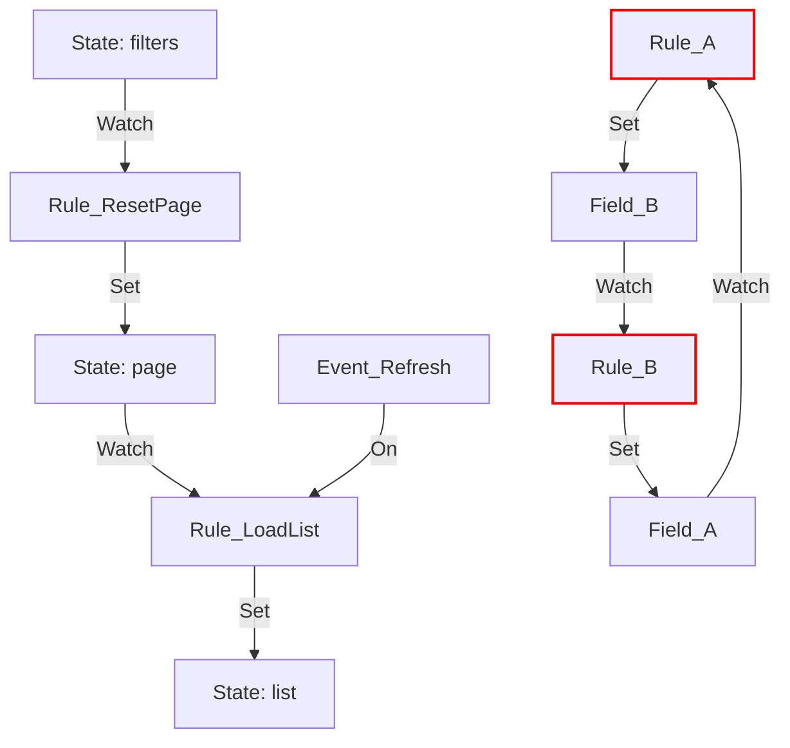

# 调试与可观测性规范 (Debugging & Observability Specification)

> **Status**: Draft
> **Date**: 2025-11-21
> **Layer**: Core Feature

本文档定义 Kernel v1 的高级调试特性。基于 Effect-TS 的结构化并发与追踪能力，我们将提供超越传统状态库（如 Redux/MobX）的调试体验，核心聚焦于 **因果追踪 (Causality)** 和 **确定性重放 (Deterministic Replay)**。

## 1. 核心理念 (Core Philosophy)

传统的调试通常是“基于状态快照”的（State Snapshot），开发者只能看到“结果”。
Kernel 的调试是“基于因果链路”的（Causality Chain），开发者能看到“过程”和“原因”。

*   **Not just "What happened?"** (State changed from A to B)
*   **But "Why did it happen?"** (Triggered by Event X -> Rule Y -> Effect Z)
*   **And "Is it safe?"** (Topology Analysis for Deadlocks & Cycles)

## 2. 特性设计 (Feature Design)

### 2.1 Causality Chain (因果链追踪)

Kernel 利用 Effect 的 `Trace` 机制，自动构建每次状态变更的完整调用栈。

**API**: `store.explain(path: string)`

**输出示例**:
```text
[Trace ID: 8f9a2b] State Change: 'list.loading' (false -> true)
  └─>  вызвано (Caused by): Rule [LoadList]
      └─> 触发源 (Triggered by): Watch ['list.page'] (Changed 1 -> 2)
          └─> 触发源 (Triggered by): User Action (set 'list.page')
              └─> Component: <Pagination /> (Source Location: UserPage.tsx:45)
```

**实现机制**:
1.  在 `LogicOps` 中注入当前的 `TraceContext`。
2.  当 `watch` 触发时，创建一个新的 Span，记录触发原因（Source Path & Value）。
3.  当 `set` 发生时，将当前 Span ID 写入 State 的元数据中。

### 2.2 Time Travel Replay (时光机重放)

由于 Kernel 的 Logic 是纯粹的 Effect，且输入仅由 State 和 Event 构成，我们可以实现**完全确定性**的重放。

**API**:
*   `store.exportSession(): SessionData`
*   `store.replaySession(session: SessionData)`

**SessionData 结构**:
```typescript
interface SessionData {
  initialState: S;
  events: Array<{
    timestamp: number;
    type: 'DISPATCH' | 'SET_USER';
    payload: any;
  }>;
}
```

**应用场景**:
1.  **Bug Report**: 用户遇到问题 -> 点击“上报” -> 自动导出 SessionData -> 开发者本地 Replay 复现。
2.  **E2E Testing**: 录制一次交互，作为测试用例反复运行，验证逻辑回归。

### 2.3 "Why Did You Run?" (规则触发诊断)

帮助开发者理解为什么某个规则被触发（或没有被触发）。

**配置**: `makeStore({ debug: { logTriggers: true } })`

**控制台输出**:
```text
[Kernel] Rule [UpdateTotal] triggered:
  ✅ 'items.0.price' changed (10 -> 20)
  ❌ 'items.0.quantity' unchanged (1)
  -> Executing Handler...
```

### 2.4 Logic Topology (逻辑拓扑图)

提供静态分析工具，将 `logic` 配置可视化为 Mermaid 图表，展示数据流向。**特别增强了对死锁环 (Deadlock Cycles) 的检测与高亮。**

**API**: `store.inspect().toMermaid()`

**可视化效果**:


## 3. DevTools Protocol (协议定义)

Kernel 通过 `store.debug$` 流向外部暴露调试信息。任何兼容此协议的 UI 工具（如 Chrome Extension）均可接入。

**Event Types**:

```typescript
type DebugEvent =
  | { type: 'INIT', state: S, schema: SchemaJson }
  | { type: 'STATE_CHANGE', path: string, value: any, prevValue: any, traceId: string }
  | { type: 'EVENT_DISPATCH', event: any, traceId: string }
  | { type: 'RULE_START', ruleId: string, trigger: TriggerInfo, traceId: string }
  | { type: 'RULE_END', ruleId: string, duration: number, traceId: string }
  | { type: 'ERROR', error: any, traceId: string };
```

## 4. 性能考量 (Performance Considerations)

*   **Production Mode**: 默认关闭所有 Trace 记录和 `debug$` 流，零运行时开销。
*   **Development Mode**: 开启完整追踪，可能会增加内存占用（用于存储 Trace History），建议限制历史记录长度（如最近 50 条）。
