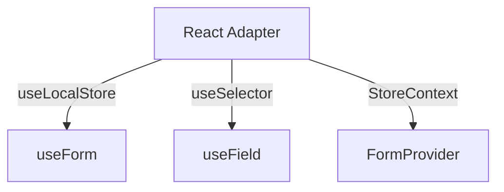

# React API 设计 (React API Specification)

> **Status**: Definitive (v2.2 Advanced Effect API)
> **Layer**: React Bindings (Form Specialized)
> **Dependency**: Built on top of `@kernel/react` (React Adapter)

本文档定义面向最终用户的 React Hooks API。这些 Hooks 并非从零实现，而是 **React Adapter** (`useStore`, `useSelector`) 在表单领域的特化封装。

## 1. 架构继承关系 (Inheritance)



通过这种分层，Form Engine 自动继承了 React Adapter 的所有特性：
*   **Concurrent Safe**: 自动防止 Tearing。
*   **Lifecycle Management**: 自动管理 Scope 的创建与销毁。
*   **Performance**: 利用 Selector 机制实现细粒度更新。

## 2. `useForm`

`useForm` 本质上是 `useLocalStore` 的工厂封装。

```typescript
// 实现伪代码
function useForm<T>(config: UseFormConfig<T>) {
  // 1. 调用 Kernel 的 makeFormStore 工厂
  const factory = useMemo(() => 
    Effect.sync(() => makeFormStore(config)), 
    [config.schema] // 仅在 Schema 变化时重建
  );

  // 2. 使用通用的 useLocalStore 管理生命周期
  const store = useLocalStore(factory);

  // 3. 返回封装后的 API
  return {
    register: createRegister(store),
    handleSubmit: createHandleSubmit(store),
    control: store,
    // ...
  };
}
```

## 3. `useField`

`useField` 本质上是 `useSelector` 的组合封装。

```typescript
// 实现伪代码
function useField(control: Control, path: string) {
  // 1. 订阅 Value (使用通用 useSelector)
  const value = useSelector(control, state => get(state.values, path));
  
  // 2. 订阅 Error
  const error = useSelector(control, state => state.errors[path]);
  
  // 3. 订阅 Touched
  const touched = useSelector(control, state => state.touched[path]);

  return {
    value,
    error,
    touched,
    onChange: (v) => control.set(`values.${path}`, v),
    onBlur: () => control.dispatch({ type: 'BLUR', path })
  };
}
```

## 4. `FormProvider`

`FormProvider` 本质上是一个特定类型的 `StoreContext.Provider`。

```typescript
const FormContext = createStoreContext<FormState<any>, FormEvent>();

export const FormProvider = FormContext.Provider;
export const useFormContext = FormContext.useStore;
```

## 5. API 签名 (API Signatures)

### 5.1 `useForm`
```typescript
function useForm<T>(config: UseFormConfig<T>): UseFormReturn<T>;
```

### 5.2 `useField`
```typescript
function useField<T>(control: Control<T>, path: Path<T>): FieldReturn;
```

### 5.3 `useFieldArray`
```typescript
function useFieldArray<T>(control: Control<T>, path: Path<T>): FieldArrayReturn;
```

## 6. 类型系统设计 (Type System Design)

为了提供极致的 DX，Form 模块必须实现一套严谨的类型推导系统。

### 6.1 路径推导 (Path Inference)

我们需要一个 `Path<T>` 工具类型，用于将嵌套对象扁平化为点分路径字符串。

*   **深度限制**: 为了防止编译器性能崩溃，递归深度应限制在 5-7 层。
*   **数组支持**: 必须支持 `items.${number}.prop` 格式的模板字符串路径。

```typescript
// 简化的 Path 类型示意
type Path<T> = T extends object ? { [K in keyof T]: ... }[keyof T] : never;
```

### 6.2 值类型提取 (Value Extraction)

配合 `Path<T>`，我们需要 `PathValue<T, P>` 来提取指定路径的值类型。

```typescript
// useField('user.age') -> FieldState<number>
function useField<T, P extends Path<T>>(
  control: Control<T>, 
  name: P
): FieldState<PathValue<T, P>>
```

### 6.3 智能上下文推导 (Smart Context Inference)

为了减少泛型书写，所有 Hooks 应优先从 `control` 对象中推导类型。

```typescript
// ✅ 推荐: 从 control 推导 T
const { control } = useForm<MyData>();
useField(control, 'user.name'); // 自动推导 P 为 Path<MyData>

// ❌ 不推荐: 手动传泛型
useField<MyData>(control, 'user.name');
```

### 6.4 数组字段类型 (Field Array Types)

`useFieldArray` 需要处理特殊的数组操作类型。

```typescript
function useFieldArray<T, P extends ArrayPath<T>>(
  control: Control<T>,
  name: P
): {
  fields: Array<FieldArrayItem<PathValue<T, P>>>;
  append: (item: ArrayItemType<T, P>) => void;
  // ...
}
```

## 7. Advanced: Effect-Native API

对于精通 Effect 的高级玩家，Kernel 提供了一套基于 **Action** 和 **Stream** 的操作接口。这允许开发者将表单操作（如数组增删）纳入统一的逻辑编排体系，实现复杂的副作用管理。

### 7.1 Action-Driven Manipulation

不再直接调用命令式方法，而是派发 Action。这些 Action 可以被 Kernel 的 `rules` 拦截和处理。

```typescript
// 获取 dispatch 接口
const { dispatch } = useFormEffect(control);

// 派发数组追加动作
// 这是一个 Intent，不仅仅是 State Change
dispatch(FormActions.arrayAppend({
  path: 'items',
  value: { name: 'New Item' }
}));
```

### 7.2 Logic Interception (逻辑拦截)

在 Store 的 `rules` 中，可以监听并处理这些 Action。

```typescript
api.rule({
  name: 'AutoSaveOnAdd',
  // 监听数组添加动作
  trigger: api.on.action('form/array/append'),
  // 过滤只针对 'items' 字段
  do: api.pipe(
    api.ops.filter(ctx => ctx.payload.path === 'items'),
    // 自动为新项填充 ID
    api.ops.map(ctx => ({
      ...ctx,
      payload: { ...ctx.payload, value: { ...ctx.payload.value, id: uuid() } }
    })),
    // 触发自动保存副作用
    api.ops.fetch(api.services.autoSave)
  )
});
```

### 7.3 Reactive Stream Consumption

组件可以直接消费字段的实时流，实现细粒度的响应式渲染。

```typescript
// 这是一个实时流，不仅仅是快照
const fields$ = useFieldStream(control, 'items');

// 在 Effect 中处理流
useEffect(() => {
  return runStream(fields$.pipe(
    // 仅当长度超过 10 时报警
    filter(items => items.length > 10),
    map(() => toast.warn('Too many items!'))
  ));
}, [fields$]);
```
