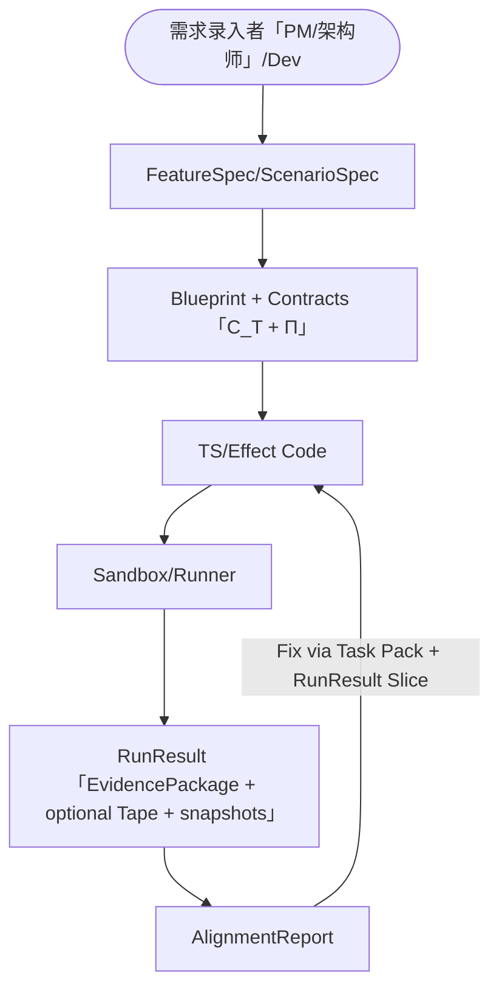

# SDD Platform Vision: Intent Flow as an Executable Spec Engine

> 本文是 `sdd-platform` 主题的**总入口**：用最短的方式定义平台闭环、角色分工、以及“哪些是不可变的物理口径（SSoT）”。

> **运行时物理模型（SSoT）**：平台侧的一切“可视化 / 可回放 / 可自纠错”都必须落在统一的执行口径上：
> - 最小系统方程与符号表：`docs/ssot/platform/foundation/01-the-one.md`（`S/E/t/Π/Ops/Δ⊕/C_T/Tape_t`）
> - 运行时执行模型：`docs/ssot/platform/contracts/00-execution-model.md`
> - 时间旅行交互：`docs/ssot/platform/contracts/02-time-travel.md`
> - RunResult 契约（平台 Grounding）：`docs/ssot/platform/contracts/01-runresult-trace-tape.md`
> - Program 的 Tape 最小契约（回放磁带）：`specs/075-flow-program-codegen-ir/contracts/tape.md`

## 1. 平台闭环（最小链路）

平台不是“低代码画布 + 出码器”，而是一个可验证的闭环系统：

```
Spec（Feature/Scenario） → Blueprint/Contracts（C_T + Π） → Code（TS/Effect）
        ↑                                                  ↓
        └────────────── Alignment（对比 RunResult） ← RunResult（Grounding）
```

关键裁决：

- **Spec 是“可执行真相”**：必须有场景与断言（Given/When/Then），而不是静态 PRD。
- **Contracts 负责约束**：`C_T`（Traits）只表达静态约束闭包；`Π`（Programs/Flow）只表达动态控制律；禁止“从静态推断动态”（见 `docs/ssot/platform/foundation/01-the-one.md`）。
- **RunResult 是唯一 Grounding**：平台/Devtools/Agent 只消费 RunResult（`EvidencePackage + optional Tape + snapshots + anchors`），不消费运行时内部对象（见 `docs/ssot/platform/contracts/01-runresult-trace-tape.md`）。

## 1.1 现实约束（平台必须诚实）

闭环图看起来“很美”，落地必然撞上物理与工程折扣；平台侧必须把这些折扣显式化为预算/降级策略与验收口径：

- **收敛不是无限的**：`Close_{C_T}` 允许预算、分帧、partial fixpoint，但必须可解释/可诊断/可回放（口径：`docs/ssot/platform/contracts/00-execution-model.md`）。
- **诊断不可能零成本**：Diagnostics=Off 只能追求“可忽略/可控”，不能承诺绝对 0 开销；必须用预算与分层通道治理（口径：`docs/ssot/platform/contracts/00-execution-model.md`）。
- **IO 不能真正时间旅行**：Live 运行最多只读回放；Replay/Fork 需要 Tape 把不确定性注入为事件（口径：`docs/ssot/platform/contracts/01-runresult-trace-tape.md` + `specs/075-flow-program-codegen-ir/contracts/tape.md`）。
- **精准更新有陷阱**：自动触发/依赖比较会在“深比较 vs 过敏触发”间权衡；粗粒度刷新可能是 MVP 必选（口径：`specs/076-logix-source-auto-trigger-kernel/spec.md` + `docs/ssot/platform/contracts/00-execution-model.md`）。
- **人类 DX 需要语法糖**：IR/Program 允许显式与结构化，但必须提供糖衣让业务写法不被“定义墙”吓退（口径：`11` 竖切优先交付）。

## 2. 角色分工（面向交接 + Agent 四阶段）

> 原则：需求录入可以由 PM 或架构师完成；架构师对“边界与约束”签字；开发消费产物并实施；Runtime 只提供可验证的证据链（RunResult）。

### 2.1 人类组织视角（你应该交接什么）

| 角色 | 做什么 | 交接物（面向下游） | 不要求掌握 |
| --- | --- | --- | --- |
| 需求录入者（PM/架构师） | 写清 Feature/Scenario/验收口径；做最小拆解与关联（范围、关键路径、示例数据） | `FeatureSpec` + `ScenarioSpec`（可执行规格） | Schema/Trait/WorkflowDef 等实现术语 |
| 架构师（裁决者） | 决定模块边界/依赖、质量约束与验收方式；把 Spec 映射到 Blueprint/Contracts | Blueprint + Contracts（`C_T + Π`）+ 风险/预算说明 | 具体实现细节与代码组织 |
| 开发（实施者） | 消费 Spec/Blueprint/Contracts，拆成可验收的任务并实现 | Task Pack + Code + 可解释 RunResult | 平台内部可视化实现细节 |

### 2.0 需求录入者（PM/架构师）的最小输入面（平台要屏蔽噪声）

PM 的目标不是“写对实现”，而是把需求变成可执行验收：

- 你只需要交付：`FeatureSpec`（范围/词表/非目标）+ `ScenarioSpec[]`（Given/When/Then + 示例数据）。
- 你不需要交付：模块边界怎么拆、traits 怎么写、flow 怎么编排、IR/锚点如何生成（这些由架构师/平台/开发完成）。

### 2.2 Agent 四阶段（平台自动化视角）

> 注：这里的 “Agent” 是执行者形态；其“责任人”仍是上面的对应人类角色（PM/架构师/开发）。

| Phase | Agent | 输入 | 输出 | 关键检查 |
| --- | --- | --- | --- | --- |
| SPECIFY | Spec Agent | 原始意图/会议纪要 | FeatureSpec + ScenarioSpec | 场景覆盖、边界条件、稳定 stepId |
| PLAN | Architect Agent | Spec + 既有资产索引 | Blueprint + Contracts（C_T/Π） | The One/Execution/RunResult 约束检查、复用优先 |
| TASKS | Task Agent | Plan | Task 列表 + Context Pack | 任务原子化、可并行、可验收 |
| IMPLEMENT | Coder Agent | Task Pack + RunResult Slice（若失败） | Code + RunResult | 类型/约束通过；RunResult 可解释 |

对应的工程化落点详见：

- Spec/交互：`ui-ux/03-spec-studio.md`
- Contracts：`01-module-traits-integration.md`（`C_T`）/ `specs/075`/`specs/076`（`Π`）
- 全双工底座（北极星；MVP 不交付）：`02-full-duplex-architecture.md`（建议先读 0 节现实约束）
- Verify：`08-alignment-lab-and-sandbox.md`
- MVP 竖切：`11-spec-to-code-mvp.md`

## 3. Context Supply Chain（只保留结论）

平台每次把任务交给 Agent 时，都必须提供 **足够但不过载** 的 Context Pack。结论如下：

- Pack 里优先给 **类型投影（d.ts subset）与契约**，避免把整仓库当上下文。
- 失败回流优先给 **RunResult Slice**（tickSeq + anchors + 少量证据），而不是全量日志。

完整协议与治理策略见：

- Pipeline/Pack：`05-intent-pipeline.md`
- 多 Track 治理：`17-project-governance-and-lean-context.md`

## 4. 架构大图（最小）



## 5. 本 Topic 的文档分工

本 Topic 内文档的职责边界与阅读路径以 `README.md` 为准：`docs/specs/sdd-platform/workbench/README.md`。

补充：如果你想先从“平台对用户的可感知价值”入手，再回看闭环与技术子篇，先读 `09-user-value-routes.md`。
