### logix-perf (quick)
- scope: `test/browser/perf-boundaries/converge-steps.test.tsx`
- profile: `quick`
- envId: `mac-local`
- base: `base0001`  head: `head0002`

### What do `maxLevel` and `null` mean?
- `maxLevel` is the highest primary-axis level that still satisfies a budget.
- Example (primary axis = `steps`):
  - `maxLevel=2000`: budget passes at `steps=200`, `800`, and `2000`.
  - `maxLevel=800`: budget passes at `steps=200` and `800`, but fails at `steps=2000`.
  - `maxLevel=null`: budget fails already at the first tested level (e.g. `steps=200`).

### What do `steps` and `dirtyRootsRatio` mean?
- `steps` is the primary axis for this suite: it controls the size of the converge state (more steps = more roots/fields).
- `dirtyRootsRatio` controls how many roots/fields are patched per transaction: `dirtyRoots = max(1, ceil(steps * dirtyRootsRatio))`.
- Metrics are evaluated on the p95 statistic (`n = runs - warmupDiscard`; tail-only failures are often noise unless reproducible).

### Comparability
- comparable: `true`
- diffMode: allowConfigDrift=true, allowEnvDrift=true

**warnings**
- `git.dirty.before=true (before report was collected from a dirty working tree)`
- `git.dirty.after=true (after report was collected from a dirty working tree)`

### Automated interpretation
- regressions: `0`
- improvements: `0`
- thresholdSlices: compared=`136`, afterOnly=`0`, beforeOnly=`0`, skippedData=`34`, total=`170`

### Head budget status (quick warning)
_Based on head-only thresholds (not a diff). Useful even when comparable=false._

- headBudgetFailures: `1` (reason=budgetExceeded)
- headDataIssues: `0` (missing/timeout/etc)
- classification: `tail-only` = p95 over budget but median within; `systemic` = median also over

_Tip: quick profile uses small sample size; tail-only failures are often noise unless reproducible._

**Failing budgets (head-only)**
- [P1] `converge.txnCommit` — converge: txn commit / derive: `auto<=full*1.05` failing=`1/17`, dataIssues=`0/17`, notApplicable=`0/17`, maxLevel=`2000×16, null×1`
- [P1] `converge.txnCommit` — converge: txn commit / derive: `decision.p95<=0.5ms` failing=`0/51`, dataIssues=`0/51`, notApplicable=`34/51`, maxLevel=`2000×17, null×34`

**Top head failures**
- [P1] `converge.txnCommit` — converge: txn commit / derive: `auto<=full*1.05` `{dirtyRootsRatio=0.25}`
  - after: maxLevel=`null` firstFail=`steps=200` classification=`tail-only`
  - p95 ratio=1.1007 (auto/full=0.328/0.298 ms), median ratio=0.8571 (auto/full=0.240/0.280 ms), n=`20`
  - auto: executedMode=`dirty` executedSteps=`50` affectedSteps=`50` reasons=`cache_hit`
  - full: executedMode=`full` executedSteps=`200` affectedSteps=`200` reasons=`module_override`

Head maps (where -> maxLevel / firstFail / p95 series)

_Each row shows which primary-axis level starts failing for that `where` slice. Levels are the discrete test levels (e.g. steps=200/800/2000)._ 

**[P1] `converge.txnCommit` — converge: txn commit / derive — `auto<=full*1.05`**
- where axis: `dirtyRootsRatio` (17 rows)
- primaryAxis: `steps` (levels=`[200, 400, 600, 800, 1200, 1600, 2000]`)

| dirtyRootsRatio | maxLevel | firstFail | classification | p95 ratio series | fail detail |
| --- | --- | --- | --- | --- | --- |
| 0.005 | 2000 | - | - | 200=0.6045, 800=0.8717, 2000=0.7275 | - |
| 0.01 | 2000 | - | - | 200=0.5672, 800=0.7682, 2000=0.7211 | - |
| 0.02 | 2000 | - | - | 200=0.7524, 800=0.7655, 2000=0.7119 | - |
| 0.05 | 2000 | - | - | 200=0.7706, 800=0.8263, 2000=0.7753 | - |
| 0.1 | 2000 | - | - | 200=0.7417, 800=0.8474, 2000=0.8343 | - |
| 0.15 | 2000 | - | - | 200=0.7704, 800=0.8768, 2000=0.8296 | - |
| 0.2 | 2000 | - | - | 200=0.8321, 800=0.9283, 2000=0.8483 | - |
| 0.25 | null | steps=200 | tail-only | 200=1.1007!, 800=0.8896, 2000=0.9155 | p95=1.1007 (auto/full=0.328/0.298 ms), median=0.8571, n=20 |
| 0.33 | 2000 | - | - | 200=0.8452, 800=0.9371, 2000=0.9248 | - |
| 0.4 | 2000 | - | - | 200=0.8920, 800=0.9412, 2000=0.9183 | - |
| 0.5 | 2000 | - | - | 200=0.9119, 800=0.9466, 2000=0.9283 | - |
| 0.6 | 2000 | - | - | 200=0.9273, 800=0.9623, 2000=0.9533 | - |
| 0.7 | 2000 | - | - | 200=0.9785, 800=0.9913, 2000=1.0075 | - |
| 0.75 | 2000 | - | - | 200=1.0083, 800=1.0272, 2000=0.9826 | - |
| 0.8 | 2000 | - | - | 200=0.9806, 800=1.0081, 2000=1.0060 | - |
| 0.9 | 2000 | - | - | 200=0.9964, 800=1.0038, 2000=1.0137 | - |
| 1 | 2000 | - | - | 200=1.0033, 800=0.9860, 2000=1.0029 | - |

### Budget details (computed from points)

#### [P1] `converge.txnCommit` — converge: txn commit / derive
- primaryAxis: `steps` (max=`2000`)

**Budget: `auto<=full*1.05`**
- metric: `runtime.txnCommitMs`
- maxRatio: `1.05`
- numeratorRef: `convergeMode=auto`
- denominatorRef: `convergeMode=full`

| where | before maxLevel | after maxLevel | before ratio | after ratio |
| --- | --- | --- | --- | --- |
| dirtyRootsRatio=0.005 | 2000 | 2000 | 0.7275 (0.662/0.910 ms) @ steps=2000 | 0.7275 (0.662/0.910 ms) @ steps=2000 |
| dirtyRootsRatio=0.01 | 2000 | 2000 | 0.7211 (0.662/0.918 ms) @ steps=2000 | 0.7211 (0.662/0.918 ms) @ steps=2000 |
| dirtyRootsRatio=0.02 | 2000 | 2000 | 0.7119 (0.692/0.972 ms) @ steps=2000 | 0.7119 (0.692/0.972 ms) @ steps=2000 |
| dirtyRootsRatio=0.05 | 2000 | 2000 | 0.7753 (0.766/0.988 ms) @ steps=2000 | 0.7753 (0.766/0.988 ms) @ steps=2000 |
| dirtyRootsRatio=0.1 | 2000 | 2000 | 0.8343 (0.906/1.086 ms) @ steps=2000 | 0.8343 (0.906/1.086 ms) @ steps=2000 |
| dirtyRootsRatio=0.15 | 2000 | 2000 | 0.8296 (0.964/1.162 ms) @ steps=2000 | 0.8296 (0.964/1.162 ms) @ steps=2000 |
| dirtyRootsRatio=0.2 | 2000 | 2000 | 0.8483 (1.074/1.266 ms) @ steps=2000 | 0.8483 (1.074/1.266 ms) @ steps=2000 |
| dirtyRootsRatio=0.25 | null | null | 1.1007 (0.328/0.298 ms) @ steps=200 | 1.1007 (0.328/0.298 ms) @ steps=200 |
| dirtyRootsRatio=0.33 | 2000 | 2000 | 0.9248 (1.426/1.542 ms) @ steps=2000 | 0.9248 (1.426/1.542 ms) @ steps=2000 |
| dirtyRootsRatio=0.4 | 2000 | 2000 | 0.9183 (1.462/1.592 ms) @ steps=2000 | 0.9183 (1.462/1.592 ms) @ steps=2000 |
| dirtyRootsRatio=0.5 | 2000 | 2000 | 0.9283 (1.658/1.786 ms) @ steps=2000 | 0.9283 (1.658/1.786 ms) @ steps=2000 |
| dirtyRootsRatio=0.6 | 2000 | 2000 | 0.9533 (1.876/1.968 ms) @ steps=2000 | 0.9533 (1.876/1.968 ms) @ steps=2000 |
| dirtyRootsRatio=0.7 | 2000 | 2000 | 1.0075 (2.160/2.144 ms) @ steps=2000 | 1.0075 (2.160/2.144 ms) @ steps=2000 |
| dirtyRootsRatio=0.75 | 2000 | 2000 | 0.9826 (2.262/2.302 ms) @ steps=2000 | 0.9826 (2.262/2.302 ms) @ steps=2000 |
| dirtyRootsRatio=0.8 | 2000 | 2000 | 1.0060 (2.338/2.324 ms) @ steps=2000 | 1.0060 (2.338/2.324 ms) @ steps=2000 |
| dirtyRootsRatio=0.9 | 2000 | 2000 | 1.0137 (2.670/2.634 ms) @ steps=2000 | 1.0137 (2.670/2.634 ms) @ steps=2000 |
| dirtyRootsRatio=1 | 2000 | 2000 | 1.0029 (2.730/2.722 ms) @ steps=2000 | 1.0029 (2.730/2.722 ms) @ steps=2000 |

Charts: p95 ratio across `dirtyRootsRatio`

Bars: base(before) vs head(after). Line: budget maxRatio=`1.05`.

```mermaid
xychart-beta
    title "converge.txnCommit auto<=full*1.05 @ steps=200"
    x-axis ["0.005", "0.01", "0.02", "0.05", "0.1", "0.15", "0.2", "0.25", "0.33", "0.4", "0.5", "0.6", "0.7", "0.75", "0.8", "0.9", "1"]
    y-axis "ratio" 0.5139 --> 1.1541
    bar [0.6045, 0.5672, 0.7524, 0.7706, 0.7417, 0.7704, 0.8321, 1.1007, 0.8452, 0.892, 0.9119, 0.9273, 0.9785, 1.0083, 0.9806, 0.9964, 1.0033]
    bar [0.6045, 0.5672, 0.7524, 0.7706, 0.7417, 0.7704, 0.8321, 1.1007, 0.8452, 0.892, 0.9119, 0.9273, 0.9785, 1.0083, 0.9806, 0.9964, 1.0033]
    line [1.05, 1.05, 1.05, 1.05, 1.05, 1.05, 1.05, 1.05, 1.05, 1.05, 1.05, 1.05, 1.05, 1.05, 1.05, 1.05, 1.05]
```

```mermaid
xychart-beta
    title "converge.txnCommit auto<=full*1.05 @ steps=800"
    x-axis ["0.005", "0.01", "0.02", "0.05", "0.1", "0.15", "0.2", "0.25", "0.33", "0.4", "0.5", "0.6", "0.7", "0.75", "0.8", "0.9", "1"]
    y-axis "ratio" 0.7155 --> 1.1
    bar [0.8717, 0.7682, 0.7655, 0.8263, 0.8474, 0.8768, 0.9283, 0.8896, 0.9371, 0.9412, 0.9466, 0.9623, 0.9913, 1.0272, 1.0081, 1.0038, 0.986]
    bar [0.8717, 0.7682, 0.7655, 0.8263, 0.8474, 0.8768, 0.9283, 0.8896, 0.9371, 0.9412, 0.9466, 0.9623, 0.9913, 1.0272, 1.0081, 1.0038, 0.986]
    line [1.05, 1.05, 1.05, 1.05, 1.05, 1.05, 1.05, 1.05, 1.05, 1.05, 1.05, 1.05, 1.05, 1.05, 1.05, 1.05, 1.05]
```

```mermaid
xychart-beta
    title "converge.txnCommit auto<=full*1.05 @ steps=2000"
    x-axis ["0.005", "0.01", "0.02", "0.05", "0.1", "0.15", "0.2", "0.25", "0.33", "0.4", "0.5", "0.6", "0.7", "0.75", "0.8", "0.9", "1"]
    y-axis "ratio" 0.6619 --> 1.1
    bar [0.7275, 0.7211, 0.7119, 0.7753, 0.8343, 0.8296, 0.8483, 0.9155, 0.9248, 0.9183, 0.9283, 0.9533, 1.0075, 0.9826, 1.006, 1.0137, 1.0029]
    bar [0.7275, 0.7211, 0.7119, 0.7753, 0.8343, 0.8296, 0.8483, 0.9155, 0.9248, 0.9183, 0.9283, 0.9533, 1.0075, 0.9826, 1.006, 1.0137, 1.0029]
    line [1.05, 1.05, 1.05, 1.05, 1.05, 1.05, 1.05, 1.05, 1.05, 1.05, 1.05, 1.05, 1.05, 1.05, 1.05, 1.05, 1.05]
```

### Artifacts (files inside the uploaded artifact)
- `after.head0002.mac-local.quick.json`
- `after.local.json`
- `after.local0002.mac-local.quick.json`
- `before.base0001.mac-local.quick.json`
- `before.local0001.mac-local.quick.json`
- `diff.base0001__head0002.mac-local.quick.json`
- `diff.local0001__local0002.mac-local.quick.json`
- `summary.md`

