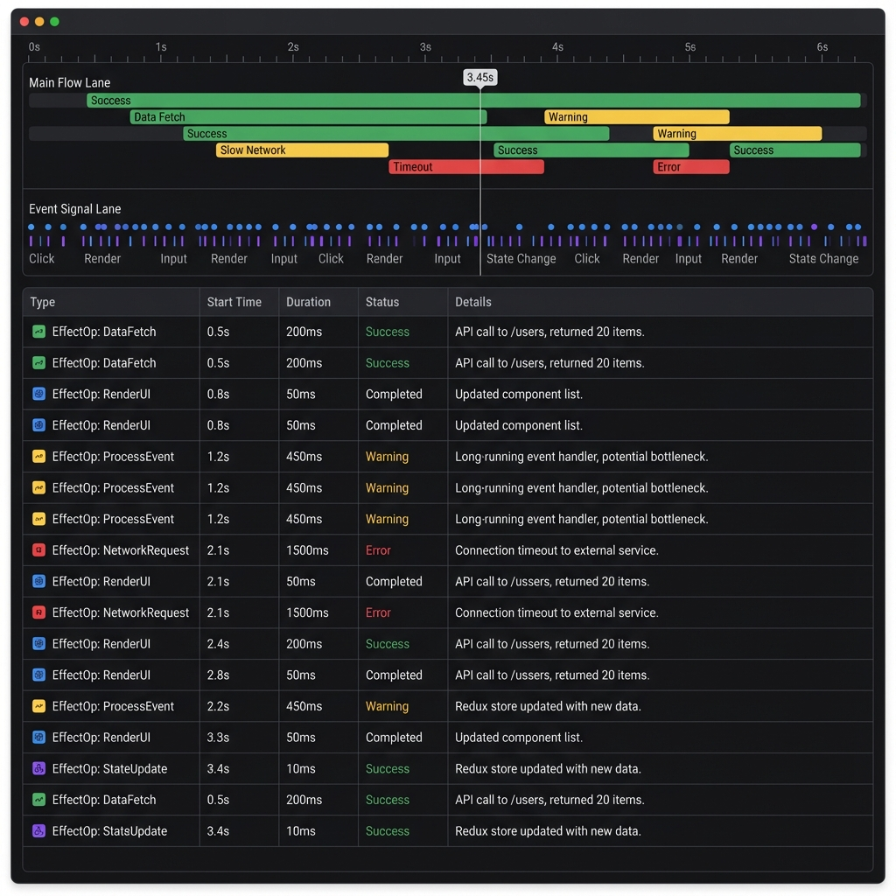
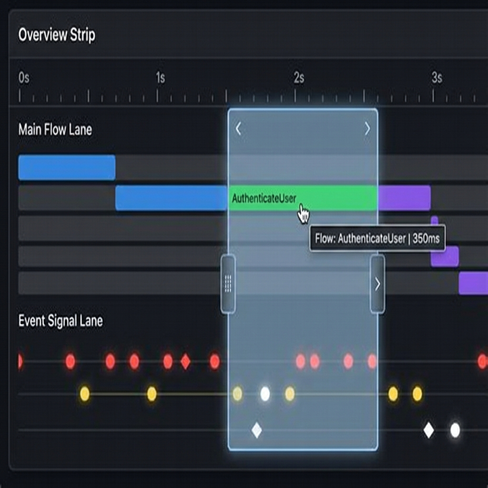
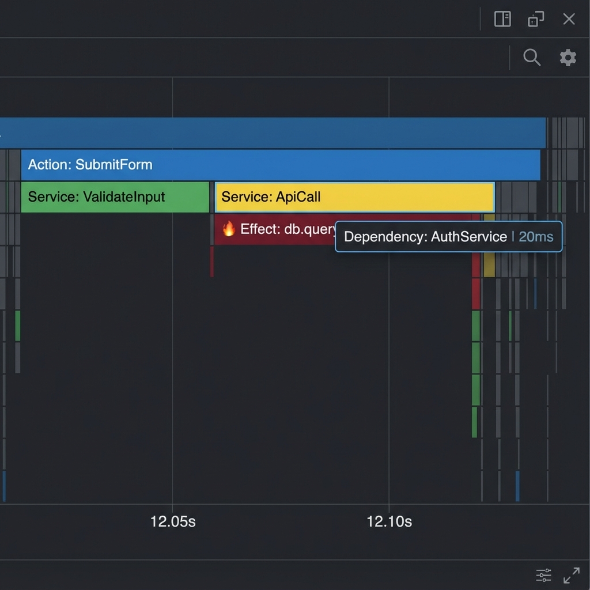

# Feature Specification: 统一观测协议与聚合引擎（平台协议层优先）

**Feature Branch**: `005-unify-observability-protocol`
**Created**: 2025-12-13
**Status**: Done
**Scope**: 仅收口 Foundational（Envelope/EvidencePackage/Aggregation/ControlCommand）；Devtools UI/渲染/Chrome 扩展 transport 等形态交付由 `038` 或后续独立 spec 承接（见 `tasks.md`）。
**Input**: User description: "统一组件/插件/平台协议层的观测协议与聚合引擎（Playground 可选验证）"

## Assumptions

- “Sandbox/Alignment Lab/Playground”当前仅作为实验性验证路径：用于验证浏览器环境（含 Worker）中可运行与可观测；其存在与形态不作为平台功能承诺。
- 本 spec 需要覆盖两种宿主（组件形态 + 扩展形态）的“一致性消费”主线；交付顺序以组件形态优先，扩展形态在 P1 至少支持离线导入 EvidencePackage 并展示一致视图，实时连接与低干扰链路在后续阶段补齐。
- 本能力主要服务于开发与测试场景；在生产环境中默认以“最小开销”模式运行或关闭高成本观测。
- “时间旅行/回放”只作用于可回放的运行时状态；不承诺回滚外部副作用（网络、存储、第三方系统）。
- 观测负载策略可配置（抽样、摘要、按需细节）；默认保留原始值（不脱敏、不做风险提示），但对已知高成本字段/超大 payload 强制摘要；deep 模式可选择包含原始值。
- 平台会逐步引入需求侧锚点（例如「场景（Scenario）/步骤（Step）」），用于把运行证据映射回需求意图；是否在某个前端 Playground 中展示不影响本特性的成立。
- **视觉交互标准**：Timeline/Flamegraph 的交互体验必须对标 Chrome DevTools（Performance/Network）的交互标准（Canvas 渲染、Brush/Zoom/Pan、Flamegraph 深度查看），以支撑高频事件流下的可用性（防止 DOM 爆炸）；但语义模型以 Logix（txn/trait/EffectOp）为准，不追求与 Chrome trace 语义一一对应。

## Out of Scope

- 不以覆盖所有第三方依赖与所有 UI 框架为目标；重点保证“可运行、可观测、可验证”的主路径体验。
- 不在本特性中一次性完成 AI 自动评分/自动修复闭环；本特性只输出结构化证据与对齐所需的基础数据。
- 不承诺交付“完整 Playground 产品”；如存在实验性 Playground，其职责是消费协议并验证平台能力，而非成为事实源。
- 不考虑敏感数据保护与合规要求；证据包默认保留原始数据且不做风险提示。

## Dependencies

- 运行环境能够产生基础观测信号（至少包含错误、关键事件、执行轨迹或等价证据），否则无法支撑一致视图与对齐。
- 运行环境能够为同一运行会话提供权威的事件顺序信息（主排序键），否则无法保证跨宿主导出/导入后的顺序稳定复现。
- 在 `007-unify-trait-system` 落地后，Logix Runtime 已具备 `StateTransaction/txnId`、`DebugSink.Event`（`state:update`/`diagnostic`/`trace:*`）与 `ReplayLog` 等基础能力；本 spec 的协议与聚合层应以这些信号为优先输入，并在跨宿主/导出场景中做可序列化降级。
- 平台能够提供场景/步骤等需求侧锚点信息（或等价结构），以便把运行证据映射回需求侧结构。
- 浏览器扩展在目标浏览器安全模型允许的范围内与当前页面建立连接；若受限，需要提供可用的降级体验。

## Clarifications

### Session 2025-12-13

- Q: 证据包的默认敏感数据策略是什么？ → A: 默认不脱敏，也不提示风险；但允许因不可序列化/体积超限做摘要降级。
- Q: 证据包/协议的版本不匹配策略是什么？ → A: 版本标记 + 尽力兼容；无法理解的部分降级展示并明确提示缺失。
- Q: 证据包的默认粒度是什么？ → A: 默认只包含单次运行（一个 runId）。
- Q: 观测事件的稳定身份与时间信息由谁生成？ → A: 由运行环境生成。
- Q: 同一 runId 内事件排序语义是什么？ → A: 由运行环境生成全局单调递增序号（seq）作为主排序键；时间戳仅作展示/辅助。

### Session 2025-12-14

- Q: Timeline 视图的 Span 建模选型是什么？ → A: 双层：顶层 Span = `StateTransaction/Operation Window`（txn）；子层 Span = trace/trait steps（仅 deep/按需）。
- Q: Devtools 的 “Record/Stop” 在协议层怎么定义更合适？ → A: 双模：优先发协议命令（支持则降低开销），不支持则退化为 UI 本地缓冲开关。
- Q: “对标 Chrome DevTools”的范围要定到哪一档？ → A: 对标交互体验（Timeline/Brush/Flamegraph），语义模型以 Logix 为准，不追求与 Chrome trace 语义一一对应。
- Q: 证据包里 `payload`（尤其 state snapshot/大对象）的默认保留策略是什么？ → A: 分级默认：默认保留原始（不脱敏），但对已知高成本字段/超大 payload 强制摘要；deep 模式可选择包含原始。
- Q: `Record/Stop` 与 `runId` 的生命周期关系怎么定义？ → A: `runId` 覆盖一次运行会话；Record/Stop 只是采集窗口（证据包可只含窗口内事件，`seq` 允许不从 1 开始/可有间隙）。

### Session 2025-12-31

- AUTO: Q: 本 spec 的 Chrome 扩展形态在 P1 是否必须支持实时连接页面会话？ → A: P1 仅要求扩展面板支持离线导入 EvidencePackage 并展示一致视图；实时连接与命令回路作为 P2（Deferred）。
- AUTO: Q: 跨宿主实时传输的最小消息集合与裁决源是什么？ → A: 使用 TransportMessage v1（HELLO/SUBSCRIBE/OBSERVATION_BATCH/CONTROL/CONTROL_ACK），schema 以 `specs/005-unify-observability-protocol/contracts/schemas/transport-message.schema.json` 为准。
- AUTO: Q: v1 的 `protocolVersion` 字符串取值是什么？ → A: 固定为 `"v1"`（对齐 `@logixjs/core` 的 `Observability.protocolVersion`）。
- AUTO: Q: ControlCommand/ControlAck 的最小字段与回执语义是什么？ → A: `ControlCommand` 必须携带 `protocolVersion + commandSeq + type (+ runId?)`，并且每条命令必须返回 `ControlAck`（`accepted` + 可选 `reason`）；不支持时必须明确拒绝（`accepted=false`）。
- AUTO: Q: `RuntimeDebugEventRef` 是否纳入可选 `linkId` 作为因果链锚点？ → A: 是；`linkId` 为可选字段（生产者在可用时填充，消费端不得依赖其必然存在），以便把跨边界的一组相关事件串成可解释链路。
- AUTO: Q: 跨宿主实时传输/证据包中的 `payload` 是否允许非 `JsonValue`？ → A: 不允许；跨宿主实时链路与 `EvidencePackage` 必须满足 `JsonValue` 硬门，宿主内原始对象仅限同进程使用，跨宿主/导出前必须投影/降级并标记原因。
- AUTO: Q: 当发生降级/丢弃时，最低必须对用户可见的证据是什么？ → A: 至少包含：单事件的 `downgrade.reason`（non_serializable/oversized/unknown）+ 累计预算统计（dropped/oversized）+（实时批量传输时）batch 的 `droppedCount/droppedReason`。
- AUTO: Q: 实时链路断线重连的最小恢复语义是什么？ → A: 以 `runId + afterSeq` 为锚点：消费者用 `SUBSCRIBE(afterSeq)` 请求补发，生产者尽力从有界窗口补发；不足时必须明确提示并引导改用 EvidencePackage 导入；`runId` 变化必须通过 `HELLO` 通知并触发消费端重置。

## User Scenarios & Testing _(mandatory)_

### User Story 1 - 同一份观测数据在不同宿主可一致消费（Priority: P1）

作为开发者/平台维护者，我希望同一份运行的观测证据可以在不同宿主中被一致消费（不依赖某一种 UI 形态），并获得一致的核心观察结果，例如：

- 平台/工具侧的 Devtools 视图（例如独立窗口、浏览器扩展或其他形态）；
- 应用内嵌的开发面板（组件形态）；
- 实验性前端 Playground（可选，用于验证浏览器/Worker 运行）。

我也希望能把一次运行的观测记录导出为“证据包”，并在另一种宿主里导入查看，以便协作、复现与审核。

**Why this priority**: 这是多端共用协议/聚合层的核心价值来源。没有一致性与可携带性，Devtools 会持续分裂，平台的验证与回归证据也难以沉淀与复用。

**Independent Test**: 对同一段业务逻辑（同一运行会话），在任一宿主产出一份观测证据包；在另一宿主导入后，仍能得到相同的事件时间线、关键计数与诊断结论。

**Acceptance Scenarios**:

1. **Given** 一个可运行的示例场景且观测能力已启用，**When** 用户在应用内嵌面板中查看并导出本次运行的观测证据包，**Then** 证据包包含完整的运行标识、事件序列、关键指标与错误/诊断信息，并可被保存与分享。
2. **Given** 一份由应用内嵌面板导出的观测证据包，**When** 用户在浏览器扩展面板中导入并打开同一套视图，**Then** 该视图展示的关键计数与事件顺序与导出时一致，且不会出现无法解释的缺失/重复。

---

### User Story 2 - 平台可将需求锚点映射到运行证据（Scenario/Step 覆盖）（Priority: P2）

作为 PM/开发者/审核者，我希望平台能把需求侧锚点（例如场景/步骤）映射到运行证据，以便做验证与回归：

- 可以看到该场景各步骤（Step）的命中情况（covered/pending）；
- 当某个步骤未命中或结果异常时，可以从该步骤直接追溯到对应的证据（例如关键事件、日志、执行轨迹、状态快照）。

**Why this priority**: 平台的核心目标是“可验证的意图落地”。如果无法把需求锚点与运行证据对齐，平台在验证与回归层面会缺少可复用的证据结构。

**Independent Test**: 选择一个典型场景（例如省市区联动），在任一浏览器运行入口产出一份证据包后，即可基于该证据包计算 Step 覆盖，并能在某个查看器中定位每个 Step 的关联证据（查看器可以是实验性 Playground 或其他工具视图）。

**Acceptance Scenarios**:

1. **Given** 一个包含多个步骤的场景定义，**When** 用户完成一次运行并产出观测证据包，**Then** 每个步骤都能被标记为 covered 或 pending，且这些标记与本次运行实际发出的 UI 意图信号一致。
2. **Given** 某个步骤被标记为 pending 或出现错误，**When** 用户在某个查看器中点击该步骤查看详情，**Then** 查看器能展示该步骤相关的证据摘要，并允许进一步查看对应事件/轨迹/日志片段以辅助定位原因。

---

### User Story 3 - 浏览器扩展提供独立窗口与更低干扰的观测体验（Priority: P2）

作为注重性能与真实性的开发者，我希望将 Devtools 面板移出被测页面的主 UI 区域，以便：

- 在多屏或分屏场景中独立查看 Devtools；
- 降低 Devtools UI 渲染对被测页面主线程的干扰，从而提升“渲染压力/概览指标”的可信度。

**Why this priority**: 组件形态开发便利但可能影响被测页面。独立窗口能力可以把“观察者效应”控制在更可接受范围内，是追求卓越观测体验的重要一环。

**Independent Test**: 在同一个示例应用中打开插件形态面板；插件形态能够独立展示页面运行会话的观测视图并提供独立窗口体验；若应用同时提供内嵌面板，则两者展示的关键结论一致。

**Acceptance Scenarios**:

- 1. **Given** 用户已打开一个启用观测的页面，**When** 用户打开浏览器扩展的 Devtools 面板，**Then** 面板可以连接到当前页面的运行会话并展示实时更新的关键视图（时间线、概览、错误/诊断）。

2. **Given** 运行会话处于高频事件场景，**When** 用户在插件形态面板中进行筛选、切换视图、查看详情，**Then** 面板保持可用与响应，且被测页面的交互体验没有出现明显劣化。

---

### User Story 4 - 交互式录制与时序回溯（Recorder & Time Travel）（Priority: P1）

作为开发者，我希望拥有类似 Chrome Performance 的“录制/停止”控制权，以及“时间轴选区（Brush）”能力，以便：

- **按需录制**：在复现 Bug 前点击 Record，复现后 Stop，避免长时间运行产生过量数据。
- **时序聚焦**：通过 Brush 在时间轴上框选一个关注区间（Viewport），主视图自动聚焦展示该区间的详细调用栈与因果关系。
- **状态回溯（Time Travel）**：点击时间轴上的某个瞬间帧，系统（如支持）能尝试恢复到该时刻的状态快照以便调试。

**Why this priority**: 高频事件流下，“全量实时展示”不仅性能不可行，信息密度也过大。用户需要“按需录制 + 局部聚焦”的交互模式来从海量数据中提取线索。

**Independent Test**: 在一个持续产生事件的页面中，点击 Record 录制 10 秒后 Stop；在 Timeline Overview 上拖拽框选其中 1 秒的区间，主视图应仅展示这 1 秒内的事件详情与 Flamegraph，且响应流畅。

**Acceptance Scenarios**:

1. **Given** 页面处于空闲或运行状态，**When** 用户点击 Devtools 的 "Record" 按钮，**Then** 系统开始缓冲观测数据（RingBuffer 或 Worker），直到用户点击 "Stop"，此时界面才通过聚合引擎渲染完整的时间轴概览。
   - 若运行环境支持控制命令：Record/Stop 应映射为 `resume`/`pause`（并可见其是否 accepted），以降低不必要的观测开销。
   - 若运行环境不支持控制命令：必须退化为 UI 本地缓冲开关（仍可导出证据包），并在 UI 中提示当前为 local-only 录制模式。
   - Record/Stop 不应创建新的 `runId`：证据包允许只包含录制窗口内事件，且 `seq` 可能不从 1 开始/可有间隙；导入端不得假设 `seq` 连续。
2. **Given** 生成了包含大量事件的时间轴，**When** 用户在 Overview 条带上拖拽框选（Brush），**Then** 下方的主详情视图应实时更新为该选区范围的内容，且支持火焰图（Flamegraph）力度的深度查看。
3. **Given** 导入了一份包含 Replay Log 的证据包，**When** 用户在 Timeline 上移动游标（Seek），**Then** 若 Runtime 支持，被测应用或预览容器应同步展示该时间戳对齐的界面快照或状态树。
   - 参考落点：`@logixjs/core` 的 `applyTransactionSnapshot(moduleId, instanceId, txnId, mode)`（若未启用时间旅行能力则允许 no-op，但必须行为可预测）。

---

### Edge Cases

- 高事件密度导致观测数据过载：系统应在不崩溃的前提下保留关键证据，并明确提示丢弃/降级情况。
- 单条事件携带的大对象过大（例如完整状态快照/大 payload）：系统应对已知高成本字段/超大 payload 强制摘要（或按需获取原始；deep 模式可选择包含原始），避免拖慢被测页面。
- 事件 payload 无法跨宿主持久化/传输（例如函数、循环引用、不可结构化克隆对象）：系统应提供可预测的降级表示，并保证核心计数与事件顺序仍可复现。
- 不同宿主/版本之间的协议不兼容：系统应明确提示版本不匹配并提供可操作的降级路径。
- 多来源并发事件导致时间戳不稳定：系统应仍能基于主排序键给出可复现的全序，避免导入后顺序漂移。
- 运行会话中断、断线重连或运行容器被终止（例如 Worker 被终止）：系统应给出清晰状态，保证导出/导入/重连行为可预测；重连恢复以 `runId + afterSeq` 为锚点（不足则提示并引导改用 EvidencePackage 导入）。
- 用户触发“控制命令”（清空、暂停、回放等）但运行环境不支持：系统应返回明确反馈且不影响其他观测能力。

## Requirements _(mandatory)_

### Functional Requirements

- **FR-001**: 系统必须定义并维护一套跨宿主一致的观测数据模型，覆盖：运行标识、事件序列、执行轨迹、UI 意图信号、错误与诊断、状态快照（可选）。
  - **Canonical Schema**: 对 `debug:event`，跨宿主/证据包形态应优先使用 `RuntimeDebugEventRef` 作为归一化 payload；其字段口径以 `specs/005-unify-observability-protocol/contracts/schemas/runtime-debug-event-ref.schema.json` 为唯一裁决源（`instanceId` 主锚点、`eventSeq/txnSeq`、可选 `linkId` 因果锚点、`errorSummary/downgrade`、`meta` 满足 JsonValue）。
  - **Export Boundary**: 写入 `EvidencePackage` 或跨宿主实时传输时，`ObservationEnvelope.payload` 必须满足 `specs/005-unify-observability-protocol/contracts/schemas/json-value.schema.json`；任何不可序列化/超阈值字段必须在边界被降级为可预测表示（并通过 `downgrade`/统计等方式对用户可见）。
- **FR-002**: 系统必须在观测信号产生处为每条观测事件生成稳定的身份、时间信息与同一 runId 内全局单调递增的主排序键（例如 seq），以支持跨窗口/跨进程传输后的排序、去重与重放；查看器不得自行“补造”这些信息导致同一事件在不同宿主中不一致。
- **FR-003**: 系统必须提供“可导出/可导入”的运行证据包能力，用于分享、复现与审核；证据包默认只包含单次运行（一个 runId）；导入后必须能够还原核心视图与关键指标。
  - **Recording Window**: 证据包允许只包含录制窗口内事件；`seq` 必须保留原值，且接收端不得假设 `seq` 从 1 开始或连续。
- **FR-004**: 系统必须支持在不同宿主中以一致方式呈现核心 Devtools 视图集合：运行对象列表、事件时间线、概览指标、错误/诊断视图、详情查看（事件/轨迹/状态）。
  - **Visual Standard**: 必须采用 **Timeline Overview + Detail Box** 的双层布局；Overview 必须支持 **Brush (框选)** 交互以控制 Detail 视图的时间窗口。
  - **Lane Model**: Overview 必须至少渲染 Operation Window（txn）跨度与事件标记；trace/trait 的子层跨度仅在 deep/按需开启时渲染。
  - **Chrome Alignment Scope**: 对标范围仅限交互体验与可用性标准；语义解释以 Logix 为准（txn/trait/EffectOp），不得为了“像 Chrome”而补造不存在的语义层级。
  - **Golden Reference**: 实现必须对标本 spec 的「Timeline Rendering Engine」章节（整合自 `design-timeline-rendering.md`）及配套的 [Layout](./assets/devtools-layout.png) / [Interaction](./assets/devtools-interaction.png) 视觉标准。
  - **Flamegraph Capability**: 针对 Detail 视图，必须支持 [Flamegraph](./assets/devtools-flamegraph.png) 形式的深度调用栈展示（Flow -> Effect -> Service -> Resource），以解释复杂因果。
- **FR-005**: 系统必须支持将需求锚点（例如场景/步骤）与运行证据关联，并支持基于观测证据包计算覆盖情况；查看器应支持从锚点追溯到关联证据。
- **FR-006**: 系统必须支持可配置的观测负载策略（例如降级、抽样、摘要、按需细节），并确保该策略的效果对用户可见且可解释（包含对 payload 的“原始/摘要/按需”的分级保留策略与其降级原因）。
  - **Minimum Evidence**: 当发生裁剪/摘要/丢弃时，必须至少提供：事件级 `RuntimeDebugEventRef.downgrade.reason`、窗口/会话级累计预算统计（例如 dropped/oversized），以及实时传输批次级的 `droppedCount/droppedReason`（若适用）。
- **FR-007**: 系统必须支持基础的观测控制命令（至少包含清空/暂停/恢复），并在不同宿主中保持行为一致；当某宿主不支持时必须返回明确反馈。
  - **Recorder Mapping**: Devtools 的 Record/Stop 应优先映射为 `resume`/`pause`；当命令不被宿主支持时必须退化为本地缓冲开关，并对用户可见当前为 local-only 模式。
  - **Canonical Schema**: 命令与回执必须分别满足 `specs/005-unify-observability-protocol/contracts/schemas/control-command.schema.json` 与 `specs/005-unify-observability-protocol/contracts/schemas/control-ack.schema.json`（用 `commandSeq` 关联一条命令与其回执）。
- **FR-008**: 当运行环境支持状态回放时，系统应允许用户触发“回放到历史点/回到最新”的调试操作，并明确告知其边界（仅状态，不回滚外部副作用）。
- **FR-009**: 系统必须在证据包与实时事件流中携带协议版本；当接收端无法完全理解数据时，必须尽力兼容并以降级方式展示不支持部分，同时明确提示缺失，且不得崩溃。
  - **Transport Profile (Live)**: 跨宿主实时链路的消息外壳必须遵守 `TransportMessage` v1（见 `specs/005-unify-observability-protocol/contracts/schemas/transport-message.schema.json`）；其中事件面仍以 `ObservationEnvelope` 为唯一事件单元，命令面使用 `ControlCommand` + `ControlAck`。
  - **v1 Value**: 当前版本字符串固定为 `"v1"`；任何 breaking change 以 bump `protocolVersion` 的方式显式体现（forward-only evolution：不提供兼容层）。
- **FR-010**: 系统必须默认保留原始数据并提供无提示的导出/导入体验；不得强制脱敏或弹出风险提示；但对已知高成本字段/超大 payload 允许强制摘要，并必须以可预测表示标记降级原因；deep 模式可选择携带原始值。
- **FR-011**: 系统必须提供宿主无关的聚合引擎：输入观测事件流或证据包，输出用于核心视图的聚合快照；同一输入必须在组件形态与插件形态中得到一致输出。
- **FR-012**: 系统必须采用 Off-Main-Thread 架构设计（例如基于 Web Worker 的计算与聚合），确保在处理高频事件流（≥ 10k events/s）时，主线程的阻塞时间不超过 10ms，避免造成观测者效应（Observer Effect）。
  - **Worker-First Aggregation**: 聚合引擎在浏览器环境中必须提供 Worker-first 路径：主线程只做轻量归一化/批量投递与渲染交互；事件索引、窗口聚合、视口裁剪、布局计算等高成本逻辑在 Worker 内执行。
  - **Snapshot Cadence**: Worker → UI 的快照推送必须受控（例如受 FR-013 的节流策略约束），避免在高频场景下造成 UI 线程反向过载。
  - **Graceful Degradation**: 当 Worker 不可用或被终止时，系统必须进入可预测的降级模式（例如强制摘要/丢弃/暂停实时渲染但继续录制），并对用户可见降级原因与影响范围。
  - **Rendering Tech**: 无论是内嵌组件还是插件，时间轴渲染层面推荐使用 **Canvas / WebGL** 或高度优化的 Virtual DOM，严禁针对每个微小事件生成独立的 DOM 节点。
- **FR-013**: 系统必须支持自适应的渲染节流（Throttling）策略（例如基于 IdleCallback 或动态帧率），在宿主资源紧张时自动降低 Devtools 刷新率，保证被测应用的交互响应优先。

## Reference Design (Golden Standards)

以下资源定义了本协议配套 Devtools 的目标交互形态与视觉标准，实现时应以此为验收基准：

### Global Layout & Timeline Overview

_Overview 采用 Top-Level Spans + Event Dots 双泳道；支持 Record/Replay 控制区。_

### Interaction Model (Brush & Zoom)

_通过 Brush 框选时间窗口，实现“宏观概览 -> 微观聚焦”的无缝切换。_

### Deep Dive (Flamegraph)

_支持高精度火焰图，还原 Flow -> Effect -> Resource 的调用深度与因果。_

### Timeline Rendering Engine（整合自 design-timeline-rendering.md）

目标：将 Timeline Overview 从“密度直方图（Density Histogram）”升级为“时序跨度时间线（Time-Span Timeline）”，对标 Chrome DevTools（Performance/Network）的交互标准，在高频事件流下仍可用且不制造观察者效应。

#### 关键问题（为何要从 Histogram 迁移）

- 丢失时序细节：无法区分“均匀分布的小任务”与“单个长耗时任务”
- 并发关系模糊：无法直观看出并行/串行与阻塞区间
- 因果链路缺失：难以从视觉位置推断触发关系
- 交互受限：难以实现精细 Brush/Zoom/Pan

#### 渲染架构（Canvas-First + Off-Main-Thread）

- Overview 层以 **Canvas/WebGL** 为默认渲染路径，避免高密度事件导致 DOM 爆炸
- 分层渲染：Background（刻度/网格）/ Content（Span+Dots）/ Interaction（Hover/Brush/Cursor）
- 计算与聚合尽量移出主线程（Worker）：Range Query、布局、裁剪（culling）、摘要统计
- Worker-first 边界（建议实现形态）：
  - 主线程：事件采集 → 轻量归一化（`RuntimeDebugEventRef`/摘要）→ 批量 `postMessage` → 渲染/交互
  - Worker：事件存储/排序/索引 → 窗口聚合（txn span）→ 视口裁剪与降级统计 →（可选）Flamegraph/steps 布局
- 可选：支持 `OffscreenCanvas` 在 Worker 侧绘制，进一步降低主线程干扰

#### 泳道模型（Lane Model）

- **Main Flow Lane（Span）**：展示 top-level 的长耗时任务/关键收敛窗口，使用 `[startedAt, endedAt]` 绘制跨度
- **Event Signal Lane（Dots/Ticks）**：展示瞬时事件（Action / React Render / Diagnostic）；密度过高时退化为 heatmap

> 对齐决策（post-007）：采用双层 Span——顶层 Span = **StateTransaction / Operation Window**（`txnId` 分组）；子层 Span = trace/trait steps（仅 deep/按需）；`action:dispatch` / `trace:react-render` / `diagnostic` 等作为 Signal Lane。

#### 交互模型（Brush & Viewport Sync）

- Overview 作为全局缩略图（Miniature View），Brush 定义 Detail 视图的时间窗口 `[viewportStart, viewportEnd]`
- Brush 拖动实时更新 Detail；Detail 侧的缩放/平移反向同步 Brush

#### 降级与节流（Throttling）

- UI 刷新率与业务执行解耦：允许 Overview 以 10–20fps 或 IdleCallback 更新
- 高负载下允许进入 Snapshot 模式：暂停实时渲染但继续记录；用户主动恢复或 Stop 后一次性渲染

### Key Entities _(include if feature involves data)_

- **观测事件（Observation Event）**：一次可观测的事实记录，包含类型、主排序键（例如 seq）、时间、关联对象（运行/模块/实例/场景步骤）、以及可选的证据摘要。
- **运行会话/证据包（Session / Evidence Package）**：对一次或多次运行的可分享记录，包含会话标识、版本信息、事件集合、关键指标摘要与必要的状态快照。
- **场景与步骤（Scenario / Step）**：需求侧的验证锚点，用于表达用户故事中的关键节点，并与 UI 意图信号和观测证据关联。

## Success Criteria _(mandatory)_

### Measurable Outcomes

- **SC-001**: 在典型开发环境下开启 Devtools 后，被测页面的关键交互延迟增幅不超过 10%，且 Devtools 面板的常用操作（切换视图/筛选/展开详情）在 200ms 内可见结果。
- **SC-002**: 对同一份运行证据包，在应用内嵌面板与浏览器扩展面板中展示的核心计数（事件总数、关键分类计数、步骤命中数）一致，且事件顺序（基于主排序键）可稳定复现。
- **SC-003**: 支持至少 10,000 条观测事件的运行证据包导出与导入；导入后 5 秒内可进行筛选与查看详情。
- **SC-004**: 对一个包含 ≥3 个步骤的示例场景，一次运行产出证据包后能明确显示每个步骤的 covered/pending，并能在 3 次点击以内定位到某个 pending/失败步骤的主要证据来源（轨迹/日志/诊断之一）。
