### logix-perf (summary)
- scope: `test/browser/perf-boundaries/converge-steps.test.tsx`
- profile: `soak`
- envId: `gh-Linux-X64`
- base: `8cb40d43`  head: `8d4f36b1`
- refs: `8cb40d43` -> `8d4f36b1`
- artifacts: `logix-perf-sweep-22588230728`

### Conclusion
- comparable: `true`
- diff: regressions=`0`, improvements=`0`
- head budgetExceeded: `0`
- status: `ok`

Terminology (maxLevel / steps / dirtyRootsRatio)

### What do `maxLevel` and `null` mean?
- `maxLevel` is the highest primary-axis level that still satisfies a budget.
- Example (primary axis = `steps`):
  - `maxLevel=2000`: budget passes at `steps=200`, `800`, and `2000`.
  - `maxLevel=800`: budget passes at `steps=200` and `800`, but fails at `steps=2000`.
  - `maxLevel=null`: budget fails already at the first tested level (e.g. `steps=200`).

### What do `steps` and `dirtyRootsRatio` mean?
- `steps` is the primary axis for this suite: it controls the size of the converge state (more steps = more roots/fields).
- `dirtyRootsRatio` controls how many roots/fields are patched per transaction: `dirtyRoots = max(1, ceil(steps * dirtyRootsRatio))`.
- Metrics are evaluated on the p95 statistic (`n = runs - warmupDiscard`; tail-only failures are often noise unless reproducible).

Details (diff / thresholds / points)

### Comparability
- comparable: `true`
- diffMode: allowConfigDrift=false, allowEnvDrift=false

**warnings**
- `git.commit: before=8cb40d43f6b6737d4c554bd7effb71f0862aa6b7 after=8d4f36b1fc164cfcbb5e883d476fb8080eec0bc5`

### Automated interpretation
- regressions: `0`
- improvements: `0`

### Head budget status (quick warning)
_Based on head-only thresholds (not a diff). Useful even when comparable=false._

- headBudgetFailures: `0` (reason=budgetExceeded)
- headDataIssues: `0` (missing/timeout/etc)
- classification: `tail-only` = p95 over budget but median within; `systemic` = median also over

_Tip: quick profile still has limited samples vs default; tail-only failures are often noise unless reproducible._

**Failing budgets (head-only)**
- [P1] `converge.txnCommit` — converge: txn commit / derive: `decision.p95<=0.5ms` failing=`0/51`, dataIssues=`0/51`, notApplicable=`34/51`, maxLevel=`2000×17, null×34`

Head maps (where -> maxLevel / firstFail / p95 series)

_Each row shows which primary-axis level starts failing for that `where` slice. Levels are the discrete test levels (e.g. steps=200/800/2000)._ 

**[P1] `converge.txnCommit` — converge: txn commit / derive — `auto<=full*1.05`**
- where axis: `dirtyRootsRatio` (17 rows)
- primaryAxis: `steps` (levels=`[200, 400, 600, 800, 1200, 1600, 2000]`)

| dirtyRootsRatio | maxLevel | firstFail | classification | p95 ratio series | fail detail |
| --- | --- | --- | --- | --- | --- |
| 0.005 | 2000 | - | - | 200=0.7143, 400=0.8023, 600=0.7520, 800=0.7724, 1200=0.6604, 1600=0.7045, 2000=0.6989 | - |
| 0.01 | 2000 | - | - | 200=0.7808, 400=0.7470, 600=0.7626, 800=0.7773, 1200=0.7312, 1600=0.7097, 2000=0.7000 | - |
| 0.02 | 2000 | - | - | 200=0.7936, 400=0.7347, 600=0.7977, 800=0.7972, 1200=0.7373, 1600=0.7401, 2000=0.7118 | - |
| 0.05 | 2000 | - | - | 200=0.8356, 400=0.7681, 600=0.8256, 800=0.8115, 1200=0.7732, 1600=0.7598, 2000=0.7414 | - |
| 0.1 | 2000 | - | - | 200=0.8075, 400=0.7951, 600=0.8406, 800=0.8247, 1200=0.7990, 1600=0.8018, 2000=0.7967 | - |
| 0.15 | 2000 | - | - | 200=0.8612, 400=0.7980, 600=0.8722, 800=0.8530, 1200=0.8500, 1600=0.8202, 2000=0.8175 | - |
| 0.2 | 2000 | - | - | 200=0.8464, 400=0.8194, 600=0.9050, 800=0.8815, 1200=0.8773, 1600=0.8463, 2000=0.8456 | - |
| 0.25 | 2000 | - | - | 200=0.8597, 400=0.8480, 600=0.9204, 800=0.9003, 1200=0.8924, 1600=0.8497, 2000=0.8494 | - |
| 0.33 | 2000 | - | - | 200=0.8983, 400=0.8974, 600=0.9309, 800=0.9250, 1200=0.9120, 1600=0.9087, 2000=0.9011 | - |
| 0.4 | 2000 | - | - | 200=0.9281, 400=0.9199, 600=0.9491, 800=0.9379, 1200=0.9402, 1600=0.9631, 2000=0.9016 | - |
| 0.5 | 2000 | - | - | 200=0.9412, 400=0.9459, 600=0.9618, 800=0.9515, 1200=0.9573, 1600=0.9554, 2000=0.9631 | - |
| 0.6 | 2000 | - | - | 200=0.9814, 400=0.9660, 600=0.9967, 800=0.9794, 1200=0.9961, 1600=0.9676, 2000=0.9411 | - |
| 0.7 | 2000 | - | - | 200=0.9849, 400=0.9872, 600=1.0587, 800=1.0166, 1200=1.0035, 1600=0.9380, 2000=0.9657 | - |
| 0.75 | 2000 | - | - | 200=0.9902, 400=0.9918, 600=0.9552, 800=0.9965, 1200=0.9628, 1600=0.9467, 2000=0.9771 | - |
| 0.8 | 2000 | - | - | 200=0.9793, 400=0.9960, 600=0.9645, 800=1.0448, 1200=0.9646, 1600=0.9621, 2000=0.9845 | - |
| 0.9 | 2000 | - | - | 200=0.9610, 400=0.9889, 600=0.9946, 800=0.9764, 1200=0.9871, 1600=0.9531, 2000=0.9551 | - |
| 1 | 2000 | - | - | 200=0.9916, 400=0.9782, 600=0.9638, 800=0.9782, 1200=0.9640, 1600=0.9385, 2000=0.9625 | - |

### Budget details (computed from points)

#### [P1] `converge.txnCommit` — converge: txn commit / derive
- primaryAxis: `steps` (max=`2000`)

**Budget: `auto<=full*1.05`**
- metric: `runtime.txnCommitMs`
- maxRatio: `1.05`
- minDeltaMs: `0.1ms`
- numeratorRef: `convergeMode=auto`
- denominatorRef: `convergeMode=full`

| where | before maxLevel | after maxLevel | before ratio | after ratio |
| --- | --- | --- | --- | --- |
| dirtyRootsRatio=0.005 | 2000 | 2000 | 0.7034 (1.148/1.632 ms) @ steps=2000 | 0.6989 (1.142/1.634 ms) @ steps=2000 |
| dirtyRootsRatio=0.01 | 2000 | 2000 | 0.7056 (1.136/1.610 ms) @ steps=2000 | 0.7000 (1.134/1.620 ms) @ steps=2000 |
| dirtyRootsRatio=0.02 | 2000 | 2000 | 0.7136 (1.186/1.662 ms) @ steps=2000 | 0.7118 (1.146/1.610 ms) @ steps=2000 |
| dirtyRootsRatio=0.05 | 2000 | 2000 | 0.7365 (1.308/1.776 ms) @ steps=2000 | 0.7414 (1.256/1.694 ms) @ steps=2000 |
| dirtyRootsRatio=0.1 | 2000 | 2000 | 0.7730 (1.512/1.956 ms) @ steps=2000 | 0.7967 (1.466/1.840 ms) @ steps=2000 |
| dirtyRootsRatio=0.15 | 2000 | 2000 | 0.8136 (1.694/2.082 ms) @ steps=2000 | 0.8175 (1.648/2.016 ms) @ steps=2000 |
| dirtyRootsRatio=0.2 | 2000 | 2000 | 0.8543 (1.888/2.210 ms) @ steps=2000 | 0.8456 (1.818/2.150 ms) @ steps=2000 |
| dirtyRootsRatio=0.25 | 2000 | 2000 | 0.8567 (2.020/2.358 ms) @ steps=2000 | 0.8494 (1.996/2.350 ms) @ steps=2000 |
| dirtyRootsRatio=0.33 | 2000 | 2000 | 0.9041 (2.282/2.524 ms) @ steps=2000 | 0.9011 (2.278/2.528 ms) @ steps=2000 |
| dirtyRootsRatio=0.4 | 2000 | 2000 | 0.9268 (2.556/2.758 ms) @ steps=2000 | 0.9016 (2.510/2.784 ms) @ steps=2000 |
| dirtyRootsRatio=0.5 | 2000 | 2000 | 0.9585 (2.910/3.036 ms) @ steps=2000 | 0.9631 (2.926/3.038 ms) @ steps=2000 |
| dirtyRootsRatio=0.6 | 2000 | 2000 | 0.9313 (3.280/3.522 ms) @ steps=2000 | 0.9411 (3.354/3.564 ms) @ steps=2000 |
| dirtyRootsRatio=0.7 | 2000 | 2000 | 0.9608 (3.534/3.678 ms) @ steps=2000 | 0.9657 (3.496/3.620 ms) @ steps=2000 |
| dirtyRootsRatio=0.75 | 2000 | 2000 | 0.9716 (3.694/3.802 ms) @ steps=2000 | 0.9771 (3.666/3.752 ms) @ steps=2000 |
| dirtyRootsRatio=0.8 | 2000 | 2000 | 0.9628 (3.832/3.980 ms) @ steps=2000 | 0.9845 (3.944/4.006 ms) @ steps=2000 |
| dirtyRootsRatio=0.9 | 2000 | 2000 | 0.9639 (4.112/4.266 ms) @ steps=2000 | 0.9551 (4.084/4.276 ms) @ steps=2000 |
| dirtyRootsRatio=1 | 2000 | 2000 | 0.9719 (4.422/4.550 ms) @ steps=2000 | 0.9625 (4.360/4.530 ms) @ steps=2000 |

Charts: p95 ratio across `dirtyRootsRatio`

Bars: base(before) vs head(after). Line: budget maxRatio=`1.05`.

```mermaid
xychart-beta
    title "converge.txnCommit auto<=full*1.05 @ steps=200"
    x-axis ["0.005", "0.01", "0.02", "0.05", "0.1", "0.15", "0.2", "0.25", "0.33", "0.4", "0.5", "0.6", "0.7", "0.75", "0.8", "0.9", "1"]
    y-axis "ratio" 0.6004 --> 1.1
    bar [0.6504, 0.7864, 0.8073, 0.8311, 0.823, 0.8527, 0.829, 0.8421, 0.8973, 0.9016, 0.9094, 0.9757, 0.9681, 1.0097, 1.0047, 0.9691, 0.9748]
    bar [0.7143, 0.7808, 0.7936, 0.8356, 0.8075, 0.8612, 0.8464, 0.8597, 0.8983, 0.9281, 0.9412, 0.9814, 0.9849, 0.9902, 0.9793, 0.961, 0.9916]
    line [1.05, 1.05, 1.05, 1.05, 1.05, 1.05, 1.05, 1.05, 1.05, 1.05, 1.05, 1.05, 1.05, 1.05, 1.05, 1.05, 1.05]
```

```mermaid
xychart-beta
    title "converge.txnCommit auto<=full*1.05 @ steps=800"
    x-axis ["0.005", "0.01", "0.02", "0.05", "0.1", "0.15", "0.2", "0.25", "0.33", "0.4", "0.5", "0.6", "0.7", "0.75", "0.8", "0.9", "1"]
    y-axis "ratio" 0.6973 --> 1.1
    bar [0.7712, 0.7783, 0.7473, 0.8257, 0.8253, 0.8542, 0.8913, 0.9634, 0.947, 0.9383, 0.9582, 0.9673, 0.9906, 0.9715, 0.9555, 0.9852, 0.9763]
    bar [0.7724, 0.7773, 0.7972, 0.8115, 0.8247, 0.853, 0.8815, 0.9003, 0.925, 0.9379, 0.9515, 0.9794, 1.0166, 0.9965, 1.0448, 0.9764, 0.9782]
    line [1.05, 1.05, 1.05, 1.05, 1.05, 1.05, 1.05, 1.05, 1.05, 1.05, 1.05, 1.05, 1.05, 1.05, 1.05, 1.05, 1.05]
```

```mermaid
xychart-beta
    title "converge.txnCommit auto<=full*1.05 @ steps=2000"
    x-axis ["0.005", "0.01", "0.02", "0.05", "0.1", "0.15", "0.2", "0.25", "0.33", "0.4", "0.5", "0.6", "0.7", "0.75", "0.8", "0.9", "1"]
    y-axis "ratio" 0.6489 --> 1.1
    bar [0.7034, 0.7056, 0.7136, 0.7365, 0.773, 0.8136, 0.8543, 0.8567, 0.9041, 0.9268, 0.9585, 0.9313, 0.9608, 0.9716, 0.9628, 0.9639, 0.9719]
    bar [0.6989, 0.7, 0.7118, 0.7414, 0.7967, 0.8175, 0.8456, 0.8494, 0.9011, 0.9016, 0.9631, 0.9411, 0.9657, 0.9771, 0.9845, 0.9551, 0.9625]
    line [1.05, 1.05, 1.05, 1.05, 1.05, 1.05, 1.05, 1.05, 1.05, 1.05, 1.05, 1.05, 1.05, 1.05, 1.05, 1.05, 1.05]
```

### Artifacts (files inside the uploaded artifact)
- `after.8d4f36b1.gh-Linux-X64.soak.json`
- `before.8cb40d43.gh-Linux-X64.soak.json`
- `diff.8cb40d43__8d4f36b1.gh-Linux-X64.soak.json`

