### logix-perf (summary)
- scope: `test/browser/perf-boundaries,test/browser/watcher-browser-perf.test.tsx`
- profile: `quick`
- envId: `gh-Linux-X64`
- base: `8cb40d43`  head: `8d4f36b1`
- refs: `8cb40d43` -> `8d4f36b1`
- artifacts: `logix-perf-sweep-22602840155`

### Conclusion
- comparable: `true`
- diff: regressions=`11`, improvements=`5`
- head budgetExceeded: `33`
- status: `has_regressions`

**Head budgetExceeded (top)**
- `negativeBoundaries.dirtyPattern::auto<=full*1.05` ×`6`
- `converge.txnCommit::auto<=full*1.05` ×`5`
- `form.listScopeCheck::auto<=full*1.05` ×`3`
- `react.strictSuspenseJitter::p95<=100ms` ×`3`
- `externalStore.ingest.tickNotify::p95<=3.00ms` ×`2`
- `runtimeStore.noTearing.tickNotify::p95<=0.30ms` ×`2`

samples (where / firstFail)

- `converge.txnCommit` `auto<=full*1.05` `ratio<=1.05` where=`{dirtyRootsRatio=0.2}` firstFail=`400`
- `converge.txnCommit` `auto<=full*1.05` `ratio<=1.05` where=`{dirtyRootsRatio=0.5}` firstFail=`400`
- `converge.txnCommit` `auto<=full*1.05` `ratio<=1.05` where=`{dirtyRootsRatio=0.75}` firstFail=`600`
- `converge.txnCommit` `auto<=full*1.05` `ratio<=1.05` where=`{dirtyRootsRatio=0.9}` firstFail=`200`
- `converge.txnCommit` `auto<=full*1.05` `ratio<=1.05` where=`{dirtyRootsRatio=1}` firstFail=`600`
- `externalStore.ingest.tickNotify` `p95<=3.00ms` `p95<=3ms` where=`{diagnosticsLevel=off}` firstFail=`128`

Terminology (maxLevel / steps / dirtyRootsRatio)

### What do `maxLevel` and `null` mean?
- `maxLevel` is the highest primary-axis level that still satisfies a budget.
- Example (primary axis = `steps`):
  - `maxLevel=2000`: budget passes at `steps=200`, `800`, and `2000`.
  - `maxLevel=800`: budget passes at `steps=200` and `800`, but fails at `steps=2000`.
  - `maxLevel=null`: budget fails already at the first tested level (e.g. `steps=200`).

### What do `steps` and `dirtyRootsRatio` mean?
- `steps` is the primary axis for this suite: it controls the size of the converge state (more steps = more roots/fields).
- `dirtyRootsRatio` controls how many roots/fields are patched per transaction: `dirtyRoots = max(1, ceil(steps * dirtyRootsRatio))`.
- Metrics are evaluated on the p95 statistic (`n = runs - warmupDiscard`; tail-only failures are often noise unless reproducible).

Details (diff / thresholds / points)

### Comparability
- comparable: `true`
- diffMode: allowConfigDrift=false, allowEnvDrift=false

**warnings**
- `git.commit: before=8cb40d43f6b6737d4c554bd7effb71f0862aa6b7 after=8d4f36b1fc164cfcbb5e883d476fb8080eec0bc5`

### Automated interpretation
- regressions: `11`
- improvements: `5`

### Head budget status (quick warning)
_Based on head-only thresholds (not a diff). Useful even when comparable=false._

- headBudgetFailures: `33` (reason=budgetExceeded)
- headDataIssues: `0` (missing/timeout/etc)
- classification: `tail-only` = p95 over budget but median within; `systemic` = median also over

_Tip: quick profile still has limited samples vs default; tail-only failures are often noise unless reproducible._

**Failing budgets (head-only)**
- [P1] `converge.txnCommit` — converge: txn commit / derive: `auto<=full*1.05` failing=`5/17`, dataIssues=`0/17`, notApplicable=`0/17`, maxLevel=`2000×12, 400×2, 200×2, null×1`
- [P1] `converge.txnCommit` — converge: txn commit / derive: `decision.p95<=0.5ms` failing=`0/51`, dataIssues=`0/51`, notApplicable=`34/51`, maxLevel=`2000×17, null×34`
- [P1] `externalStore.ingest.tickNotify` — externalStore: ingest→notify baseline (external input workload): `full/off<=1.25` failing=`1/1`, dataIssues=`0/1`, notApplicable=`0/1`, maxLevel=`256×1`
- [P1] `externalStore.ingest.tickNotify` — externalStore: ingest→notify baseline (external input workload): `p95<=3.00ms` failing=`2/2`, dataIssues=`0/2`, notApplicable=`0/2`, maxLevel=`null×2`
- [P1] `runtimeStore.noTearing.tickNotify` — runtimeStore: tick→notify baseline (no-tearing workload): `full/off<=1.25` failing=`1/1`, dataIssues=`0/1`, notApplicable=`0/1`, maxLevel=`128×1`
- [P1] `runtimeStore.noTearing.tickNotify` — runtimeStore: tick→notify baseline (no-tearing workload): `p95<=0.30ms` failing=`2/2`, dataIssues=`0/2`, notApplicable=`0/2`, maxLevel=`null×2`
- [P1] `txnLanes.urgentBacklog` — txn lanes: urgent interaction under non-urgent backlog (off vs on): `urgent.p95<=50ms` failing=`1/1`, dataIssues=`0/1`, notApplicable=`0/1`, maxLevel=`null×1`
- [P1] `watchers.clickToPaint` — watchers: click→paint: `p95<=100ms` failing=`2/2`, dataIssues=`0/2`, notApplicable=`0/2`, maxLevel=`128×2`
- [P1] `watchers.clickToPaint` — watchers: click→paint: `p95<=16ms` failing=`2/2`, dataIssues=`0/2`, notApplicable=`0/2`, maxLevel=`null×2`
- [P1] `watchers.clickToPaint` — watchers: click→paint: `p95<=50ms` failing=`2/2`, dataIssues=`0/2`, notApplicable=`0/2`, maxLevel=`32×1, 8×1`
- [P1] `workflow.delay.timer` — workflow: delay(timer)→notify baseline (manualWatcher vs workflow): `off.p95<=6.09ms (baseline@watchers=256 manualWatcher * 1.05)` failing=`1/2`, dataIssues=`0/2`, notApplicable=`0/2`, maxLevel=`256×1, null×1`
- [P1] `workflow.submit.tickNotify` — workflow: submit→notify baseline (manualWatcher vs workflow): `off.p95<=1.58ms (baseline@watchers=256 manualWatcher * 1.05)` failing=`2/2`, dataIssues=`0/2`, notApplicable=`0/2`, maxLevel=`null×2`
- [P2] `form.listScopeCheck` — form: dynamic list (cross-row check) · txn commit: `auto<=full*1.05` failing=`3/3`, dataIssues=`0/3`, notApplicable=`0/3`, maxLevel=`100×1, 30×1, null×1`
- [P2] `negativeBoundaries.dirtyPattern` — negative boundary: dirty-pattern adversarial scenarios: `auto<=full*1.05` failing=`6/9`, dataIssues=`0/9`, notApplicable=`0/9`, maxLevel=`4096×3, 512×1, 64×2, 8×1, null×2`
- [P3] `react.strictSuspenseJitter` — react: strict mode / suspense jitter (interaction→stable): `p95<=100ms` failing=`3/3`, dataIssues=`0/3`, notApplicable=`0/3`, maxLevel=`1×3`

**Top head failures**
- [P2] `negativeBoundaries.dirtyPattern` — negative boundary: dirty-pattern adversarial scenarios: `auto<=full*1.05` `{dirtyRootsRatio=0.05&patternKind=alternatingTwoStable&seed=1337&steps=800}`
  - after: maxLevel=`64` firstFail=`uniquePatternPoolSize=512` classification=`systemic`
  - p95 ratio=5.1818 (auto/full=5.700/1.100 ms, Δ=4.600ms), median ratio=1.1111 (auto/full=1.000/0.900 ms, Δ=0.100ms), n=`20`
- [P1] `externalStore.ingest.tickNotify` — externalStore: ingest→notify baseline (external input workload): `full/off<=1.25` `{}`
  - after: maxLevel=`256` firstFail=`watchers=512` classification=`tail-only`
  - p95 ratio=1.5472 (auto/full=8.200/5.300 ms, Δ=2.900ms), median ratio=0.8462 (auto/full=3.300/3.900 ms, Δ=-0.600ms), n=`8`, minDeltaMs=0.020ms
- [P1] `runtimeStore.noTearing.tickNotify` — runtimeStore: tick→notify baseline (no-tearing workload): `full/off<=1.25` `{}`
  - after: maxLevel=`128` firstFail=`watchers=256` classification=`systemic`
  - p95 ratio=1.5263 (auto/full=5.800/3.800 ms, Δ=2.000ms), median ratio=1.5278 (auto/full=5.500/3.600 ms, Δ=1.900ms), n=`8`, minDeltaMs=0.020ms
- [P2] `form.listScopeCheck` — form: dynamic list (cross-row check) · txn commit: `auto<=full*1.05` `{diagnosticsLevel=off}`
  - after: maxLevel=`100` firstFail=`rows=300` classification=`systemic`
  - p95 ratio=1.2857 (auto/full=0.900/0.700 ms, Δ=0.200ms), median ratio=1.3333 (auto/full=0.800/0.600 ms, Δ=0.200ms), n=`20`
  - auto: executedMode=`full` reasons=`dirty_all,unknown_write`
  - full: executedMode=`full`
- [P1] `converge.txnCommit` — converge: txn commit / derive: `auto<=full*1.05` `{dirtyRootsRatio=0.75}`
  - after: maxLevel=`400` firstFail=`steps=600` classification=`tail-only`
  - p95 ratio=1.2569 (auto/full=1.722/1.370 ms, Δ=0.352ms), median ratio=0.9762 (auto/full=1.310/1.342 ms, Δ=-0.032ms), n=`20`, minDeltaMs=0.100ms
  - auto: executedMode=`full` executedSteps=`600` affectedSteps=`600` reasons=`near_full`
  - full: executedMode=`full` executedSteps=`600` affectedSteps=`600` reasons=`module_override`
- [P2] `negativeBoundaries.dirtyPattern` — negative boundary: dirty-pattern adversarial scenarios: `auto<=full*1.05` `{dirtyRootsRatio=0.05&patternKind=randomHighCardinality&seed=1337&steps=800}`
  - after: maxLevel=`8` firstFail=`uniquePatternPoolSize=64` classification=`systemic`
  - p95 ratio=1.2500 (auto/full=1.500/1.200 ms, Δ=0.300ms), median ratio=1.2500 (auto/full=1.000/0.800 ms, Δ=0.200ms), n=`20`
- [P1] `converge.txnCommit` — converge: txn commit / derive: `auto<=full*1.05` `{dirtyRootsRatio=1}`
  - after: maxLevel=`400` firstFail=`steps=600` classification=`tail-only`
  - p95 ratio=1.2431 (auto/full=1.974/1.588 ms, Δ=0.386ms), median ratio=0.9822 (auto/full=1.542/1.570 ms, Δ=-0.028ms), n=`20`, minDeltaMs=0.100ms
  - auto: executedMode=`full` executedSteps=`600` affectedSteps=`600` reasons=`near_full`
  - full: executedMode=`full` executedSteps=`600` affectedSteps=`600` reasons=`module_override`
- [P2] `negativeBoundaries.dirtyPattern` — negative boundary: dirty-pattern adversarial scenarios: `auto<=full*1.05` `{dirtyRootsRatio=0.05&patternKind=graphChangeInvalidation&seed=1337&steps=800}`
  - after: maxLevel=`512` firstFail=`uniquePatternPoolSize=4096` classification=`tail-only`
  - p95 ratio=1.1818 (auto/full=1.300/1.100 ms, Δ=0.200ms), median ratio=1.0000 (auto/full=0.800/0.800 ms, Δ=0.000ms), n=`20`
- [P1] `converge.txnCommit` — converge: txn commit / derive: `auto<=full*1.05` `{dirtyRootsRatio=0.2}`
  - after: maxLevel=`200` firstFail=`steps=400` classification=`tail-only`
  - p95 ratio=1.1787 (auto/full=1.042/0.884 ms, Δ=0.158ms), median ratio=0.8383 (auto/full=0.726/0.866 ms, Δ=-0.140ms), n=`20`, minDeltaMs=0.100ms
  - auto: executedMode=`dirty` executedSteps=`80` affectedSteps=`80` reasons=`cache_hit`
  - full: executedMode=`full` executedSteps=`400` affectedSteps=`400` reasons=`module_override`
- [P1] `converge.txnCommit` — converge: txn commit / derive: `auto<=full*1.05` `{dirtyRootsRatio=0.5}`
  - after: maxLevel=`200` firstFail=`steps=400` classification=`tail-only`
  - p95 ratio=1.1496 (auto/full=1.368/1.190 ms, Δ=0.178ms), median ratio=0.9433 (auto/full=1.098/1.164 ms, Δ=-0.066ms), n=`20`, minDeltaMs=0.100ms
  - auto: executedMode=`dirty` executedSteps=`200` affectedSteps=`200` reasons=`cache_miss`
  - full: executedMode=`full` executedSteps=`400` affectedSteps=`400` reasons=`module_override`

All head failures (33)

- [P2] `negativeBoundaries.dirtyPattern` — negative boundary: dirty-pattern adversarial scenarios: `auto<=full*1.05` `{dirtyRootsRatio=0.05&patternKind=alternatingTwoStable&seed=1337&steps=800}` maxLevel=`64` firstFail=`uniquePatternPoolSize=512` `systemic`
- [P1] `externalStore.ingest.tickNotify` — externalStore: ingest→notify baseline (external input workload): `full/off<=1.25` `{}` maxLevel=`256` firstFail=`watchers=512` `tail-only`
- [P1] `runtimeStore.noTearing.tickNotify` — runtimeStore: tick→notify baseline (no-tearing workload): `full/off<=1.25` `{}` maxLevel=`128` firstFail=`watchers=256` `systemic`
- [P2] `form.listScopeCheck` — form: dynamic list (cross-row check) · txn commit: `auto<=full*1.05` `{diagnosticsLevel=off}` maxLevel=`100` firstFail=`rows=300` `systemic`
- [P1] `converge.txnCommit` — converge: txn commit / derive: `auto<=full*1.05` `{dirtyRootsRatio=0.75}` maxLevel=`400` firstFail=`steps=600` `tail-only`
- [P2] `negativeBoundaries.dirtyPattern` — negative boundary: dirty-pattern adversarial scenarios: `auto<=full*1.05` `{dirtyRootsRatio=0.05&patternKind=randomHighCardinality&seed=1337&steps=800}` maxLevel=`8` firstFail=`uniquePatternPoolSize=64` `systemic`
- [P1] `converge.txnCommit` — converge: txn commit / derive: `auto<=full*1.05` `{dirtyRootsRatio=1}` maxLevel=`400` firstFail=`steps=600` `tail-only`
- [P2] `negativeBoundaries.dirtyPattern` — negative boundary: dirty-pattern adversarial scenarios: `auto<=full*1.05` `{dirtyRootsRatio=0.05&patternKind=graphChangeInvalidation&seed=1337&steps=800}` maxLevel=`512` firstFail=`uniquePatternPoolSize=4096` `tail-only`
- [P1] `converge.txnCommit` — converge: txn commit / derive: `auto<=full*1.05` `{dirtyRootsRatio=0.2}` maxLevel=`200` firstFail=`steps=400` `tail-only`
- [P1] `converge.txnCommit` — converge: txn commit / derive: `auto<=full*1.05` `{dirtyRootsRatio=0.5}` maxLevel=`200` firstFail=`steps=400` `tail-only`
- [P2] `negativeBoundaries.dirtyPattern` — negative boundary: dirty-pattern adversarial scenarios: `auto<=full*1.05` `{dirtyRootsRatio=0.05&patternKind=sawtoothCardinality&seed=1337&steps=800}` maxLevel=`null` firstFail=`uniquePatternPoolSize=8` `tail-only`
- [P1] `converge.txnCommit` — converge: txn commit / derive: `auto<=full*1.05` `{dirtyRootsRatio=0.9}` maxLevel=`null` firstFail=`steps=200` `tail-only`
- [P2] `negativeBoundaries.dirtyPattern` — negative boundary: dirty-pattern adversarial scenarios: `auto<=full*1.05` `{dirtyRootsRatio=0.05&patternKind=warmupPhaseShift&seed=1337&steps=800}` maxLevel=`null` firstFail=`uniquePatternPoolSize=8` `tail-only`
- [P2] `form.listScopeCheck` — form: dynamic list (cross-row check) · txn commit: `auto<=full*1.05` `{diagnosticsLevel=light}` maxLevel=`null` firstFail=`rows=10` `tail-only`
- [P2] `negativeBoundaries.dirtyPattern` — negative boundary: dirty-pattern adversarial scenarios: `auto<=full*1.05` `{dirtyRootsRatio=0.05&patternKind=repeatedStable&seed=1337&steps=800}` maxLevel=`64` firstFail=`uniquePatternPoolSize=512` `tail-only`
- [P2] `form.listScopeCheck` — form: dynamic list (cross-row check) · txn commit: `auto<=full*1.05` `{diagnosticsLevel=full}` maxLevel=`30` firstFail=`rows=100` `systemic`
- [P3] `react.strictSuspenseJitter` — react: strict mode / suspense jitter (interaction→stable): `p95<=100ms` `{reactStrictMode=true&suspenseCycles=3}` maxLevel=`1` firstFail=`mountCycles=3` `systemic`
- [P3] `react.strictSuspenseJitter` — react: strict mode / suspense jitter (interaction→stable): `p95<=100ms` `{reactStrictMode=true&suspenseCycles=1}` maxLevel=`1` firstFail=`mountCycles=3` `systemic`
- [P3] `react.strictSuspenseJitter` — react: strict mode / suspense jitter (interaction→stable): `p95<=100ms` `{reactStrictMode=true&suspenseCycles=0}` maxLevel=`1` firstFail=`mountCycles=3` `systemic`
- [P1] `watchers.clickToPaint` — watchers: click→paint: `p95<=100ms` `{reactStrictMode=false}` maxLevel=`128` firstFail=`watchers=256` `systemic`
- [P1] `watchers.clickToPaint` — watchers: click→paint: `p95<=16ms` `{reactStrictMode=false}` maxLevel=`null` firstFail=`watchers=1` `systemic`
- [P1] `watchers.clickToPaint` — watchers: click→paint: `p95<=100ms` `{reactStrictMode=true}` maxLevel=`128` firstFail=`watchers=256` `systemic`
- [P1] `watchers.clickToPaint` — watchers: click→paint: `p95<=16ms` `{reactStrictMode=true}` maxLevel=`null` firstFail=`watchers=1` `systemic`
- [P1] `runtimeStore.noTearing.tickNotify` — runtimeStore: tick→notify baseline (no-tearing workload): `p95<=0.30ms` `{diagnosticsLevel=full}` maxLevel=`null` firstFail=`watchers=128` `systemic`
- [P1] `runtimeStore.noTearing.tickNotify` — runtimeStore: tick→notify baseline (no-tearing workload): `p95<=0.30ms` `{diagnosticsLevel=off}` maxLevel=`null` firstFail=`watchers=128` `systemic`
- [P1] `externalStore.ingest.tickNotify` — externalStore: ingest→notify baseline (external input workload): `p95<=3.00ms` `{diagnosticsLevel=off}` maxLevel=`null` firstFail=`watchers=128` `systemic`
- [P1] `externalStore.ingest.tickNotify` — externalStore: ingest→notify baseline (external input workload): `p95<=3.00ms` `{diagnosticsLevel=full}` maxLevel=`null` firstFail=`watchers=128` `systemic`
- [P1] `watchers.clickToPaint` — watchers: click→paint: `p95<=50ms` `{reactStrictMode=true}` maxLevel=`32` firstFail=`watchers=64` `tail-only`
- [P1] `workflow.submit.tickNotify` — workflow: submit→notify baseline (manualWatcher vs workflow): `off.p95<=1.58ms (baseline@watchers=256 manualWatcher * 1.05)` `{diagnosticsLevel=off}` maxLevel=`null` firstFail=`watchers=256` `systemic`
- [P1] `watchers.clickToPaint` — watchers: click→paint: `p95<=50ms` `{reactStrictMode=false}` maxLevel=`8` firstFail=`watchers=32` `tail-only`
- [P1] `workflow.submit.tickNotify` — workflow: submit→notify baseline (manualWatcher vs workflow): `off.p95<=1.58ms (baseline@watchers=256 manualWatcher * 1.05)` `{diagnosticsLevel=full}` maxLevel=`null` firstFail=`watchers=256` `systemic`
- [P1] `txnLanes.urgentBacklog` — txn lanes: urgent interaction under non-urgent backlog (off vs on): `urgent.p95<=50ms` `{}` maxLevel=`null` firstFail=`steps=200` `systemic`
- [P1] `workflow.delay.timer` — workflow: delay(timer)→notify baseline (manualWatcher vs workflow): `off.p95<=6.09ms (baseline@watchers=256 manualWatcher * 1.05)` `{diagnosticsLevel=full}` maxLevel=`null` firstFail=`watchers=256` `tail-only`

Head maps (where -> maxLevel / firstFail / p95 series)

_Each row shows which primary-axis level starts failing for that `where` slice. Levels are the discrete test levels (e.g. steps=200/800/2000)._ 

**[P1] `converge.txnCommit` — converge: txn commit / derive — `auto<=full*1.05`**
- where axis: `dirtyRootsRatio` (17 rows)
- primaryAxis: `steps` (levels=`[200, 400, 600, 800, 1200, 1600, 2000]`)

| dirtyRootsRatio | maxLevel | firstFail | classification | p95 ratio series | fail detail |
| --- | --- | --- | --- | --- | --- |
| 0.005 | 2000 | - | - | 200=0.5964, 400=0.7587, 600=0.7542, 800=0.7604, 1200=0.7151, 1600=0.7110, 2000=0.7281 | - |
| 0.01 | 2000 | - | - | 200=0.7991, 400=0.7293, 600=0.7775, 800=0.7378, 1200=0.5190, 1600=0.7226, 2000=0.8260 | - |
| 0.02 | 2000 | - | - | 200=0.7818, 400=0.5040, 600=0.7810, 800=0.7677, 1200=0.8399, 1600=0.7278, 2000=0.7070 | - |
| 0.05 | 2000 | - | - | 200=0.8161, 400=0.7762, 600=0.7143, 800=0.7817, 1200=0.7509, 1600=0.9226, 2000=0.6115 | - |
| 0.1 | 2000 | - | - | 200=0.8257, 400=0.8263, 600=0.6850, 800=0.9299, 1200=0.7676, 1600=0.8076, 2000=0.7989 | - |
| 0.15 | 2000 | - | - | 200=0.8425, 400=0.8005, 600=0.8565, 800=0.6140, 1200=0.6333, 1600=0.9890, 2000=0.8170 | - |
| 0.2 | 200 | steps=400 | tail-only | 200=0.8657, 400=1.1787!, 600=0.8772, 800=0.6814, 1200=0.8492, 1600=0.9145, 2000=0.7687 | p95=1.1787 (auto/full=1.042/0.884 ms, Δ=0.158ms), median=0.8383 (Δ=-0.140ms), n=20, minDeltaMs=0.100ms |
| 0.25 | 2000 | - | - | 200=0.8830, 400=0.8316, 600=0.9196, 800=0.9132, 1200=0.8719, 1600=0.8700, 2000=0.8614 | - |
| 0.33 | 2000 | - | - | 200=0.9057, 400=0.8913, 600=0.7436, 800=0.9570, 1200=0.8929, 1600=0.8978, 2000=0.8808 | - |
| 0.4 | 2000 | - | - | 200=0.9094, 400=0.9253, 600=0.9396, 800=0.9440, 1200=0.9186, 1600=1.0286, 2000=0.9185 | - |
| 0.5 | 200 | steps=400 | tail-only | 200=0.9355, 400=1.1496!, 600=0.9484, 800=0.9735, 1200=1.1063!, 1600=0.9425, 2000=0.9191 | p95=1.1496 (auto/full=1.368/1.190 ms, Δ=0.178ms), median=0.9433 (Δ=-0.066ms), n=20, minDeltaMs=0.100ms |
| 0.6 | 2000 | - | - | 200=0.9579, 400=0.9607, 600=1.0386, 800=0.9912, 1200=0.9519, 1600=0.9306, 2000=0.9593 | - |
| 0.7 | 2000 | - | - | 200=0.7988, 400=0.9928, 600=1.0090, 800=0.9483, 1200=0.8373, 1600=0.8818, 2000=1.0121 | - |
| 0.75 | 400 | steps=600 | tail-only | 200=0.9927, 400=0.8440, 600=1.2569!, 800=0.9791, 1200=1.0825!, 1600=0.9860, 2000=0.9485 | p95=1.2569 (auto/full=1.722/1.370 ms, Δ=0.352ms), median=0.9762 (Δ=-0.032ms), n=20, minDeltaMs=0.100ms |
| 0.8 | 2000 | - | - | 200=0.9838, 400=1.0094, 600=0.9841, 800=0.9035, 1200=0.9333, 1600=0.9617, 2000=0.9815 | - |
| 0.9 | null | steps=200 | tail-only | 200=1.1137!, 400=0.9756, 600=0.9630, 800=0.9939, 1200=0.8615, 1600=0.9502, 2000=0.9646 | p95=1.1137 (auto/full=1.038/0.932 ms, Δ=0.106ms), median=0.9711 (Δ=-0.026ms), n=20, minDeltaMs=0.100ms |
| 1 | 400 | steps=600 | tail-only | 200=0.9832, 400=0.9795, 600=1.2431!, 800=0.8476, 1200=0.9210, 1600=0.9139, 2000=0.9474 | p95=1.2431 (auto/full=1.974/1.588 ms, Δ=0.386ms), median=0.9822 (Δ=-0.028ms), n=20, minDeltaMs=0.100ms |

**[P2] `form.listScopeCheck` — form: dynamic list (cross-row check) · txn commit — `auto<=full*1.05`**
- where axis: `diagnosticsLevel` (3 rows)
- primaryAxis: `rows` (levels=`[10, 30, 100, 300]`)

| diagnosticsLevel | maxLevel | firstFail | classification | p95 ratio series | fail detail |
| --- | --- | --- | --- | --- | --- |
| off | 100 | rows=300 | systemic | 10=1.0000, 30=0.9000, 100=1.0000, 300=1.2857! | p95=1.2857 (auto/full=0.900/0.700 ms, Δ=0.200ms), median=1.3333 (Δ=0.200ms), n=20 |
| light | null | rows=10 | tail-only | 10=1.1000!, 30=1.1429!, 100=0.8750, 300=1.1250! | p95=1.1000 (auto/full=1.100/1.000 ms, Δ=0.100ms), median=1.0000 (Δ=0.000ms), n=20 |
| full | 30 | rows=100 | systemic | 10=1.0000, 30=0.8889, 100=1.0625!, 300=0.8750 | p95=1.0625 (auto/full=1.700/1.600 ms, Δ=0.100ms), median=1.1250 (Δ=0.100ms), n=20 |

### Top regressions
- [P1] `converge.txnCommit` — converge: txn commit / derive: `auto<=full*1.05` `{dirtyRootsRatio=0.2}`
  - before: maxLevel=2000 (passes all levels)
  - after: maxLevel=200 (fails at steps=400, reason=budgetExceeded)
  - p95 ratio series (auto/full): steps=200: 0.8832→0.8657, steps=800: 0.6400→0.6814, steps=2000: 0.8317→0.7687
  - after fail @ steps=400: p95 ratio=1.1787 (over) (auto/full=1.042/0.884 ms, Δ=0.158ms), median ratio=0.8383 (auto/full=0.726/0.866 ms, Δ=-0.140ms), n=`20`, minDeltaMs=0.100ms
- [P1] `converge.txnCommit` — converge: txn commit / derive: `auto<=full*1.05` `{dirtyRootsRatio=0.5}`
  - before: maxLevel=2000 (passes all levels)
  - after: maxLevel=200 (fails at steps=400, reason=budgetExceeded)
  - p95 ratio series (auto/full): steps=200: 0.9343→0.9355, steps=800: 0.9726→0.9735, steps=2000: 0.9430→0.9191
  - after fail @ steps=400: p95 ratio=1.1496 (over) (auto/full=1.368/1.190 ms, Δ=0.178ms), median ratio=0.9433 (auto/full=1.098/1.164 ms, Δ=-0.066ms), n=`20`, minDeltaMs=0.100ms
- [P1] `converge.txnCommit` — converge: txn commit / derive: `auto<=full*1.05` `{dirtyRootsRatio=0.75}`
  - before: maxLevel=2000 (passes all levels)
  - after: maxLevel=400 (fails at steps=600, reason=budgetExceeded)
  - p95 ratio series (auto/full): steps=200: 0.7626→0.9927, steps=800: 0.9689→0.9791, steps=2000: 1.0111→0.9485
  - after fail @ steps=600: p95 ratio=1.2569 (over) (auto/full=1.722/1.370 ms, Δ=0.352ms), median ratio=0.9762 (auto/full=1.310/1.342 ms, Δ=-0.032ms), n=`20`, minDeltaMs=0.100ms
- [P1] `converge.txnCommit` — converge: txn commit / derive: `auto<=full*1.05` `{dirtyRootsRatio=1}`
  - before: maxLevel=2000 (passes all levels)
  - after: maxLevel=400 (fails at steps=600, reason=budgetExceeded)
  - p95 ratio series (auto/full): steps=200: 0.9853→0.9832, steps=800: 0.9702→0.8476, steps=2000: 1.0097→0.9474
  - after fail @ steps=600: p95 ratio=1.2431 (over) (auto/full=1.974/1.588 ms, Δ=0.386ms), median ratio=0.9822 (auto/full=1.542/1.570 ms, Δ=-0.028ms), n=`20`, minDeltaMs=0.100ms
- [P2] `negativeBoundaries.dirtyPattern` — negative boundary: dirty-pattern adversarial scenarios: `auto<=full*1.05` `{dirtyRootsRatio=0.05&patternKind=warmupPhaseShift&seed=1337&steps=800}`
  - before: maxLevel=4096 (passes all levels)
  - after: maxLevel=null (fails at uniquePatternPoolSize=8, reason=budgetExceeded)
  - p95 ratio series (auto/full): uniquePatternPoolSize=8: 1.0000→1.1111 (over), uniquePatternPoolSize=512: 1.0000→1.0000, uniquePatternPoolSize=4096: 1.0000→1.1250 (over)
  - after fail @ uniquePatternPoolSize=8: p95 ratio=1.1111 (over) (auto/full=1.000/0.900 ms, Δ=0.100ms), median ratio=1.0000 (auto/full=0.800/0.800 ms, Δ=0.000ms), n=`20`
- [P2] `negativeBoundaries.dirtyPattern` — negative boundary: dirty-pattern adversarial scenarios: `auto<=full*1.05` `{dirtyRootsRatio=0.05&patternKind=sawtoothCardinality&seed=1337&steps=800}`
  - before: maxLevel=4096 (passes all levels)
  - after: maxLevel=null (fails at uniquePatternPoolSize=8, reason=budgetExceeded)
  - p95 ratio series (auto/full): uniquePatternPoolSize=8: 1.0000→1.1250 (over), uniquePatternPoolSize=512: 0.8889→1.0000, uniquePatternPoolSize=4096: 1.0000→0.8889
  - after fail @ uniquePatternPoolSize=8: p95 ratio=1.1250 (over) (auto/full=0.900/0.800 ms, Δ=0.100ms), median ratio=1.0000 (auto/full=0.800/0.800 ms, Δ=0.000ms), n=`20`
- [P2] `negativeBoundaries.dirtyPattern` — negative boundary: dirty-pattern adversarial scenarios: `auto<=full*1.05` `{dirtyRootsRatio=0.05&patternKind=repeatedStable&seed=1337&steps=800}`
  - before: maxLevel=4096 (passes all levels)
  - after: maxLevel=64 (fails at uniquePatternPoolSize=512, reason=budgetExceeded)
  - p95 ratio series (auto/full): uniquePatternPoolSize=8: 0.6452→0.7000, uniquePatternPoolSize=512: 0.8824→1.0833 (over), uniquePatternPoolSize=4096: 0.9167→1.0000
  - after fail @ uniquePatternPoolSize=512: p95 ratio=1.0833 (over) (auto/full=1.300/1.200 ms, Δ=0.100ms), median ratio=1.0000 (auto/full=1.000/1.000 ms, Δ=0.000ms), n=`20`
- [P1] `converge.txnCommit` — converge: txn commit / derive: `auto<=full*1.05` `{dirtyRootsRatio=0.9}`
  - before: maxLevel=200 (fails at steps=400, reason=budgetExceeded)
  - after: maxLevel=null (fails at steps=200, reason=budgetExceeded)
  - p95 ratio series (auto/full): steps=200: 0.9798→1.1137 (over), steps=800: 0.9345→0.9939, steps=2000: 0.9817→0.9646
  - after fail @ steps=200: p95 ratio=1.1137 (over) (auto/full=1.038/0.932 ms, Δ=0.106ms), median ratio=0.9711 (auto/full=0.874/0.900 ms, Δ=-0.026ms), n=`20`, minDeltaMs=0.100ms
- [P2] `negativeBoundaries.dirtyPattern` — negative boundary: dirty-pattern adversarial scenarios: `auto<=full*1.05` `{dirtyRootsRatio=0.05&patternKind=randomHighCardinality&seed=1337&steps=800}`
  - before: maxLevel=64 (fails at uniquePatternPoolSize=512, reason=budgetExceeded)
  - after: maxLevel=8 (fails at uniquePatternPoolSize=64, reason=budgetExceeded)
  - p95 ratio series (auto/full): uniquePatternPoolSize=8: 0.9000→1.0000, uniquePatternPoolSize=512: 1.1250→0.8182, uniquePatternPoolSize=4096: 1.0000→1.0000
  - after fail @ uniquePatternPoolSize=64: p95 ratio=1.2500 (over) (auto/full=1.500/1.200 ms, Δ=0.300ms), median ratio=1.2500 (auto/full=1.000/0.800 ms, Δ=0.200ms), n=`20`
- [P2] `negativeBoundaries.dirtyPattern` — negative boundary: dirty-pattern adversarial scenarios: `auto<=full*1.05` `{dirtyRootsRatio=0.05&patternKind=graphChangeInvalidation&seed=1337&steps=800}`
  - before: maxLevel=4096 (passes all levels)
  - after: maxLevel=512 (fails at uniquePatternPoolSize=4096, reason=budgetExceeded)
  - p95 ratio series (auto/full): uniquePatternPoolSize=8: 0.7059→0.6842, uniquePatternPoolSize=512: 1.0000→1.0000, uniquePatternPoolSize=4096: 1.0000→1.1818 (over)
  - after fail @ uniquePatternPoolSize=4096: p95 ratio=1.1818 (over) (auto/full=1.300/1.100 ms, Δ=0.200ms), median ratio=1.0000 (auto/full=0.800/0.800 ms, Δ=0.000ms), n=`20`

### Top improvements
- [P1] `converge.txnCommit` — converge: txn commit / derive: `auto<=full*1.05` `{dirtyRootsRatio=0.01}`
  - before: maxLevel=null (fails at steps=200, reason=budgetExceeded)
  - after: maxLevel=2000 (passes all levels)
  - p95 ratio series (auto/full): steps=200: 1.6017→0.7991, steps=800: 0.4889→0.7378, steps=2000: 0.7155→0.8260
  - before fail @ steps=200: p95 ratio=1.6017 (over) (auto/full=0.740/0.462 ms, Δ=0.278ms), median ratio=0.7534 (auto/full=0.330/0.438 ms, Δ=-0.108ms), n=`20`, minDeltaMs=0.100ms
- [P1] `converge.txnCommit` — converge: txn commit / derive: `auto<=full*1.05` `{dirtyRootsRatio=0.15}`
  - before: maxLevel=600 (fails at steps=800, reason=budgetExceeded)
  - after: maxLevel=2000 (passes all levels)
  - p95 ratio series (auto/full): steps=200: 0.8605→0.8425, steps=800: 1.1689→0.6140, steps=2000: 0.8006→0.8170
  - before fail @ steps=800: p95 ratio=1.1689 (over) (auto/full=1.246/1.066 ms, Δ=0.180ms), median ratio=0.8906 (auto/full=0.912/1.024 ms, Δ=-0.112ms), n=`20`, minDeltaMs=0.100ms
- [P1] `converge.txnCommit` — converge: txn commit / derive: `auto<=full*1.05` `{dirtyRootsRatio=0.7}`
  - before: maxLevel=800 (fails at steps=1200, reason=budgetExceeded)
  - after: maxLevel=2000 (passes all levels)
  - p95 ratio series (auto/full): steps=200: 1.0050→0.7988, steps=800: 0.9802→0.9483, steps=2000: 0.9420→1.0121
  - before fail @ steps=1200: p95 ratio=1.0791 (over) (auto/full=2.484/2.302 ms, Δ=0.182ms), median ratio=0.9577 (auto/full=2.176/2.272 ms, Δ=-0.096ms), n=`20`, minDeltaMs=0.100ms
- [P2] `form.listScopeCheck` — form: dynamic list (cross-row check) · txn commit: `auto<=full*1.05` `{diagnosticsLevel=off}`
  - before: maxLevel=null (fails at rows=10, reason=budgetExceeded)
  - after: maxLevel=100 (fails at rows=300, reason=budgetExceeded)
  - p95 ratio series (auto/full): rows=10: 1.0714→1.0000, rows=100: 0.7273→1.0000, rows=300: 1.0000→1.2857 (over)
  - before fail @ rows=10: p95 ratio=1.0714 (over) (auto/full=1.500/1.400 ms, Δ=0.100ms), median ratio=0.6000 (auto/full=0.600/1.000 ms, Δ=-0.400ms), n=`20`
- [P2] `negativeBoundaries.dirtyPattern` — negative boundary: dirty-pattern adversarial scenarios: `auto<=full*1.05` `{dirtyRootsRatio=0.05&patternKind=listIndexExplosion&seed=1337&steps=800}`
  - before: maxLevel=8 (fails at uniquePatternPoolSize=64, reason=budgetExceeded)
  - after: maxLevel=4096 (passes all levels)
  - p95 ratio series (auto/full): uniquePatternPoolSize=8: 1.0000→0.8889, uniquePatternPoolSize=512: 0.8889→0.8889, uniquePatternPoolSize=4096: 1.1250→1.0000
  - before fail @ uniquePatternPoolSize=64: p95 ratio=1.1250 (over) (auto/full=0.900/0.800 ms, Δ=0.100ms), median ratio=1.1429 (auto/full=0.800/0.700 ms, Δ=0.100ms), n=`20`

### Notes
- [P1] `converge.txnCommit` — converge: txn commit / derive: mostSignificantRegression: auto<=full*1.05 {dirtyRootsRatio=0.2} (before=2000, after=200)
- [P3] `diagnostics.overhead.e2e` — diagnostics: overhead curve (off/light/sampled/full) · e2e: stabilityWarning: metric=e2e.clickToPaintMs {diagnosticsLevel=off&scenario=watchers.clickToPaint} baselineP95=186.20ms afterP95=165.90ms diff=20.30ms limit=18.62ms (possible causes: tab switch, power-saving mode, background load, browser/version drift)
- [P2] `negativeBoundaries.dirtyPattern` — negative boundary: dirty-pattern adversarial scenarios: mostSignificantRegression: auto<=full*1.05 {dirtyRootsRatio=0.05&patternKind=warmupPhaseShift&seed=1337&steps=800} (before=4096, after=null)
- [P1] `txnLanes.urgentBacklog` — txn lanes: urgent interaction under non-urgent backlog (off vs on): stabilityWarning: metric=e2e.urgentToStableMs {steps=800} baselineP95=66.80ms afterP95=50.40ms diff=16.40ms limit=6.68ms (possible causes: tab switch, power-saving mode, background load, browser/version drift)
- [P1] `watchers.clickToPaint` — watchers: click→paint: mostSignificantRegression: p95<=50ms {reactStrictMode=false} (before=32, after=8)

### Budget details (computed from points)

#### [P1] `converge.timeSlicing.txnCommit` — converge: time-slicing txn commit (dirtyAll) on/off
- primaryAxis: `steps` (max=`2000`)

**Budget: `timeSlicing.on<=off*0.5`**
- metric: `runtime.txnCommitMs`
- maxRatio: `0.5`
- numeratorRef: `timeSlicing=on`
- denominatorRef: `timeSlicing=off`

| where | before maxLevel | after maxLevel | before ratio | after ratio |
| --- | --- | --- | --- | --- |
| convergeMode=dirty, immediateRatio=0.1, dirtyMode=dirtyAll | 2000 | 2000 | 0.5132 (2.720/5.300 ms) @ steps=2000 | 0.4536 (2.540/5.600 ms) @ steps=2000 |

#### [P1] `converge.txnCommit` — converge: txn commit / derive
- primaryAxis: `steps` (max=`2000`)

**Budget: `auto<=full*1.05`**
- metric: `runtime.txnCommitMs`
- maxRatio: `1.05`
- minDeltaMs: `0.1ms`
- numeratorRef: `convergeMode=auto`
- denominatorRef: `convergeMode=full`

| where | before maxLevel | after maxLevel | before ratio | after ratio |
| --- | --- | --- | --- | --- |
| dirtyRootsRatio=0.005 | 2000 | 2000 | 0.8747 (1.396/1.596 ms) @ steps=2000 | 0.7281 (1.162/1.596 ms) @ steps=2000 |
| dirtyRootsRatio=0.01 | null | 2000 | 1.6017 (0.740/0.462 ms) @ steps=200 | 0.8260 (1.320/1.598 ms) @ steps=2000 |
| dirtyRootsRatio=0.02 | 2000 | 2000 | 0.7127 (1.176/1.650 ms) @ steps=2000 | 0.7070 (1.168/1.652 ms) @ steps=2000 |
| dirtyRootsRatio=0.05 | 2000 | 2000 | 0.7403 (1.334/1.802 ms) @ steps=2000 | 0.6115 (1.256/2.054 ms) @ steps=2000 |
| dirtyRootsRatio=0.1 | 2000 | 2000 | 0.7850 (1.490/1.898 ms) @ steps=2000 | 0.7989 (1.518/1.900 ms) @ steps=2000 |
| dirtyRootsRatio=0.15 | 600 | 2000 | 1.1689 (1.246/1.066 ms) @ steps=800 | 0.8170 (1.688/2.066 ms) @ steps=2000 |
| dirtyRootsRatio=0.2 | 2000 | 200 | 0.8317 (1.878/2.258 ms) @ steps=2000 | 1.1787 (1.042/0.884 ms) @ steps=400 |
| dirtyRootsRatio=0.25 | 2000 | 2000 | 0.8584 (2.024/2.358 ms) @ steps=2000 | 0.8614 (2.014/2.338 ms) @ steps=2000 |
| dirtyRootsRatio=0.33 | 2000 | 2000 | 0.8784 (2.326/2.648 ms) @ steps=2000 | 0.8808 (2.306/2.618 ms) @ steps=2000 |
| dirtyRootsRatio=0.4 | 2000 | 2000 | 0.9260 (2.576/2.782 ms) @ steps=2000 | 0.9185 (2.524/2.748 ms) @ steps=2000 |
| dirtyRootsRatio=0.5 | 2000 | 200 | 0.9430 (2.912/3.088 ms) @ steps=2000 | 1.1496 (1.368/1.190 ms) @ steps=400 |
| dirtyRootsRatio=0.6 | 2000 | 2000 | 1.0147 (3.454/3.404 ms) @ steps=2000 | 0.9593 (3.300/3.440 ms) @ steps=2000 |
| dirtyRootsRatio=0.7 | 800 | 2000 | 1.0791 (2.484/2.302 ms) @ steps=1200 | 1.0121 (3.694/3.650 ms) @ steps=2000 |
| dirtyRootsRatio=0.75 | 2000 | 400 | 1.0111 (3.812/3.770 ms) @ steps=2000 | 1.2569 (1.722/1.370 ms) @ steps=600 |
| dirtyRootsRatio=0.8 | 2000 | 2000 | 0.9499 (3.752/3.950 ms) @ steps=2000 | 0.9815 (4.138/4.216 ms) @ steps=2000 |
| dirtyRootsRatio=0.9 | 200 | null | 1.0794 (1.740/1.612 ms) @ steps=400 | 1.1137 (1.038/0.932 ms) @ steps=200 |
| dirtyRootsRatio=1 | 2000 | 400 | 1.0097 (5.010/4.962 ms) @ steps=2000 | 1.2431 (1.974/1.588 ms) @ steps=600 |

Charts: p95 ratio across `dirtyRootsRatio`

Bars: base(before) vs head(after). Line: budget maxRatio=`1.05`.

```mermaid
xychart-beta
    title "converge.txnCommit auto<=full*1.05 @ steps=200"
    x-axis ["0.005", "0.01", "0.02", "0.05", "0.1", "0.15", "0.2", "0.25", "0.33", "0.4", "0.5", "0.6", "0.7", "0.75", "0.8", "0.9", "1"]
    y-axis "ratio" 0.4145 --> 1.7096
    bar [0.5923, 1.6017, 0.8082, 0.8217, 0.5224, 0.8605, 0.8832, 0.8837, 0.8654, 0.7781, 0.9343, 0.9518, 1.005, 0.7626, 1, 0.9798, 0.9853]
    bar [0.5964, 0.7991, 0.7818, 0.8161, 0.8257, 0.8425, 0.8657, 0.883, 0.9057, 0.9094, 0.9355, 0.9579, 0.7988, 0.9927, 0.9838, 1.1137, 0.9832]
    line [1.05, 1.05, 1.05, 1.05, 1.05, 1.05, 1.05, 1.05, 1.05, 1.05, 1.05, 1.05, 1.05, 1.05, 1.05, 1.05, 1.05]
```

```mermaid
xychart-beta
    title "converge.txnCommit auto<=full*1.05 @ steps=800"
    x-axis ["0.005", "0.01", "0.02", "0.05", "0.1", "0.15", "0.2", "0.25", "0.33", "0.4", "0.5", "0.6", "0.7", "0.75", "0.8", "0.9", "1"]
    y-axis "ratio" 0.4209 --> 1.2369
    bar [0.7822, 0.4889, 0.8116, 0.7982, 0.832, 1.1689, 0.64, 0.9161, 0.8343, 0.985, 0.9726, 0.7942, 0.9802, 0.9689, 0.8604, 0.9345, 0.9702]
    bar [0.7604, 0.7378, 0.7677, 0.7817, 0.9299, 0.614, 0.6814, 0.9132, 0.957, 0.944, 0.9735, 0.9912, 0.9483, 0.9791, 0.9035, 0.9939, 0.8476]
    line [1.05, 1.05, 1.05, 1.05, 1.05, 1.05, 1.05, 1.05, 1.05, 1.05, 1.05, 1.05, 1.05, 1.05, 1.05, 1.05, 1.05]
```

```mermaid
xychart-beta
    title "converge.txnCommit auto<=full*1.05 @ steps=2000"
    x-axis ["0.005", "0.01", "0.02", "0.05", "0.1", "0.15", "0.2", "0.25", "0.33", "0.4", "0.5", "0.6", "0.7", "0.75", "0.8", "0.9", "1"]
    y-axis "ratio" 0.5615 --> 1.1
    bar [0.8747, 0.7155, 0.7127, 0.7403, 0.785, 0.8006, 0.8317, 0.8584, 0.8784, 0.926, 0.943, 1.0147, 0.942, 1.0111, 0.9499, 0.9817, 1.0097]
    bar [0.7281, 0.826, 0.707, 0.6115, 0.7989, 0.817, 0.7687, 0.8614, 0.8808, 0.9185, 0.9191, 0.9593, 1.0121, 0.9485, 0.9815, 0.9646, 0.9474]
    line [1.05, 1.05, 1.05, 1.05, 1.05, 1.05, 1.05, 1.05, 1.05, 1.05, 1.05, 1.05, 1.05, 1.05, 1.05, 1.05, 1.05]
```

#### [P3] `diagnostics.overhead.e2e` — diagnostics: overhead curve (off/light/sampled/full) · e2e
- primaryAxis: `diagnosticsLevel` (max=`full`)
- No relative budgets found for detailed ratio view.

#### [P1] `externalStore.ingest.tickNotify` — externalStore: ingest→notify baseline (external input workload)
- primaryAxis: `watchers` (max=`512`)

**Budget: `full/off<=1.25`**
- metric: `timePerIngestMs`
- maxRatio: `1.25`
- minDeltaMs: `0.02ms`
- numeratorRef: `diagnosticsLevel=full`
- denominatorRef: `diagnosticsLevel=off`

| where | before maxLevel | after maxLevel | before ratio | after ratio |
| --- | --- | --- | --- | --- |
| {} | 256 | 256 | 1.2698 (8.000/6.300 ms) @ watchers=512 | 1.5472 (8.200/5.300 ms) @ watchers=512 |

#### [P2] `form.listScopeCheck` — form: dynamic list (cross-row check) · txn commit
- primaryAxis: `rows` (max=`300`)

**Budget: `auto<=full*1.05`**
- metric: `runtime.txnCommitMs`
- maxRatio: `1.05`
- numeratorRef: `requestedMode=auto`
- denominatorRef: `requestedMode=full`

| where | before maxLevel | after maxLevel | before ratio | after ratio |
| --- | --- | --- | --- | --- |
| diagnosticsLevel=off | null | 100 | 1.0714 (1.500/1.400 ms) @ rows=10 | 1.2857 (0.900/0.700 ms) @ rows=300 |
| diagnosticsLevel=light | null | null | 1.1000 (1.100/1.000 ms) @ rows=10 | 1.1000 (1.100/1.000 ms) @ rows=10 |
| diagnosticsLevel=full | 30 | 30 | 1.2667 (1.900/1.500 ms) @ rows=100 | 1.0625 (1.700/1.600 ms) @ rows=100 |

Charts: p95 ratio across `diagnosticsLevel`

Bars: base(before) vs head(after). Line: budget maxRatio=`1.05`.

```mermaid
xychart-beta
    title "form.listScopeCheck auto<=full*1.05 @ rows=10"
    x-axis ["off", "light", "full"]
    y-axis "ratio" 0.95 --> 1.15
    bar [1.0714, 1.1, 1]
    bar [1, 1.1, 1]
    line [1.05, 1.05, 1.05]
```

```mermaid
xychart-beta
    title "form.listScopeCheck auto<=full*1.05 @ rows=30"
    x-axis ["off", "light", "full"]
    y-axis "ratio" 0.75 --> 1.1929
    bar [0.8, 0.8, 0.8]
    bar [0.9, 1.1429, 0.8889]
    line [1.05, 1.05, 1.05]
```

```mermaid
xychart-beta
    title "form.listScopeCheck auto<=full*1.05 @ rows=100"
    x-axis ["off", "light", "full"]
    y-axis "ratio" 0.6734 --> 1.3206
    bar [0.7273, 0.875, 1.2667]
    bar [1, 0.875, 1.0625]
    line [1.05, 1.05, 1.05]
```

```mermaid
xychart-beta
    title "form.listScopeCheck auto<=full*1.05 @ rows=300"
    x-axis ["off", "light", "full"]
    y-axis "ratio" 0.727 --> 1.3365
    bar [1, 1.25, 0.7778]
    bar [1.2857, 1.125, 0.875]
    line [1.05, 1.05, 1.05]
```

#### [P2] `negativeBoundaries.dirtyPattern` — negative boundary: dirty-pattern adversarial scenarios
- primaryAxis: `uniquePatternPoolSize` (max=`4096`)

**Budget: `auto<=full*1.05`**
- metric: `runtime.txnCommitMs`
- maxRatio: `1.05`
- numeratorRef: `convergeMode=auto`
- denominatorRef: `convergeMode=full`

| where | before maxLevel | after maxLevel | before ratio | after ratio |
| --- | --- | --- | --- | --- |
| steps=800, dirtyRootsRatio=0.05, seed=1337, patternKind=repeatedStable | 4096 | 64 | 0.9167 (1.100/1.200 ms) @ uniquePatternPoolSize=4096 | 1.0833 (1.300/1.200 ms) @ uniquePatternPoolSize=512 |
| steps=800, dirtyRootsRatio=0.05, seed=1337, patternKind=alternatingTwoStable | 64 | 64 | 1.9091 (2.100/1.100 ms) @ uniquePatternPoolSize=512 | 5.1818 (5.700/1.100 ms) @ uniquePatternPoolSize=512 |
| steps=800, dirtyRootsRatio=0.05, seed=1337, patternKind=mostlyStableWithNoise | 4096 | 4096 | 1.0000 (0.900/0.900 ms) @ uniquePatternPoolSize=4096 | 0.8182 (0.900/1.100 ms) @ uniquePatternPoolSize=4096 |
| steps=800, dirtyRootsRatio=0.05, seed=1337, patternKind=warmupPhaseShift | 4096 | null | 1.0000 (0.900/0.900 ms) @ uniquePatternPoolSize=4096 | 1.1111 (1.000/0.900 ms) @ uniquePatternPoolSize=8 |
| steps=800, dirtyRootsRatio=0.05, seed=1337, patternKind=slidingWindowOverlap | 4096 | 4096 | 1.0000 (0.900/0.900 ms) @ uniquePatternPoolSize=4096 | 1.0000 (0.900/0.900 ms) @ uniquePatternPoolSize=4096 |
| steps=800, dirtyRootsRatio=0.05, seed=1337, patternKind=sawtoothCardinality | 4096 | null | 1.0000 (0.800/0.800 ms) @ uniquePatternPoolSize=4096 | 1.1250 (0.900/0.800 ms) @ uniquePatternPoolSize=8 |
| steps=800, dirtyRootsRatio=0.05, seed=1337, patternKind=randomHighCardinality | 64 | 8 | 1.1250 (0.900/0.800 ms) @ uniquePatternPoolSize=512 | 1.2500 (1.500/1.200 ms) @ uniquePatternPoolSize=64 |
| steps=800, dirtyRootsRatio=0.05, seed=1337, patternKind=graphChangeInvalidation | 4096 | 512 | 1.0000 (1.200/1.200 ms) @ uniquePatternPoolSize=4096 | 1.1818 (1.300/1.100 ms) @ uniquePatternPoolSize=4096 |
| steps=800, dirtyRootsRatio=0.05, seed=1337, patternKind=listIndexExplosion | 8 | 4096 | 1.1250 (0.900/0.800 ms) @ uniquePatternPoolSize=64 | 1.0000 (0.800/0.800 ms) @ uniquePatternPoolSize=4096 |

#### [P3] `react.bootResolve` — react: boot/resolve baseline (provider + module init/tag resolve)
- primaryAxis: `mountCycles` (max=`1`)

**Budget: `suspend.microtask<=suspend.none*1.2:impl`**
- metric: `e2e.bootToModuleImplReadyMs`
- maxRatio: `1.2`
- numeratorRef: `policyMode=suspend&yieldStrategy=microtask`
- denominatorRef: `policyMode=suspend&yieldStrategy=none`

| where | before maxLevel | after maxLevel | before ratio | after ratio |
| --- | --- | --- | --- | --- |
| reactStrictMode=false, keyMode=auto | 1 | 1 | 1.0010 (314.300/314.000 ms) @ mountCycles=1 | 1.0010 (314.400/314.100 ms) @ mountCycles=1 |
| reactStrictMode=false, keyMode=explicit | 1 | 1 | 0.9716 (314.200/323.400 ms) @ mountCycles=1 | 1.0003 (314.100/314.000 ms) @ mountCycles=1 |

**Budget: `suspend.microtask<=suspend.none*1.2:tag`**
- metric: `e2e.bootToModuleTagReadyMs`
- maxRatio: `1.2`
- numeratorRef: `policyMode=suspend&yieldStrategy=microtask`
- denominatorRef: `policyMode=suspend&yieldStrategy=none`

| where | before maxLevel | after maxLevel | before ratio | after ratio |
| --- | --- | --- | --- | --- |
| reactStrictMode=false, keyMode=auto | 1 | 1 | 1.0010 (314.300/314.000 ms) @ mountCycles=1 | 1.0010 (314.400/314.100 ms) @ mountCycles=1 |
| reactStrictMode=false, keyMode=explicit | 1 | 1 | 0.9716 (314.200/323.400 ms) @ mountCycles=1 | 1.0003 (314.100/314.000 ms) @ mountCycles=1 |

**Budget: `suspend.auto<=suspend.explicit*1.5:impl`**
- metric: `e2e.bootToModuleImplReadyMs`
- maxRatio: `1.5`
- numeratorRef: `policyMode=suspend&keyMode=auto`
- denominatorRef: `policyMode=suspend&keyMode=explicit`

| where | before maxLevel | after maxLevel | before ratio | after ratio |
| --- | --- | --- | --- | --- |
| reactStrictMode=false, yieldStrategy=none | 1 | 1 | 0.9709 (314.000/323.400 ms) @ mountCycles=1 | 1.0003 (314.100/314.000 ms) @ mountCycles=1 |
| reactStrictMode=false, yieldStrategy=microtask | 1 | 1 | 1.0003 (314.300/314.200 ms) @ mountCycles=1 | 1.0010 (314.400/314.100 ms) @ mountCycles=1 |

**Budget: `suspend.auto<=suspend.explicit*1.5:tag`**
- metric: `e2e.bootToModuleTagReadyMs`
- maxRatio: `1.5`
- numeratorRef: `policyMode=suspend&keyMode=auto`
- denominatorRef: `policyMode=suspend&keyMode=explicit`

| where | before maxLevel | after maxLevel | before ratio | after ratio |
| --- | --- | --- | --- | --- |
| reactStrictMode=false, yieldStrategy=none | 1 | 1 | 0.9709 (314.000/323.400 ms) @ mountCycles=1 | 1.0003 (314.100/314.000 ms) @ mountCycles=1 |
| reactStrictMode=false, yieldStrategy=microtask | 1 | 1 | 1.0003 (314.300/314.200 ms) @ mountCycles=1 | 1.0010 (314.400/314.100 ms) @ mountCycles=1 |

#### [P3] `react.deferPreload` — react: defer+preload (no double fallback)
- primaryAxis: `mountCycles` (max=`1`)
- No relative budgets found for detailed ratio view.

#### [P3] `react.strictSuspenseJitter` — react: strict mode / suspense jitter (interaction→stable)
- primaryAxis: `mountCycles` (max=`5`)
- No relative budgets found for detailed ratio view.

#### [P1] `runtimeStore.noTearing.tickNotify` — runtimeStore: tick→notify baseline (no-tearing workload)
- primaryAxis: `watchers` (max=`512`)

**Budget: `full/off<=1.25`**
- metric: `timePerTickMs`
- maxRatio: `1.25`
- minDeltaMs: `0.02ms`
- numeratorRef: `diagnosticsLevel=full`
- denominatorRef: `diagnosticsLevel=off`

| where | before maxLevel | after maxLevel | before ratio | after ratio |
| --- | --- | --- | --- | --- |
| {} | 128 | 128 | 1.4324 (5.300/3.700 ms) @ watchers=256 | 1.5263 (5.800/3.800 ms) @ watchers=256 |

#### [P3] `tickScheduler.yieldToHost.backlog` — tickScheduler: yield-to-host overhead under budgeted backlog
- primaryAxis: `budgetMaxSteps` (max=`4`)
- No relative budgets found for detailed ratio view.

#### [P1] `txnLanes.urgentBacklog` — txn lanes: urgent interaction under non-urgent backlog (off vs on)
- primaryAxis: `steps` (max=`2000`)
- No relative budgets found for detailed ratio view.

#### [P1] `watchers.clickToPaint` — watchers: click→paint
- primaryAxis: `watchers` (max=`512`)
- No relative budgets found for detailed ratio view.

#### [P1] `workflow.delay.timer` — workflow: delay(timer)→notify baseline (manualWatcher vs workflow)
- primaryAxis: `watchers` (max=`256`)
- No relative budgets found for detailed ratio view.

#### [P1] `workflow.submit.tickNotify` — workflow: submit→notify baseline (manualWatcher vs workflow)
- primaryAxis: `watchers` (max=`256`)
- No relative budgets found for detailed ratio view.

### Artifacts (files inside the uploaded artifact)
- `after.8d4f36b1.gh-Linux-X64.quick.json`
- `before.8cb40d43.gh-Linux-X64.quick.json`
- `diff.8cb40d43__8d4f36b1.gh-Linux-X64.quick.json`

